# sc-referee — Decision Logic (IF-THEN Decision Tree)

*A linter for single-cell RNA-seq methods. Two stages: **IDENTIFY** (ingest + classify + human confirm) then **APPLY** (route to statistical checks, each of which recomputes and emits a verdict), plus a **FIX** companion (§5) that hands back the correction, **MULTI-FILE** assembly (§6) for analyses sharded across many files, and **MULTI-STEP BUNDLE** ingest (§7) for a whole Claude-Science-style pipeline the referee parses but never runs. Every threshold below is quoted from the source with `file:line`.*

All status/severity constants come from `src/sc_referee/statuses.py`:
- Ladder (line 17): `blocker` > `major` > `needs_evidence` > `not_audited` > `informational` > `pass`
- `SEVERITY` (lines 21-28): blocker=5, major=4, needs_evidence=3, not_audited=2, informational=1, pass=0
- `FAIL_ON_DEFAULT = (BLOCKER,)` (line 32) — **only `blocker` fails CI by default.**

---

## 1. Top-level pipeline flowchart

```mermaid
flowchart TD
    A[folder] --> MAN{"sc-referee.manifest.yaml present?\n(ingest.py:78)"}
    MAN -- "yes: multi-file" --> ASM["ASSEMBLE the declared shards -> ONE Bundle\n(verified, not trusted) (adapters/assemble.py:77) — §6"]
    ASM --> E
    MAN -- no --> AMB{"2+ candidate matrices on disk?\ndiscover_matrix_files (manifest.py:106)"}
    AMB -- yes --> AMB0["IngestError: refuse-on-ambiguity —\nnever guess which is the analysis"]
    AMB -- "no (0 or 1)" --> B{"*.h5ad present?\n(ingest.py:62-64)"}
    B -- yes --> C["read first *.h5ad\nprefer layers['counts'] -> raw.X -> X\n(anndata_adapter.py:23-31)"]
    B -- "no, but counts.csv/.tsv + obs table" --> C2["read CSV/TSV\ncounts or matrix + obs/metadata/cells/coldata\n(csv_adapter.py:40-72)"]
    B -- neither --> B0["FileNotFoundError\n(ingest.py:74-77)"]
    C --> D["LABEL the measure\nmeasure_from_matrix (_common.py:43-49)"]
    C2 --> D
    D --> D1{"matrix integer-valued?\nis_integer_valued (_common.py:20-40)"}
    D1 -- yes --> E1["Measure.kind = 'counts'"]
    D1 -- "no (looks normalized)" --> E0["Measure.kind = 'normalized', counts=None\nNOT refused — count-dependent checks abstain\n(_common.py:43-49)"]
    E1 --> E
    E0 --> E
    E["Bundle: replicate_var via token match,\nreported table if header matches DE synonyms,\ncode_signals parsed (never executed)\n(ingest.py / bundle.py / synonyms.py / code_signals.py)"]

    E --> F["STAGE 1 — IDENTIFY (init.propose)"]
    F --> G{"hard_signal_proposal:\nexactly-one replicate col in 2..50\nAND exactly-one condition col in 2..6?\n(init.py:141-167)"}
    G -- yes --> H["source = hard_signals\n(Claude NEVER called)"]
    G -- no --> I{"ANTHROPIC_API_KEY set\n& anthropic importable?\n(init.py:441-448)"}
    I -- yes --> J["source = claude:\nmodel fills ROLES only, forced tool call,\nschema-validated (init.py:413-438)"]
    I -- no --> K["source = heuristic_no_llm\n(init.py:170-204)"]

    H --> L["synthesize_config: ROLES + DATA -> per-contrast config\n(the ONLY writer of a formula) (init.py:291-347)"]
    J --> L
    K --> L
    L --> M["write sc-referee.yaml\nconfirmed_by_human = FALSE\n(init.py:477-483)"]

    M --> N{"HUMAN CONFIRM GATE\nsc-referee confirm -> confirmed_by_human=TRUE\n(init.py:486-492)"}
    N -- not confirmed --> N0["blocker verdicts are DOWNGRADED to needs_evidence\nin every check (nothing blocks before a human ratifies)"]
    N -- confirmed --> O

    O["STAGE 2 — APPLY (audit.run_audit)\nload_designs -> one Design per contrast\n(config.py:24-62)"]
    O --> P{"validate_design_against\ncontrast col + both levels present?\n(design.py:81-94)"}
    P -- no --> P0["DesignError (CONFIG error)\nNEVER a blocker ('your YAML is wrong', not 'your science')"]
    P -- yes --> Q["for each registered check whose analysis_types match (registry.py)"]

    Q --> R{"check.cannot_evaluate\nreturns a reason?\n(audit.py:101-104)"}
    R -- yes --> R0["Finding = not_audited\n(silence is forbidden)"]
    R -- no --> S{"check.applies_to?\n(audit.py:106)"}
    S -- yes --> T["_safe_run -> verdict\n(clamped to max_status;\ncrash->needs_evidence)\n(audit.py:62-84)"]
    S -- no --> U["skipped (not this check's business)"]

    R0 --> V
    T --> V
    U --> W{"any check ran for this design?"}
    W -- no --> X["coverage: not_audited\n'recognised but no check available'\n(audit.py:109-115)"]
    X --> V
    W -- yes --> V

    V["AGGREGATE (AuditResult)"]
    V --> Y["worst_status = max by SEVERITY (audit:34-37)\nci_fails = any status in FAIL_ON_DEFAULT={blocker} (audit:39-41)\nci_conclusion = fail|neutral|pass (audit:43-54)\nfully_audited = no not_audited findings (audit:56-59)"]
```

---

## 2. STAGE 1 — IDENTIFY (`init.py`, `code_signals.py`, `ingest.py`)

### 2a. Ingest (`ingest.py`, `adapters/anndata_adapter.py`, `adapters/csv_adapter.py`, `adapters/_common.py`)
- **Format routing** (ingest.py:61-77): **IF** a `*.h5ad` exists (top level, then one level down) → `read_anndata` on the first one. **ELSE IF** a CSV/TSV count matrix exists (`find_counts_file`) → `read_csv`. **ELSE** → `FileNotFoundError` (ingest.py:74-77). You do not need the scanpy/AnnData stack to be audited.
- **AnnData path:** matrix source preference `layers['counts']` → `raw.X` → `X` (anndata_adapter.py:23-31).
- **CSV/TSV path:** explicit filenames, never guessed — `counts.{csv,tsv}` or `matrix.{csv,tsv}` (cells × genes, first col = cell_id) **plus** a metadata table `obs`/`metadata`/`cells`/`coldata` carrying the design columns (csv_adapter.py:21-22, 40-72). A count matrix with no metadata table is a `FileNotFoundError`, not a guess. (10x `.mtx` support lands next.)
- **Measure LABELING, not refusal** (`measure_from_matrix`, _common.py:43-49; item 2): `is_integer_valued` casts sparse/dense to array and checks `np.all(np.mod(finite,1)==0)` (_common.py:20-40). Integer → `Measure(kind="counts")`; otherwise → `Measure(kind="normalized", counts=None)` — **recorded, not refused**. The earlier global `ValueError` ("sc-referee refuses to recompute") is gone: it was too blunt, since the structural checks (`confounding`, `double_dipping`) never touch the matrix. Instead the count-dependent checks (`experimental_unit`, `count_model`) abstain via `cannot_evaluate` → `not_audited` (§3.2, §3.4). `"proportions"` is the EIP/long path (bundle.py:16-17), not wired through either adapter.
- `replicate_var` = first `.obs`/metadata column whose lowercased name contains a token in `{donor, subject, patient, sample, mouse, animal, individual, replicate}` (`detect_replicate_var`, _common.py:16, 38), else `None`. This is only a **hint** — the confirmed design is authoritative for `experimental_unit` (§3.2), so a column literally named `replicate` can't slip past the token list.
- Reported results table = first non-data CSV/TSV whose header `is_reported_de`: has a GENE column **and** at least one of PVAL/PADJ (synonyms.py:`is_reported_de`; ingest.py:38-48). Bound to canonical `feature_id / pvalue / padj / effect` (ingest.py:26-35).
- Code parsed, never executed, into `code_signals` (`de_calls / cluster_calls / da_calls / imports`) (code_signals.py).

### 2b. Classification — who proposes (`init.propose`, init.py:451-471)
Order is fixed; Claude is the fallback, never the default:

1. **Deterministic hard-signal classifier FIRST** (`hard_signal_proposal`, init.py:141-167).
   `_match_role` = **exactly one** column whose lowercased name contains a token, cardinality in range (init.py:113-122):
   - replicate tokens `{donor,subject,patient,sample,mouse,animal,individual,replicate}`, range **(2, 50)** (init.py:38-39, 43)
   - condition tokens `{condition,treatment,stim,geno,perturb,status}`, range **(2, 6)** (init.py:40, 44)
   - batch tokens `{batch,run,lane,chip,plate,10x}`, no cardinality bound (init.py:41, 150)
   - **IF** replicate matched AND condition matched **THEN** emit `Roles(analysis_type="condition_contrast_DE", type_confidence="high")` and **Claude is never called** (init.py:147, 151-167).
   - **ELSE** (0 or >1 candidate for either role) → return `None` → escalate. `group` is *deliberately* absent from condition tokens: a regex cannot tell condition from cluster/batch (docstring init.py:8-11, 37).
2. **Claude fallback** — only reached when hard signals were ambiguous. **IF** `ANTHROPIC_API_KEY` set and `anthropic` importable (`_default_client`, init.py:441-448) **THEN** `claude_proposal` (init.py:413-438): forced single `propose_design` tool call, `jsonschema`-validated, **ROLES ONLY** (schema omits `model`/`target_coefficient`/`contrasts`/… — "an LLM cannot author what the schema cannot represent", init.py:357-391). Prose / schema violation → `ValueError`, never a guess.
3. **Heuristic (no LLM)** — **IF** no API key/client **THEN** `_heuristic_draft` (init.py:170-204): resolve what it can, guess condition by cardinality in (2,6), stamp everything `low`, list `unresolved`.

### 2c. Roles the model is trusted with (init.py:82, roles.py)
`analysis_type, condition, replicate_unit, batch, reference, unit_of_test`. Everything else is **synthesized deterministically** from roles + data (`synthesize_config`, the single formula writer, init.py:291-347):
- **`unit_of_test`** (`code_signals.unit_of_test_from`, code_signals.py:87-101): `de_calls ∩ DE_CELL {rank_genes_groups, findmarkers}` → **`"cell"`**; `∩ DE_SAMPLE {deseq2, pydeseq2, edger, limma, voom, muscat, pseudobulk, …}` → **`"sample"`**; else **`None`** (ambiguous tests like `ttest_ind`/`wilcoxon` settle nothing). Deterministic value **wins** over the model's (init.py:327-328). `None` is surfaced as `unresolved` (init.py:166), not a silent skip.
- **`reference`** (`choose_reference`, init.py:219-230): model's choice honoured **iff** it names a real level; else first level whose name ∈ `{control,ctrl,rest,untreated,non-targeting,wt,vehicle,dmso}` (init.py:45); else `sorted()[0]` **and flagged `unresolved`** (a wrong reference flips every log2FC sign).
- **Per-contrast `model`** (`synth_model`, init.py:233-250): `~ replicate + condition` **only if** the replicate does **not** alias the condition on that two-level slice (reusing confounding's `R² < 1 - ALIAS_TOL`); otherwise `~ condition` (unpaired). This forecloses a false confounding blocker on a valid unpaired design.

### 2d. Confirm gate (init.py:477-492)
- `write_config` always writes **`confirmed_by_human: false`** (init.py:479). The model never sets it.
- `confirm_config` (via `sc-referee confirm`) sets it `true` (init.py:489).
- **Consequence, enforced inside each check:** with `confirmed_by_human=False`, `confounding` / `experimental_unit` demote any earned `blocker` → `needs_evidence`; `multiple_testing` likewise. **Nothing can fail CI before a human ratifies.**

---

## 3. STAGE 2 — APPLY

Two analysis types are wired. **Five** checks declare `analysis_types = ("condition_contrast_DE",)` (`confounding`, `experimental_unit`, `multiple_testing`, `count_model`, `effect_size_threshold`); `double_dipping` declares `("marker_detection",)` (§3.5, registry.py:21-22). The audit loop, per design: `validate_design_against` (DesignError = config error, never a verdict), then for each check `cannot_evaluate` (→ `not_audited`) **before** `applies_to` (→ `_safe_run`) (audit.py:97-108).

Two shared "block entitlement" gates:
- `blocking_allowed = confirmed_by_human AND confidence_high(design, role)` — each check gates on the confidence of the ROLE it reasons about: `confounding` on `"condition"`, `experimental_unit` on `"replicate_unit"`. (Fixed 2026-07-08 from a single-key coupling that gated a condition/batch confounding blocker on *replicate* confidence.)
- `multiple_testing` and `double_dipping` gate on `confirmed_by_human` **only** — BH doesn't depend on a design role, and marker_detection centres on neither condition nor replicate.

---

### 3.1 `confounding` — exact design-matrix algebra (confounding.py)
- **`applies_to`**: `analysis_type == condition_contrast_DE` (line 331-332). Reads only `.obs`.
- **`cannot_evaluate`**: always `None` (line 334-335) — needs only `.obs`; unrealizable designs raise `DesignError` upstream.
- **`max_status = blocker`** (line 329) — structural, power-independent.
- Constants: **`ALIAS_TOL = 1e-8`** (line 38, "the only threshold that is mathematics not policy"), **`OMITTED_R2_MAJOR = 0.01`** (line 50), **`VIF_ADVISORY = 10.0`** (line 57), `LEAKAGE_MAJOR = 0.10` (line 52, prose only).

IF-THEN ladder (`evaluate_confounding`, lines 213-321), `blocking_allowed` per §3 top:

1. **IF** a nuisance covariate varies within a sample_unit group → **`needs_evidence`** (217-220).
2. **IF** declared reference/test level not both present → **`needs_evidence`** ("configuration error, not a finding") (230-234).
3. **IF** target has no variation after subsetting to the two levels → **`needs_evidence`** (238-242).
4. Compute `r2 = R²(target ~ nuisance)`; `aliased = r2 >= 1 - ALIAS_TOL`; `vif = inf if aliased else 1/(1-r2)` (245-247).
5. **IF `aliased`**:
   - **AND NOT `blocking_allowed`** → **`needs_evidence`** (266-269)
   - **ELSE** → **`blocker`** — "R²=1.00, not estimable, re-run the experiment" (270-273).
6. **IF NOT `blocking_allowed`** (and not aliased) → **`needs_evidence`** (275-277).
7. **IF** there is an **omitted** batch term AND `omitted_partial_r2 >= OMITTED_R2_MAJOR (0.01)` → **`major`** — partially confounded, omitted term explains ≥1% of residual condition variance; add it, SE cost ×√VIF (279-290).
8. **ELSE IF `vif >= VIF_ADVISORY (10.0)`** → **`informational`** — estimable but near-collinear; efficiency cost, never fails CI (304-316).
9. **ELSE** → **`pass`** — estimable (318-321).

> Note: `omitted_partial_r2` (partial R² of target on the omitted block, residualized on included terms; lines 166-189) is the **decision statistic** — chosen over `max|λ|` because λ shrinks mechanically with nuisance cardinality. `shares_common_support` / `interaction_aliased` is diagnostic only — an additive-model target aliased only with the *interaction* is **reported, never blocked** (192-206, 257).

---

### 3.2 `experimental_unit` — pseudoreplication, replicate-aware recompute (experimental_unit.py + engine.py)
- **`applies_to`**: `analysis_type == condition_contrast_DE` **AND** `design.unit_of_test == "cell"` **AND** `replicate_recorded(design, .obs)` — the CONFIRMED design names a replicate present in `.obs` (design.py). The design is authoritative, NOT the adapter's `bundle.replicate_var` name-hint (which can miss a column named `replicate`). A report already at sample level has nothing to correct.
- **`cannot_evaluate`** (→ `not_audited`):
  - `unit_of_test is None` → "unit unresolved … pseudoreplication NOT checked"
  - normalized matrix → "raw counts required … NOT checked" (item 2)
  - `unit_of_test == "cell"` AND NOT `replicate_recorded` → "no biological replicate is recorded — `replicate_unit` is empty or names a column absent from .obs … name it in sc-referee.yaml"
- **`max_status = blocker` if engine=="pydeseq2" else `major`** (line 107). `--engine simple` may never block.
- Constants (engine.py): **`BLOCKER_AT = 0.10`** (line 22), **`MAJOR_BELOW = 0.60`** (line 23), **`REF_LOG2FC = 1.0`** (line 27), **`REF_DPROP = 0.10`** (line 28), **`POWERED_FRACTION = 0.80`** (line 29), `DEFAULT_POWER = 0.80` (line 30).

Pre-recompute gates (`evaluate_experimental_unit`, lines 30-92):
1. **IF** covariate varies within sample unit → **`needs_evidence`** (38-42).
2. **IF** the contrast column itself varies within a sample unit (aggregation would merge both arms) → **`needs_evidence`** (49-54).
3. **IF** no reported result → **`needs_evidence`** (56-58).
4. Else aggregate cells → pseudobulk, recompute (pydeseq2 NB Wald, or `simple` paired-t), `build_panel`, `earned_verdict`.
5. **IF** engine=="simple" AND verdict==blocker → downgrade to **`major`** (advisory) (74-76).
6. **IF** verdict==blocker AND NOT `blocking_allowed` → **`needs_evidence`** (77-78).

**Earned-verdict ladder** (`engine.earned_verdict`, lines 55-77) — every `needs_evidence` gate is checked **before** survival, so an underpowered/incomparable recompute can never masquerade as a blocker:
1. **IF NOT `comparable`** → **`needs_evidence`**. (Not comparable when, in `build_panel` lines 289-308: id-match rate `< 0.70`; no full tested family; reported p uncorrected; or impossible adjustment — the last two defer to `multiple_testing`.)
2. **IF** `valid_reported_sig == 0` (no claimed-sig feature testable/matched) → **`needs_evidence`**.
3. **IF NOT** covariates constant → **`needs_evidence`**.
4. **IF NOT** replicate recorded (`design.replicate_unit` names column(s) present in `.obs`) → **`needs_evidence`**.
5. **IF** `n_biological_replicates_per_arm < 3` → **`needs_evidence`** ("need ≥3 per arm").
6. **IF NOT `powered`** → **`needs_evidence`**. `powered = powered_fraction ≥ POWERED_FRACTION (0.80)`, where a feature is "detectable" iff its MDE ≤ `ref` (`ref = REF_DPROP 0.10` for proportions else `REF_LOG2FC 1.0`, engine.py:276); non-finite MDE counts against power (engine.py:108-123).
7. **IF** `survival_rate <= BLOCKER_AT (0.10)` → **`blocker`** — claimed discoveries collapse under replicate-aware inference.
8. **ELSE IF** `survival_rate < MAJOR_BELOW (0.60)` → **`major`** — claims only partly survive.
9. **ELSE** → **`pass`** — already replicate-level / claims survive.

> `survival_rate` denominator is `valid_reported_sig` (claimed-sig features that were testable in the recompute), not all features (engine.py:236-262).

---

### 3.3 `multiple_testing` — recompute BH over the analyst's own p-values (multiple_testing.py)
- **`applies_to`**: `analysis_type == condition_contrast_DE` **AND** `bundle.reported_results is not None` (lines 150-152). Reads only the reported table — no data, no code, no model.
- **`cannot_evaluate`**: `None` (154-155).
- **`max_status = blocker`** (line 148) — an uncorrected list that collapses under BH is overwhelmingly false positives.
- **Block gate = `confirmed_by_human` only** (line 70). Constants: **`BLOCKER_AT = 0.10`** (line 33), **`MAJOR_BELOW = 0.60`** (line 34). `alpha=0.05`.

IF-THEN ladder (`evaluate_multiple_testing`, lines 66-134):
1. **IF** no reported table / empty → **`needs_evidence`** (72-73).
2. **IF** no finite raw p-values → **`needs_evidence`** (76-78).
3. `called = padj where finite else p`; `n_claimed = #(called ≤ α)`; `family = #finite`.
   - **IF** `n_claimed == 0` → **`pass`** ("nothing claimed significant") (87-88).
   - **IF** `n_claimed == family` (no non-sig rows) → **`needs_evidence`** ("can't rebuild BH family") (89-92).
4. Recompute BH over all finite p; `survivors = #(claimed AND bh ≤ α)`; `survival = survivors/n_claimed`.
5. **Regime A — legitimately corrected** (`padj ≥ p` and differs from p) (106-114):
   - **IF** `survival ≥ MAJOR_BELOW (0.60)` → **`pass`**.
   - **ELSE** → **`informational`** (a valid less-conservative method, e.g. Storey q ≤ BH — reported, never accused).
6. **Regime B — uncorrected** (`padj` absent or elementwise == p, lines 46-52) **or impossible** (`padj < p` somewhere, lines 55-59):
   - **IF** `survival ≥ MAJOR_BELOW` AND not impossible → **`informational`** ("omission changed nothing; apply BH anyway") (124-126).
   - **ELSE IF NOT** `blocking_allowed` (not human-confirmed) → **`needs_evidence`** (127-129).
   - **ELSE IF** `survival <= BLOCKER_AT (0.10)` → **`blocker`** ("overwhelmingly false positives") (130-132).
   - **ELSE** → **`major`** (133-134).

---

### 3.4 `count_model` — right unit, wrong model (count_model.py)
- **`applies_to`**: `analysis_type == condition_contrast_DE` **AND** `design.unit_of_test == "sample"` **AND** `bundle.measure.kind == "counts"` (lines 106-110). (A cell-level analysis is `experimental_unit`'s territory.)
- **`cannot_evaluate`** (→ `not_audited`): **IF** kind=="normalized" AND `unit_of_test=="sample"` → "the matrix looks normalized … the NB recompute needs raw integer counts … model NOT checked" (116-119, item 2). **ELSE IF** kind=="counts" AND `unit_of_test is None` → "unit unresolved … model NOT checked" (122-124). **ELSE** `None`.
- **`max_status = major`** (line 101) — a wrong test model is never a blocker (the BiomniBench judge graded it "suboptimal but acceptable").
- `ALPHA = 0.05` (line 29). No `confirmed_by_human`/blocking gate needed (it can't block anyway).

IF-THEN ladder (`evaluate_count_model`, lines 40-92):
1. **IF** no reported table → **`needs_evidence`** (41-42).
2. **IF** no `de_calls` in code → **`needs_evidence`** ("NB fit and t-test on log-CPM are indistinguishable from the table alone") (44-48).
3. `count_methods = de ∩ COUNT_METHODS {deseq2,pydeseq2,edger,voom,limma,glmmtmb,negative_binomial,nbinom}`; `non_count = de ∩ NON_COUNT_TESTS {mannwhitneyu,ranksums,ttest_ind,ttest_rel,wilcoxon,smf.ols,sm.ols,linregress}` (code_signals.py:31-35).
   - **IF** both present → **`needs_evidence`** ("cannot tell which produced the table") (51-58).
   - **ELSE IF** count method present → **`pass`** (59-61).
   - **ELSE IF** no non-count test → **`needs_evidence`** ("model could not be identified") (62-63).
4. **ELSE** (a non-count test only): recompute NB on the same pseudobulk, report how many claimed discoveries survive and how many the count model finds that you missed → **`major`** ("counts are not Gaussian; use DESeq2/edgeR") (86-92).

---

### 3.5 `double_dipping` — inference after selection, STRUCTURAL detector (double_dipping.py)

The failure: cluster cells de novo from the expression matrix, then test DE **between those
clusters on the same cells**, and report "marker" p-values. The groups were chosen to separate the
cells, so the between-cluster test is anti-conservative.

- **`applies_to`** (`double_dipping.applies_to`): `analysis_type == "marker_detection"` **AND**
  `unit_of_test == "cell"`, then **provenance is authoritative on the ACTUAL tested grouping**
  (`_provenance_gate` → `groupby_provenance`, §7c): it fires when a marker test's grouping column is
  `data_derived` **or** `unresolved`, and a **provably-predefined grouping VETOES** an incidental
  clustering hit — e.g. `leiden` run for a UMAP + a marker test on a predefined `genotype` column is
  **not** flagged (Codex code review, finding 1). The coarse **vocab gate** (`cluster_calls` ∩ CLUSTER
  and `de_calls` ∩ DE_CELL) is only a **fallback** when provenance had no parseable marker test to
  judge. The provenance arm catches an off-vocabulary clusterer — `GaussianMixture(...).fit_predict(X_pca)`
  or any bespoke function that writes an `obs` column and is then tested — that the name list alone would
  miss: **taint follows the data, not the method name** (reads `code_signals["sources"]`, the raw step
  text `parse_code_signals` retains).
- **`cannot_evaluate`** (→ `not_audited`): `marker_detection` with `unit_of_test is None` → "unit
  unresolved … double dipping NOT checked."
- **`max_status = blocker`** — the STRUCTURAL ceiling (the analog of `confounding`) — **but in Phase A
  the check caps at `needs_evidence`**: provenance is may-level, so a `blocker` is reserved for the
  deferred must/overlap machinery (below).
- **Block gate**: `blocking_allowed = confirmed_by_human` (marker_detection centres on neither condition nor replicate, so no role-confidence gate fits).

IF-THEN ladder (`evaluate_double_dipping`, double_dipping.py:64-106) — order matters, the most specific
answer wins:
1. **IF** the reported table claims **no** calibrated p-values (no `padj`/`pvalue`/… column) →
   **`informational`** ("rankings are descriptive, not post-clustering inference"). Checked **first** so
   a ranking-only report is never accused, regardless of any other signal (double_dipping.py:73-77).
2. **ELSE IF** a selection-aware safeguard KEYWORD is in the code — `code_signals["safeguards"]`
   non-empty (SAFEGUARD tokens: countsplit / count_split / datathin / clusterde / train_test_split /
   holdout / held-out / selective_inference, code_signals.py) → **`needs_evidence`** ("verify the
   safeguard's contract"). **A keyword is NOT proof the safeguard is correctly applied** — naive
   sample-splitting can stay anti-conservative (Chen & Witten 2023), and BH does not erase
   post-clustering selection dependence — so the safeguard branch **no longer clears the check to
   `pass`** (double_dipping.py:84-91). This is the "safeguards are proof obligations" rule (spec §5);
   restoring `pass` requires actually verifying the contract, which is deferred.
3. **ELSE** → **`needs_evidence`** — the double-dipping structure: clusters derived de novo from the
   SAME data used to test the markers, no safeguard, so the reported p-values are not valid for
   post-clustering inference. The claim is about **calibration, NOT truth** — never "the markers are
   false." **Phase-A provenance is may-level, so the check ESCALATES rather than accuses** — a
   `blocker` is deferred until the must/overlap machinery exists (Codex code review, finding 1: a
   may-level read like `np.where(X>0, gt, gt)` must never produce a false accusation). Both the
   unconfirmed and the confirmed-but-may-level cases land on `needs_evidence`; **no `blocker` is
   reachable today.**

> **Why the blocker is structural-only** (GPT-5.5 Pro consult, 2026-07-08,
> [docs/research/gpt5pro-countsplitting-consult-2026-07-08.md](../research/gpt5pro-countsplitting-consult-2026-07-08.md)):
> a **count-split recompute** (how many claimed markers survive a selection-aware reanalysis à la
> Neufeld–Witten data thinning) is a **NON-blocking DIAGNOSTIC**. Low survival does not prove the
> markers are artifacts — it can fall from lost power, unstable reclustering on the thinned fold, a
> changed estimand, split variance, or dispersion misspecification. So the blocking signal comes from
> the pipeline STRUCTURE alone.
>
> The count-split machinery is now **built and benchmarked** (Option A, item 3): `countsplit.py`
> provides `poisson_thin` and `nb_thin` (Poisson thinning `X_train | X ~ Binomial(X, ε)`; NB thinning
> `ρ ~ Beta(εb, (1−ε)b)`, `X_train | X ~ Binomial(X, ρ)`, where `b` is the NB **size** parameter), and
> `bench/countsplit_bench.py` demonstrates the naïve-vs-split false-discovery gap on simulated data.
> It stays **non-blocking**: an anti-conservative split (e.g. Poisson thinning applied to genuinely NB
> counts induces a positive train/test covariance) or lost power could otherwise manufacture a false
> blocker. A live "split certificate" mode (recompute survival on the analyst's own data) is future
> v2, gated to `needs_evidence`/`not_audited` when raw counts or NB dispersion are unavailable.
> Citation: Kriegeskorte et al. 2009 (the "double dipping" paper).

---

### 3.6 `effect_size_threshold` — significance without an effect-size gate (effect_size.py, item 4)

With enough cells an arbitrarily small `|log2FC|` reaches FDR significance. An analysis that claims
**every** FDR-significant gene, with no effect-size floor, produces a discovery list dominated by
biologically negligible effects — significance driven by `n`, not effect. This check reads only the
reported table.

- **`applies_to`**: `analysis_type == condition_contrast_DE` **AND** `bundle.reported_results is not None` (lines 82-84). No data, no code, no model — the reported `effect` + `pvalue`/`padj` columns only.
- **`cannot_evaluate`**: `None` (86-87).
- **`max_status = major`** (line 80) — an effect-size cutoff is a **policy** choice, not a mathematical fact, so this check **never blocks**. It reports the fraction and names the concern; it does not overrule the analyst on where the biological-relevance line sits.
- Constants: **`NEGLIGIBLE_LOG2FC = 0.25`** (line 27 — below edgeR/Seurat's usual `logfc.threshold`; ~1.19-fold. A real modest effect 0.5–1 is **not** counted, to protect specificity — we flag effects near *zero*, not merely "small"). **`MAJOR_FRACTION = 0.50`** (line 28), **`INFO_FRACTION = 0.10`** (line 29), `ALPHA = 0.05` (line 23).

IF-THEN ladder (`evaluate_effect_size`, lines 36-72):
1. **IF** no `effect` column reported → **`needs_evidence`** ("effect size could not be assessed") (37-39).
2. **IF** no `padj`/`pvalue` column to identify the claimed discoveries → **`needs_evidence`** (44-45).
3. **IF** nothing was claimed significant (`called ≤ α` empty) → **`pass`** ("nothing was claimed significant", `claimed=0`) (49-50).
4. **IF** claimed-significant but none has a finite `effect` → **`needs_evidence`** (54-56).
5. `frac = negligible / n_claimed`, where negligible = `|effect| < NEGLIGIBLE_LOG2FC (0.25)` among claimed (58-59).
   - **IF** `frac >= MAJOR_FRACTION (0.50)` → **`major`** — the list is dominated by negligible effects; significance is driven by power. Apply a `|log2FC|` floor (65-68).
   - **ELSE IF** `frac >= INFO_FRACTION (0.10)` → **`informational`** — a meaningful minority are marginal; consider a threshold (69-71).
   - **ELSE** → **`pass`** — claimed discoveries carry meaningful effect sizes (72).

---

## 4. Verdict aggregation (`audit.py`, `AuditResult`)
- **`worst_status()`** (34-37): `max` of finding statuses by `SEVERITY`. Empty findings → **`not_audited`** (never claim `pass` when nothing ran).
- **`ci_fails(fail_on=FAIL_ON_DEFAULT)`** (39-41): `True` iff any finding status ∈ `{blocker}` (default). Configurable.
- **`ci_conclusion()`** (43-54):
  - **IF** `ci_fails` → **`fail`**.
  - **ELSE IF** no findings OR any status ∈ `{major, needs_evidence, not_audited}` → **`neutral`** (posted, never a silent green).
  - **ELSE** → **`pass`**.
- **`fully_audited()`** (56-59): `True` iff there are findings AND none is `not_audited`. A green run that is not fully audited means "we didn't look", not "clean".
- **Unhandled `analysis_type` → coverage finding** (audit.py:109-115): for any design where **no** check `applies_to` and none `cannot_evaluate`-fires (i.e. `ran == 0`) — today that is any `analysis_type` other than `condition_contrast_DE` (§3.1–3.4, §3.6) and `marker_detection` (§3.5) — emit a single `coverage` finding with status **`not_audited`**: "recognised, but no methods check is available for it yet." This makes `ci_conclusion` `neutral` and `fully_audited` `False`.
- **Safety clamp** (`_clamp_to_entitlement`, 62-70): if a finding's `SEVERITY` exceeds the check's `max_status`, it is clamped **down** to `max_status`. A crash in `run` → **`needs_evidence`** (`_safe_run`, 73-84); a missing optional dep → **`needs_evidence`**. One broken check never destroys the others' findings.
- **Config vs science boundary**: a `DesignError` (level/column not in data) is raised by `validate_design_against` (design.py:81-94) and propagates as an error — it is **never** a `blocker`. "`blocker` means your science is wrong, never your YAML is wrong."

---

## 5. Companion: `fix` — the actionable other half (`fixes.py`, `cli.py`)

A linter that only flags is half a tool. `sc-referee fix <folder>` re-runs the audit and, for each
**flagged** (`blocker`/`major`) finding, emits a correction generated **from the confirmed design,
never from an LLM** (`fix_for(finding, design)`, fixes.py:119-124). A `pass`/`needs_evidence`/
`informational`/`not_audited` finding has nothing to correct → `None`. `_FIXABLE = (BLOCKER, MAJOR)` (fixes.py:15).

- **`experimental_unit`** → a **RUNNABLE** pseudobulk reanalysis script (fixes.py:18-56): sum raw counts to one sample per `(replicate × condition)`, fit DESeq2 at the replicate level, write the corrected gene list. The model is rebuilt from the `replicate`/`condition` roles (`~ rep + cond` if paired, else `~ cond`) — **not** `design.model` verbatim, so the script always runs against the columns it constructs (fixes.py:25).
- **`confounding`** → aliased (`R²=1`) says "re-run the experiment, cross the batch with condition"; an omitted batch names the exact term to add to the model (fixes.py:59-76).
- **`multiple_testing`** → the three lines of Benjamini–Hochberg over the full tested family (fixes.py:79-84).
- **`count_model`** → swap the t-test/OLS on log-CPM for a count model (DESeq2/edgeR) on raw counts (fixes.py:87-90).
- **`effect_size_threshold`** → add a fold-change floor (`abs(log2FC) ≥ 1.0`) or test against a threshold directly (edgeR `glmTreat`/limma `treat`) (fixes.py:93-97).
- **`double_dipping`** → a selection-aware recipe: count-splitting/data-thinning, held-out clustering, or ClusterDE (fixes.py:100-106).

CLI (`cli.py:111-152`): `--check` restricts to one check; the runnable `experimental_unit` script is
also written to `<folder>/corrected_reanalysis_template.py`. "The verdict tells you what broke; the
fix hands you the reanalysis."

---

## 6. Multi-file assembly (`manifest.py`, `adapters/assemble.py`, `layout_proposer.py`)

A DEG analysis is often **sharded** across files — 8 mice in 8 `.h5ad`, two treatments in two CSVs.
sc-referee audits the **assembled** analysis, never one shard, and refuses to silently audit a partial
scope. The pattern is `init` one level up: **Claude proposes a layout manifest → a human confirms once →
the deterministic assembler builds ONE canonical Bundle → the ordinary checks (§3) run unchanged.** The
`Bundle` contract is identical, so **no check changes** — multi-file is purely an ingest-layer concern.

### 6a. The manifest — `sc-referee.manifest.yaml` (`manifest.py`)
Declares **disk layout only**, separate from `sc-referee.yaml` (which confirms *design*). Model:
`Shard` / `Manifest` (manifest.py:21, 36); `load_manifest` (manifest.py:49); lossless `write_manifest`
(manifest.py:138). Per shard: `path`, `format` (h5ad/csv/tsv), `orientation`, `count_type`, `modality`,
optional `obs` (`path` + `join_on`), and **`constants`** — the semantic labels (condition / replicate /
batch) a filename cannot *prove*. The `constants` are **materialized as obs columns** at assembly, so
"one file per mouse" becomes a real `mouse_id` column and pseudoreplication (§3.2) becomes visible.

### 6b. The proposer — `init` for layout (`layout_proposer.py`)
Mirrors the roles proposer: **metadata only, never the matrices.** `scan_shards` (layout_proposer.py:80)
reads each file's obs columns + shape via backed mode. `propose_manifest` (layout_proposer.py:206):
- **API key present** → Claude fills each shard's `constants` + an `excluded` list via a forced,
  `jsonschema`-validated tool call (layout_proposer.py:46, 150); a hallucinated path is refused and an
  unclassified shard is surfaced as `unresolved`, never silently blanked (`_manifest_from_payload`,
  layout_proposer.py:111).
- **no key** → `_deterministic_draft` (layout_proposer.py:186): enumerate shards with `sample_id` from
  the filename stem, detect condition/replicate already present in *every* shard's `.obs` (preferring
  the BIOLOGICAL unit), and leave what it cannot derive `unresolved`. Never a guess.
`sample_id` is always deterministic (the stem); the model only ever proposes semantics.

### 6c. The assembler — VERIFIED, NOT TRUSTED (`adapters/assemble.py:77`)
A manifest is a *proposal*. The assembler re-derives everything checkable and **refuses** (raises
`IngestError`) on anything that would silently corrupt or narrow the scope:
1. **Exhaustive scope** (assemble.py:96): every supported matrix on disk (`discover_matrix_files`,
   manifest.py:106) must be a declared shard or explicitly `excluded` — no forgotten file narrows scope.
   Shard paths are constrained to the discovery surface (≤1 subdir, matching suffix, `counts*`/`matrix*`
   for CSV) so discovery is a superset of what is readable (assemble.py:52).
2. **Duplicate shard paths** (assemble.py:88, compared as RESOLVED targets so `./M1` / a same-target
   symlink collide) and **duplicate `sample_id`s** → refuse (double-count).
3. **Integrity of a confirmed manifest** (assemble.py:118): it MUST carry its `confirmed_digest` + each
   shard's `sha256` (+ obs `sha256`); the semantic digest (`semantic_digest`, manifest.py:86) and every
   file hash are re-verified — a post-confirm edit (flipped constant, swapped file, edited obs) refuses.
4. **Count-type** per shard (`is_raw_counts`, _common.py) — a normalized / mixed shard refuses;
   **non-RNA modality** shards are dropped *before* this check.
5. **Gene axis** (assemble.py:154): `require_identical` (same normalized set, reorder by label; duplicate
   normalized ids refuse) or `intersect` (shared set; empty intersection refuses).
6. **Cell-ids** prefixed by `sample_id` (assemble.py:194); a collision after prefixing refuses. CSV cell
   / obs keys are read as strings (BOM/unnamed-safe) so numeric ids (`001` vs `1`) don't collapse.
7. **Expected sample set** (assemble.py:206): the assembled samples must equal the declared
   `expected.sample_ids`, else a shard is missing / duplicated → refuse. No partial scope.

### 6d. `confirm` — one gate that RE-DERIVES (`cli.py`, `manifest.record_hashes`)
`sc-referee confirm <folder>` re-assembles from the (possibly hand-edited) manifest, re-validates the
design against that fresh assembly (contrast + levels + replicate/batch columns), **refuses** if the
manifest still has `unresolved` items (cli.py:146), then `record_hashes` (manifest.py:172) records the
content digest + every shard/obs file hash and flips both `confirmed_by_human` flags (design first, so a
half state fails safe under the both-confirmed gate).

### 6e. The audit gate for multi-file (`audit.run_audit`)
A blocking verdict requires **both** the design AND the manifest confirmed. When the manifest is
unconfirmed, `run_audit` (audit.py:104) rewrites every `Design` with `confirmed_by_human = False`, so
the checks — which gate blockers on `design.confirmed_by_human` — cannot block an unratified layout, and
a clean run is `neutral`, never a green `pass` (audit.py:55).

> **The inherent limit.** The assembler re-derives what is *decidable*; it cannot know that `M1.h5ad` is
> really the WT mouse. That file→label map is the one thing the human ratifies — a `pass` means "*given
> your confirmed map*, the statistics hold," never "your labels are right." The confirm surface shows the
> whole scope (included shards + `excluded` files) so the judgment is reviewable. This trust chain was
> hardened against a multi-round adversarial review (Codex) and fails closed.

---

## 7. Multi-step BUNDLE ingest + Layer-2 provenance (`sc-referee bundle`, `science_bundle.py`, `provenance.py`)

§6 stitches many files into **one matrix** for the ordinary single-contrast audit. This is a different
entry point. A real Claude-Science-style analysis is a **chain of steps** — numbered scripts, data files,
and a narrative report full of confident claims — and `sc-referee bundle <folder|.zip>` INVENTORIES that
pipeline (parsing, **never executing** — same stance as `code_signals`), then says HONESTLY what it can
audit. It runs its own STRUCTURAL checks and attributes report claims, but it renders **no `pass` and no
`blocker`**: a bundle carries no human ratification in place, so its strongest verdict is
**`needs_evidence`** — a blocker still needs the `init → confirm → audit` ratification on the offending
step's data. Command + output sections: `cli.py:246-312`.

### 7a. Inventory (`inventory_bundle`, science_bundle.py:177-192)
`_collect` reads a `.zip` in place or an already-unpacked folder, EAGERLY reading the text of code /
report / config suffixes and never executing anything (science_bundle.py:112-140). Each member is classed:
- **Steps** (`.py`/`.ipynb`/`.r`) → `BundleStep` (39-47): `order` = the numeric filename prefix
  (`02_…` → 2, the pipeline position; `_parse_step`, 143-160); `calls` grouped into
  `{de_cell, de_sample, de_ambiguous, cluster, differential_abundance, safeguard}` by the SAME token
  vocabulary the checks key on (`_CALL_GROUPS`, 22-29); `imports`; `declared_inputs` (from a docstring
  `Inputs: [...]` line, `_INPUTS_RE`); `lineage` (a conversation/artifact id from a `lineage(version …`
  note); and `source` (the raw text, retained so provenance can re-parse it). Steps are then sorted into
  pipeline order (191).
- **Reports** (`.md`) → `Report` (`_parse_report`): `headings` + `claims` — sentences carrying a
  QUANTITATIVE assertion, i.e. a number bound to a statistical/count context (`94%`, `padj < 0.05`,
  `q ≤ 0.05`, an N-fold, or `42 marker genes`; the `_QUANT` pattern), with markdown stripped, fenced code
  and table rows handled, unicode operators normalized, and negated ("did not report … p-values")
  sentences excluded — so gene IDs and bare prose are not mistaken for claims.
- **Requirements** (`requirements.txt` / `environment.yml` / `pyproject.toml`) and everything else →
  `data` files (name + size only).

### 7b. Coverage verdict — honest, not asserted (`coverage_verdict`, science_bundle.py:77-91)
The specificity rule applied to a whole pipeline. A step is `auditable` iff it runs a
differential-expression call in `_AUDITABLE_GROUPS = (de_cell, de_sample, de_ambiguous)` (74) — every
wired check keys off a DE contrast; clustering / DA **alone** are not audited yet. **IF** ≥1 auditable step
→ `status="auditable"` (with the count and "confirm a design to audit them"). **ELSE** →
`status="not_audited"` ("no step runs an analysis sc-referee checks yet … a green run here would mean
'not looked at', not 'clean'"). A cross-step **note** fires when clustering and cell-level DE co-occur —
"double_dipping applies" (83-84) — which the CLI suppresses in favour of the real structural finding when
one exists (cli.py:281-284).

### 7c. Layer 2 — deterministic provenance / data-flow (`provenance.py`, spec §4)
`groupby_provenance(sources)` (141-210) classifies **every** marker/DE test's grouping column by WHERE ITS
VALUES CAME FROM, not by the name of the method that produced them — an `ast` analysis, with notebooks
decoded to their code cells first (`_to_python`, 51-68). A grouping is:
- **`data_derived`** — its values trace, through visible assignments and calls, back to the expression
  matrix or anything derived from it: `.X` / `.raw` (`_DATA_ATTRS`, 32), any `.layers[…]`, an EXPRESSION
  embedding `.obsm['X_*']` (`X_pca` / `X_umap` / `X_scvi`, prefix `X_`, 37) — **but NOT** external
  coordinates like `obsm['spatial']` (clustering on spatial coords and then testing genes is not circular
  w.r.t. the genes, 34-36); a data-derived `obs` column (an annotated cluster,
  `obs['ct']=obs['leiden'].map(...)`, 110); or the output of a clustering call (`leiden`/`louvain` seed a
  data-derived column, respecting `key_added`, 156-167).
- **`predefined_within_program`** — traces only to row-metadata / literals / non-expression sources.
- **`unresolved`** — the `groupby` is not a literal (dynamic), or its origin cannot be seen (203-209).

Taint propagates through a **FLOW-SENSITIVE single pass** in source order — so a later overwrite never
re-interprets an earlier read (`obs['B']=obs['A']` before `obs['A']=cluster(X)` leaves `B` predefined) —
with `obs` columns, `obsm` keys, and **AnnData identities** forming ONE shared namespace across steps (a
step writes `obs['G']`, a later step tests `groupby='G'`) while local variables reset per source. Two
precision rules matter: only a **known AnnData receiver's** `.X`/`.obsm`/`.layers` count as the matrix (a
`metadata.X` DataFrame column does not), and an `obsm` key **visibly written from the data**
(`obsm['emb'] = pca(X)`) is tracked as data-derived by provenance, not judged by its name (an external
overwrite kills that taint). A column written data-derived in *some* branch of an if/else but overwritten
predefined at the end classifies as `unresolved` — escalate, never a silent clean (full control-dependence
join is deferred). Marker sinks: `rank_genes_groups` / `findmarkers` / `findallmarkers` (`_MARKER_FUNCS`),
with the `groupby` read as a literal kwarg or scanpy positional arg (`_literal_groupby`).
**Method-agnostic by construction**: `GaussianMixture(...).fit_predict(X_pca)` → `obs['gmm_cluster']` →
`rank_genes_groups(groupby='gmm_cluster')` is caught exactly like `leiden`, because taint follows the
*data*, not the name. This is why `pbmc_dex` (an off-vocabulary GMM double-dip) now flags instead of
reading clean.

> **What provenance IS today, vs the north star.** Phase A computes the **may-level** origin only — the
> signal that drives `needs_evidence` (bundle path) and the audit-path `applies_to` gate. It is
> deliberately conservative and fails SAFE (over-escalate, never a silent clean): a syntactic read of `X`
> that does not *semantically* depend on it (`np.where(X>0, gt, gt)`) is treated as data-derived, an
> over-escalation (provenance.py:14-23). The full machinery a **sound blocker** would need —
> must/definite dependence with reaching definitions and pinned-path feasibility, proven selection/test
> overlap, the calibration/claim/reachability tri-states, coverage completeness, and closed-world binding
> — and the wider refinement/effect "validity type system" are the **deferred** north star (spec §4.2-4.8,
> §9), **not built**. Provenance today never accuses on its own; it only ESCALATES to `needs_evidence`.

### 7d. Structural findings over a bundle (`bundle_findings`, science_bundle.py:281-309)
Collapses the per-step call groups back into the `{de_calls, cluster_calls, safeguards}` shape the checks
consume (`_code_signals`), then runs `double_dipping` through the **same** ladder as the audit
path (§3.5). The gate is `vocab_gate OR prov_data_derived OR prov_unresolved` — the provenance arm (a
data-derived **or** an unresolved tested grouping) is what makes the GMM `pbmc_dex` case fire and lets a
provably-predefined grouping veto an incidental clustering hit. The "calibrated p-values claimed" signal
is **per-claim**, not a bundle-wide boolean: p-values count for the dip only when `attribute_claims` (§7e)
links a claim to a *data-derived* test — a predefined test's `padj` claim can no longer make a descriptive
cluster test inferential (an unresolved grouping conservatively assumes claimed) — synthesized into a
stand-in `reported.columns=["padj"]`. Because a bundle is **never ratified in place**
(`confirmed_by_human=False`), the verdict caps at
**`needs_evidence`** — the structure is caught, but a `blocker` still requires confirming the specific
contrast. The finding is enriched with the implicated steps (`cluster_steps` / `marker_steps`, 301-307),
which the CLI prints as the finding's location and follows with "init → confirm → audit on the offending
step's data" (cli.py:290-297).

### 7e. Claim attribution (`attribute_claims`, science_bundle.py:252-278)
Backward-links each numeric report claim to the marker test that produced it and pins that test's
provenance verdict onto the sentence — **statically, no execution**. Attribution is deliberately
conservative (an ambiguous producer must abstain, not be force-attributed): a claim is flagged only when
it **uniquely** resolves to a single `data_derived` marker test — either the sentence NAMES that test's
grouping column (**whole-word**, so `g` doesn't match every word with a `g`), or the bundle has exactly
ONE marker test (**counting unresolved ones**) and it is data-derived. A column tested by both a
data-derived AND a predefined invocation is ambiguous and abstains. Any other marker-p-value claim is
`unresolved_attribution` (status `unresolved`). A sentence counts as a marker inference only if it carries
both a p-value token AND a marker/cluster token AND no negation (`_is_marker_pvalue_claim`), so a
predefined-group DE claim ("WT vs KO … padj") cannot masquerade as a marker inference.
The pinned verdict certifies the claim's **METHOD** — it rests on a de-novo-cluster marker test whose
p-values are not valid for post-clustering inference — **never that the reported number reproduces**; claim
recomputation is not wired, and the CLI says so explicitly (cli.py:299-312).

> **Worked example** (`sc-referee bundle adversarial_double_dip_bundles/pbmc_dex_bundle.zip`): 4 steps,
> 3 data files, 2 reports, 3 numeric claims. Step 2 runs pseudobulk DESeq2 (`de_sample`); step 3 clusters
> with an off-vocabulary GMM (parsed as "no recognized analysis call"); step 4 tests markers with
> `rank_genes_groups`. Coverage = **AUDITABLE** (2 of 4 steps). The structural check returns
> **`needs_evidence`** on `04_cluster_markers.ipynb` because provenance traced `groupby='gmm_cluster'`
> back to `X_pca`. One report sentence ("cluster 3 had 58 markers at padj < 0.05") is attributed to that
> test (`groupby=gmm_cluster`) and flagged `needs_evidence` — method, not number.
