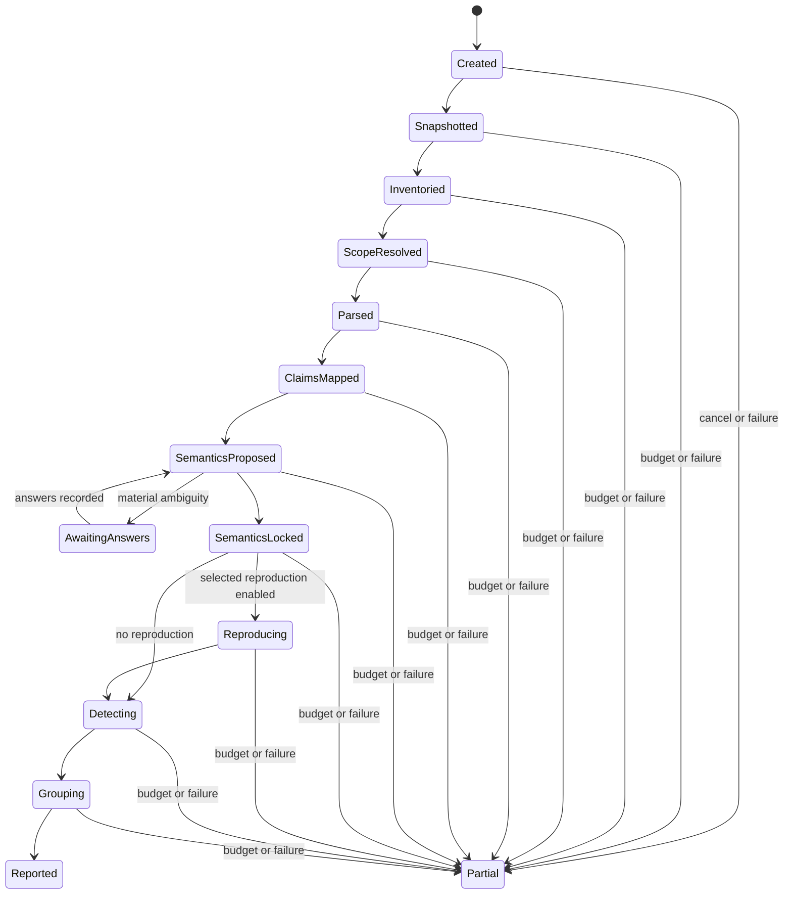

# Contents {#contents}

- [Accepted policy decisions for version 0.5](#accepted-decisions)
- [0. Product charter](#chapter-00)
- [1. Product requirements](#chapter-01)
- [2. System architecture](#chapter-02)
- [3. Record model and evidence graph](#chapter-03)
- [4. Audit lifecycle](#chapter-04)
- [5. Detector framework and finding admission](#chapter-05)
- [6. Runtime, performance, and resource policy](#chapter-06)
- [7. Security, trust, and authority](#chapter-07)
- [8. Reporting and user experience](#chapter-08)
- [9. Claude Code and Claude Science integration](#chapter-09)
- [10. Evaluation and validation plan](#chapter-10)
- [11. Implementation plan](#chapter-11)
- [12. Open decisions](#chapter-12)
- [13. Glossary](#chapter-13)
- [Appendix A. Acceptance criteria](#appendix-a)
- [Appendix B. Architecture Decision Records](#appendix-b)
- [Appendix C. Reference index](#appendix-c)

> **Review status:** This is a design specification, not a claim that the system has been implemented or scientifically validated. Open decisions remain normative gaps until accepted through an ADR.

The modular Markdown documents in `docs/`, the ADRs, the accepted-decision log, and the machine registers are the editing sources of truth. This consolidated file is generated for review.

# Accepted policy decisions for version 0.5 {#accepted-decisions}

This revision incorporates the scientific-validation review while retaining the accepted epistemic, runtime, security, causal, and implementation-foundation policies from versions 0.2 through 0.4.

## First implementation slices

- The architectural vertical slice is domain-neutral and is exercised first on GeneBench-derived and synthetic fixtures.
- The first named domain pack is a deliberately narrow bulk RNA-seq differential-expression profile.

## Agent adjudication

- Benchmark adjudicators are coding agents rather than assumed manual experts.
- The initial reference pair is Claude Code with Claude Opus 5 and Codex with GPT-5.6 Sol.
- Qualification uses at least four blind Stage-1 reviews across both providers and at least two fresh Stage-2 adjudications.
- Exact model, agent, prompt, tool, environment, and transcript identities are pinned.
- Agent confidence and simple majority vote do not determine labels.
- Material disagreement excludes a case from positive and verified-good sets.
- Scientific labels are frozen before sc-referee output is exposed.
- Agent-only review is disclosed and is not described as human expert endorsement.

## Fixtures and external packaging

- Evaluation distinguishes verified-good, scope-verified-good, hard-negative, positive, and ambiguous fixtures.
- No fixture label permits a global correctness claim.
- RO-Crate 1.3 is the first external research-object export; native records remain canonical.

## Capability and maturity

- Public capability claims use a machine-generated multidimensional matrix.
- Validated and publication-grade detectors may both emit Findings inside their qualified envelope and the same five-part admission rule.
- Experimental detectors cannot emit Findings.
- Non-negotiable promotion safety gates are accepted now; numeric thresholds are deferred until a pilot-corpus ADR.


# 0. Product charter {#chapter-00}

## 0.1 Purpose

**sc-referee** is a coding-agent skill and deterministic audit system for inspecting a bioinformatics or statistical workflow in a project directory or notebook workspace. Its purpose is to identify and localize narrowly demonstrated scientific-analysis issues, preserve scientifically material unknowns, and disclose the boundaries of what the system could inspect.

The primary interaction is `/scientific-audit` in Claude Code or an equivalent Claude Science workspace. The deterministic core remains usable as a standalone CLI after semantic records have been created.

The product is for scientists who used a coding agent to create or modify an analysis and want a publication-oriented review of what the code and report actually do. It does not select or apply a replacement analysis.

### Project identity and lineage

The public project name is **sc-referee**. The repository, primary Python distribution, and CLI use `sc-referee`; the Python import namespace uses `sc_referee`. The user-facing Claude command remains `/scientific-audit` because it describes the action directly.

The name continues the identity of the original `sc-referee` prototype created for the Claude Life Sciences hackathon. This specification describes a rearchitecture: the original single-cell emphasis becomes a broader, conservative system for localizing subtle scientific-analysis mistakes across bioinformatics and statistical workflows.

## 0.2 Problem statement

A workflow can execute successfully and still answer the wrong scientific question. Common failures include:

- a reported claim disagreeing with the computed result or uncertainty;
- an outcome being used to choose a model, threshold, filter, or subgroup;
- use of the wrong population, estimand, adjustment set, comparison, denominator, background set, or controls;
- failure to identify a measurement or error model from the available data;
- omission of batch effects, nuisance variables, repeated measures, kinship, site, or other dependence;
- a global fit statistic hiding a group-specific offset or residual pattern;
- unsupported assumptions about label orientation, scale, timing, calibration, or a scientific invariant;
- ignored missingness, transport, measurement, or calibration uncertainty; and
- claims without complete computational and semantic lineage.

These failures depend on scientific meaning and relationships among task text, data, code, outputs, and report language. Ordinary linters, unit tests, and workflow engines do not generally detect them.

The known issue classes are not exhaustive. However, publication-critical review cannot safely delegate open-ended scientific error discovery to an LLM. Version one therefore handles the open world by preserving unknown semantics, unsupported operations, opaque boundaries, unavailable evidence, detector gaps, and uninspected paths. New issue classes enter production through explicit detector development and validation, not through free-form model suspicion.

## 0.3 Product goals

sc-referee will:

1. inventory an entire project while deeply inspecting final-claim paths and their selection envelope;
2. parse supported Python, R, notebook, document, shell, Snakemake, and Nextflow surfaces into one operation representation;
3. connect report claims to results, operations, decisions, inputs, environments, and scientific contracts;
4. represent scientific meaning as typed, provenance-bearing assertions with explicit unknown and conflict states;
5. ask the scientist only questions whose plausible answers can materially change the assessment;
6. apply versioned deterministic detectors with executable applicability and counterevidence contracts;
7. reserve `Finding` for demonstrated issues and use distinct records for conditional concerns, material questions, and disclosures;
8. group downstream effects under one graph-supported root cause;
9. create a semantic lock from which detection and reporting rerun without Claude;
10. enforce user-visible elapsed deadlines, never escalate mode automatically, and return a useful partial report when its deadline expires; and
11. expose detector, parser, lineage, evidence, and execution coverage without implying correctness.

## 0.4 Non-goals

sc-referee will not:

- certify that an analysis, manuscript, or scientific conclusion is correct;
- emit a global pass badge, publication-ready state, or risk score;
- search a repository with an open-ended LLM prompt for unspecified scientific mistakes;
- infer undocumented scientific meaning and silently treat it as fact;
- select, fit, or apply a replacement analysis;
- exhaustively symbolically execute arbitrary Python, R, shell, compiled code, or remote systems;
- silently run project-authored analysis code, submit an HPC job, run a complete workflow, or mutate the user's active software environment;
- equate successful execution with scientific validity;
- treat unsupported or unavailable paths as negative detector results; or
- hide uncertainty merely to make the report look complete.

## 0.5 Primary users

### Scientist who used a coding agent

The scientist needs a direct answer to five questions:

1. Which reported claims demonstrably require correction?
2. Which analysis choices could be problematic only under a stated unresolved condition?
3. Which scientific meanings must be clarified before review can continue?
4. Which claims lack complete lineage or reproducibility evidence?
5. Which parts of the workflow were unsupported, opaque, unavailable, or outside validated detector coverage?

### Analysis author or research software engineer

The author needs exact source locations, root-cause paths, machine-readable records, deterministic reruns, and stable audit diffs after code changes.

### Methodologist or reviewer

The reviewer needs bounded finding language, visible premises and non-inferences, detector maturity, finite counterevidence checks, coverage boundaries, and durable scientist responses.

### Detector developer

The developer needs explicit operation and semantic contracts, positive and verified-good fixtures, ambiguity cases, counterevidence cases, held-out evaluation, and strict promotion criteria.

## 0.6 Design principles

### P-001 — Evidence compiler

The system compiles source material through observed facts, proposed semantics, resolved semantics and unknowns, detector results, admitted assessments, and coverage records. No stage may be skipped.

### P-002 — Epistemic types, not badges

A demonstrated issue, a conditional possibility, an unanswered scientific question, and a coverage limitation are different record types. They are not one generic finding with different confidence labels.

### P-003 — “Finding” means demonstrated

A Finding is a narrowly worded issue that follows from the persisted evidence under a validated detector contract. If a knowledgeable scientist can accept every stored fact and still reasonably deny the exact sentence, it is not yet a Finding.

### P-004 — Unknown means unknown

Missing scientific meaning remains a typed unknown or conflict. It does not inherit a package default, model guess, naming convention, or convenient assumption.

### P-005 — Scoped authority

The scientist is authoritative about intended scientific meaning. Static and runtime observations are authoritative about realized computation. Report text is authoritative about what was written. These authorities can conflict without overwriting one another.

### P-006 — False-positive asymmetry

Falsely accusing a correct analysis is the most serious product failure. The system recovers usability through questions, conditional concerns, disclosures, and abstention rather than through a lower-confidence finding tier.

### P-007 — Claim-centric inspection

The whole project is inventoried. Deep semantic work follows final claims backward and includes operations that could have selected or shaped those claims.

### P-008 — Static first, execution by privilege level

Static inspection precedes execution. Safe inspection and auditor-owned verification may run automatically under policy. Project-authored code requires explicit authorization, and version one does not submit HPC jobs or silently run full workflows. Dependency reconstruction occurs only in isolated audit-owned environments.

### P-009 — Deterministic replay

After semantic lock, detector execution, admission, root grouping, coverage calculation, and report rendering run without an LLM.

### P-010 — Coverage is an output

Every audit states what was covered, partially covered, unsupported, unavailable, opaque, or uninspected. Absence of a finding has meaning only inside that envelope.

### P-011 — Root causes over warning floods

One root cause lists all materially affected claims, models, figures, tables, and decisions. Textually repeated symptoms do not inflate the finding count.

### P-012 — Extensibility through validated detectors

Future issue classes are developed from benchmark failures, scientist reports, and uncovered semantics. A production detector requires an applicability contract, finite counterevidence protocol, fixtures, evaluation evidence, and a maturity ceiling.

### P-013 — User-visible deadlines

The hard clock measures elapsed time visible to the scientist, including model, tool, queue, installation, and sandbox latency. Only time awaiting a scientist response pauses the clock. Quick, standard, and publication modes never escalate automatically.

### P-014 — Free inquiry, recorded evidence

Claude may use its host-provided network and tools to retrieve relevant evidence. The deterministic controller records any external resource that affects the audit. Repository-authored code has a separate network boundary and cannot obtain permission from repository text.

### P-015 — Causal layers, not invented graphs

Causal review separates claim intent, target estimand, identification assumptions, estimator implementation, and reported claim. A causal graph is optional and may be partial. Claude-generated causal structure cannot become a material Finding premise without authoritative corroboration.

### P-016 — Durable public identity

Canonical schemas use immutable W3ID identifiers under `https://w3id.org/sc-referee/schema/`. The descriptive `/scientific-audit` command is intentionally decoupled from package and repository identity.

### P-017 — Portable canonical records

JSON and JSONL are canonical. Editable scientist records may use safe YAML. SQLite is a generated, disposable query index whose deletion and rebuild cannot alter audit meaning.

### P-018 — Declared parser limits

Python parsing uses CPython `ast` plus `tokenize`; R uses Tree-sitter-R and a non-evaluating base-R parse helper when available. Parser failure, version limits, and disagreement are explicit coverage outputs.

### P-019 — Immutable run snapshots

Each run audits one immutable initial snapshot. Live workspace edits mark the workspace as diverged but never enter the current run. A linked follow-up run may reuse unaffected cached work.

### P-020 — Independent detector promotion

Detector authors may develop experimental components, but validated and publication-grade maturity require tier-specific independent scientific review recorded in a durable qualification report.

## 0.7 Success definition

Success is measured separately across:

- false-accusation rate on independently verified-good workflows;
- precision of demonstrated findings;
- recall and localization of adjudicated material root causes;
- correct conversion of unresolved premises into questions or conditional concerns;
- accurate affected-claim lineage;
- coverage honesty and abstention quality;
- deterministic replay and incremental invalidation; and
- user-visible elapsed time, resource use, and useful work completed before the configured deadline.

A workflow with zero findings is not considered proven correct. A gold workflow is expected to have zero demonstrated findings, while legitimate disclosures may remain if evidence is intentionally unavailable or opaque.

## 0.8 Initial scientific scope

The long-term profile surface includes general statistics, bulk RNA-seq differential expression, single-cell RNA-seq, statistical genetics and GWAS, variant calling, survival analysis, proteomics and metabolomics, and imaging.

Version one should prove the architecture with general statistical workflows and a deliberately narrow bulk RNA-seq profile before making publication-grade claims across every domain. Parser support, semantic-profile coverage, detector availability, detector validation, and publication-grade maturity are reported independently.


# 1. Product requirements {#chapter-01}

## 1.1 Requirement conventions

Each requirement has a stable identifier. Requirements describe the intended system; they do not imply that the capability has already been implemented.

Priority labels:

- **P0:** required for the first usable vertical slice;
- **P1:** required before a broad public beta;
- **P2:** desirable after the core system is validated.

## 1.2 Functional requirements

### Invocation and scope

**SA-FR-001 — Slash-command invocation (P0).** The system MUST provide a user-invoked `/scientific-audit` skill entry point in Claude Code.

**SA-FR-002 — Whole-project inventory (P0).** One invocation MUST inventory the entire project root, subject to explicit exclusions and security policy.

**SA-FR-003 — Notebook operation (P0).** The system MUST support auditing a notebook-centric workspace without requiring a conventional repository layout.

**SA-FR-004 — Publication-surface resolution (P0).** The system MUST resolve the final publication surface using explicit user or active-workspace selection, declared build targets, explicit task or repository statements, and unique lineage evidence in that order. Filename and modification time MAY support ranking but MUST NOT decide alone. If multiple materially plausible surfaces remain, the system MUST ask the scientist or preserve an unresolved scope conflict.

**SA-FR-005 — Selection envelope (P0).** Deep inspection MUST include all candidate-generating, filtering, thresholding, tuning, comparison, subgroup, and rejection decisions that could have selected a final reported result.

**SA-FR-006 — Narrow internal work units (P0).** Although invocation is project-wide, the controller MUST decompose work into bounded claim-, artifact-, operation-, or question-centered units.

### Languages and workflow surfaces

**SA-FR-007 — Initial language support (P0/P1).** The parser architecture MUST support Python, R, Jupyter, Quarto, R Markdown, shell, Snakemake, and Nextflow through versioned adapters. Python, R, Jupyter, Quarto, and R Markdown are P0; shell, Snakemake, and Nextflow are P1.

**SA-FR-008 — Unified operation IR (P0).** All parsers MUST emit a common observed-operation intermediate representation rather than detector-specific parse trees.

**SA-FR-009 — Opaque operation preservation (P0).** Unsupported or dynamically resolved calls MUST still be represented as opaque operations with known inputs, outputs, source locations, and trust properties where available.

**SA-FR-010 — Rendered report support (P1).** The system SHOULD extract claims and artifact references from rendered HTML. PDF support MAY be provided with explicitly weaker source precision when source documents are unavailable.

### Observed computation and lineage

**SA-FR-011 — Immutable observed facts (P0).** Static or runtime observations MUST be immutable within an audit run. Later scientific explanations may annotate but MUST NOT overwrite them.

**SA-FR-012 — Source precision (P0).** Every material operation, claim, assertion, finding, and lineage link MUST reference exact source locations appropriate to the medium.

**SA-FR-013 — Claim-to-computation lineage (P0).** The system MUST connect each final claim to the result artifact, producing operation, relevant decisions, input assets, and environment evidence or record a precise missing or opaque link.

**SA-FR-014 — Qualitative claim lineage (P0).** Qualitative claims such as model adequacy, robustness, enrichment, or absence of association MUST link to the diagnostics or results that support the wording.

**SA-FR-015 — Lineage grading (P0).** Lineage MUST be assessed separately for report origin, result origin, computational origin, input origin, execution origin, and semantic origin.

**SA-FR-016 — External and HPC evidence (P1).** The system MUST accept workflow traces, scheduler logs, manifests, checksums, environment records, and remote data identifiers when raw or intermediate data are not local.

### Scientific semantics

**SA-FR-017 — Scientific Contracts (P0).** Each material analysis or claim MUST have a Scientific Contract that represents the scientific meaning required for interpretation.

**SA-FR-018 — Core contract dimensions (P0).** Contracts MUST support target and analysis populations, unit of analysis, exposure or treatment, outcome, estimand, comparison, timing, scale and orientation, adjustment set, denominator or universe, control set, dependence structure, measurement model, missingness, transport, calibration, selection process, and uncertainty target as applicable.

**SA-FR-019 — Explicit causal semantics (P0).** The system MUST classify material claim intent as descriptive, associational, predictive, causal, or ambiguous and MUST support target estimands, identification strategies, treatment, outcome, target population, effect scale, time zero, adjustment-set roles, and optional causal structure without assuming that every analysis is causal.

**SA-FR-020 — Typed semantic states (P0).** Every material semantic dimension MUST be explicitly `known`, `unknown`, `conflicted`, or `not_applicable`.

**SA-FR-021 — Provenance-bearing assertions (P0).** Semantic meaning MUST be represented as fallible assertions with subject, predicate, object, semantic role, authority scope, epistemic status, evidence, source references, and provenance.

**SA-FR-022 — Hierarchical contract authoring (P1).** The authoring model SHOULD support study-, cohort-, analysis-, and claim-level inheritance. The locked form MUST materialize a complete contract for each claim.

**SA-FR-023 — Scientist questions (P0).** The system MUST ask only questions for which plausible answers can change detector applicability, assessment type, potential impact or publication materiality, root-cause grouping, or affected claims.

**SA-FR-024 — Answer persistence (P0).** Scientist answers MUST be persisted in editable JSON or YAML with respondent, timestamp when available, source, authority scope, and confidence or certainty description when available.

**SA-FR-025 — Conflict retention (P0).** When scientist intent conflicts with code, metadata, artifacts, or report text, the system MUST notify the scientist and retain both assertions. Scientist authority resolves intended scientific meaning but does not redefine observed execution.

### Claims and scientific issue detection

**SA-FR-026 — Structured claims (P0).** Report claims MUST be represented as structured propositions including subject, population, comparison, estimate or direction, magnitude, scale, uncertainty, time, and causal or associational wording when applicable.

**SA-FR-027 — Known issue classes (P0/P1).** The detector framework MUST support the known issue classes listed in the product charter. Initial P0 detectors SHOULD prioritize claim/result agreement, population or estimand mismatch, denominator or control mismatch, dependence or repeated measures, orientation/scale/timing assumptions, and lineage completeness.

**SA-FR-028 — Scientific risks requiring judgment (P0).** The system MUST be able to report scientifically plausible conditional risks that depend on domain judgment, provided the missing premise and resolving evidence are explicit.

**SA-FR-029 — Unsupported and unknown behavior (P0).** Unsupported operations, unknown semantics, unavailable execution evidence, opaque dependencies, and detector coverage gaps MUST be reported independently from scientific findings.

**SA-FR-030 — No open-ended model issue discovery (P0).** The production audit MUST NOT perform an open-ended language-model search for unspecified scientific errors. Future issue classes MUST enter through explicit coverage gaps, scientist reports, benchmark analysis, and validated deterministic detector development.

**SA-FR-031 — Detector manifests (P0).** Every detector MUST declare applicability, required records, accepted assertion classes, supported operations and versions, domains, assumptions, abstention rules, permitted output types, maturity, a finite counterevidence protocol, wording constraints, coverage rules, limitations, implementation digest, and tests.

**SA-FR-032 — Detector result states (P0).** Every scheduled detector-target pair MUST produce one explicit state: finding candidate, conditional-concern candidate, material-question candidate, disclosure candidate, no issue detected within coverage, not applicable, insufficient semantics, unsupported path, execution evidence unavailable, or detector error.

**SA-FR-033 — Counterevidence search (P0).** Before a candidate finding is admitted, the controller MUST perform and record every applicable check in the detector's finite, versioned counterevidence protocol. A decisive unavailable check MUST block finding admission.

**SA-FR-034 — Conservative admission gate (P0).** A Finding MUST satisfy all five admission conditions: direct entailment of the bounded statement, no unresolved fact that could reverse it, exact validated detector applicability, completed finite counterevidence protocol, and bounded wording reproducible from the semantic lock.

**SA-FR-035 — Evidence-bounded wording (P0).** Finding language MUST NOT assert a stronger conclusion than the admitted evidence supports.

**SA-FR-036 — Root-cause grouping (P0).** Findings MUST be grouped by causal root rather than textual similarity, with all materially affected descendant operations, models, artifacts, figures, tables, and claims enumerated.

**SA-FR-037 — Scientist disposition (P1).** A scientist MUST be able to record `confirmed`, `accepted_risk`, `disputed`, `not_material`, `deferred`, or `corrected_in_later_revision` without deleting the original evidence. Objective false-positive and detector-defect labels MUST be stored in a separate independent adjudication record.

**SA-FR-038 — No remediation selection (P0).** The system MUST NOT select or apply a replacement analysis as part of the audit.

### Coverage and reporting

**SA-FR-039 — Mandatory coverage record (P0).** Every completed or partial audit MUST produce a Coverage Record.

**SA-FR-040 — No correctness status (P0).** The system MUST NOT emit a global status equivalent to “correct,” “valid,” “safe,” or “publication ready.”

**SA-FR-041 — Human-readable output (P0).** The system MUST generate an HTML report with separate sections for demonstrated findings, conditional concerns, material questions, and disclosures, plus claim lineage, coverage, provenance, and performance.

**SA-FR-042 — Agent-readable output (P0).** The system MUST generate a canonical machine-readable audit bundle and normalized per-record JSON or JSONL.

**SA-FR-043 — Exact evidence package (P0).** Every Finding MUST include exact source locations, material premises, logical basis, detector applicability, completed counterevidence checks, explicit non-inferences, affected descendants, detector identity, and coverage limitations. No material premise may remain missing or conflicted.

**SA-FR-044 — Zero-finding wording (P0).** A report with zero admitted findings MUST still state the inspected scope, unresolved semantics, opaque boundaries, unavailable evidence, and detector coverage.

### Reproducibility and execution

**SA-FR-045 — Semantic lock (P0).** The controller MUST create a content-addressed semantic lock that fixes accepted assertions, unresolved unknowns, conflicts, publication scope, and detector inputs.

**SA-FR-046 — Model-free rerun (P0).** Given the same repository snapshot, semantic lock, detector implementations, and policy, detector execution, grouping, coverage calculation, and report rendering MUST rerun without Claude.

**SA-FR-047 — Static-first operation (P0).** Static inspection MUST precede and guide any execution.

**SA-FR-048 — Bounded selected reproduction (P1).** The system MAY perform safe inspection and auditor-owned verification automatically in a sandbox. Execution of project-authored code requires explicit authorization. It MUST NOT silently escalate to full workflow execution or HPC submission.

**SA-FR-049 — Execution provenance (P1).** Every executed command, dependency installation, and controller network retrieval that affects the audit MUST record the initiating work item, purpose, environment or destination, inputs, outputs, resource consumption, exit or retrieval state, and content identities or logs.

**SA-FR-050 — Data identity tiers (P1).** Data assets MUST record identity strength, distinguishing full digest, immutable external identity, manifest identity, weak fingerprint, and unidentified location.

### Runtime and iteration

**SA-FR-051 — Audit modes (P0).** The controller MUST support `quick`, `standard`, and `publication` policies with distinct scheduling cutoffs, user-visible hard deadlines, and enabled work classes. A run MUST NOT escalate mode automatically.

**SA-FR-052 — Hard deadlines and resource policy (P0).** Every audit MUST have a user-visible elapsed scheduling cutoff and hard deadline, sandbox and per-command limits, and data-read policy. Auditor-imposed model-call and token caps MAY be `null`; host subscription, organization, provider, and context limits remain authoritative.

**SA-FR-053 — Partial completion (P0).** On cancellation, timeout, tool failure, or budget exhaustion, the controller MUST preserve completed records and render a partial report with pending and uninspected work.

**SA-FR-054 — Incremental invalidation (P1).** The controller SHOULD cache content-addressed parse, extraction, semantic, lineage, and detector results and invalidate only affected descendants after a project change.

**SA-FR-055 — Progress visibility (P0).** The agent-facing interface MUST expose current stage, completed high-materiality targets, pending material questions, budget consumption, and major coverage gaps without flooding the user with low-level events.

### Integration and extensibility

**SA-FR-056 — Standalone CLI (P0).** The deterministic controller MUST expose a standalone CLI independent of Claude Code.

**SA-FR-057 — Typed tool API (P0).** The Claude integration SHOULD use a typed local tool boundary, preferably an MCP server, for starting audits, submitting assertions, recording answers, running detectors, and rendering reports.

**SA-FR-058 — Model provider boundary (P1).** Model-assisted extraction SHOULD be isolated behind a provider-neutral interface so that deterministic records and detector behavior do not depend on one model vendor.

**SA-FR-059 — Domain profiles (P1).** Domain-specific operation signatures, semantic extensions, and detectors MUST be packaged as independently versioned profiles.

**SA-FR-060 — Maturity declarations (P0).** Parsers, extractors, profiles, and detectors MUST declare separate maturity or validation status. Parsing support MUST NOT be described as scientific detector validation.

### Evaluation

**SA-FR-061 — Answer-key isolation (P0).** Production audit code and agent workspaces MUST not receive benchmark answer keys or graders.

**SA-FR-062 — Root-cause benchmark labels (P1).** Evaluation records MUST identify the first material scientific divergence and its affected descendants, rather than labeling only final answer correctness.

**SA-FR-063 — Correct-answer review (P1).** Evaluation corpora MUST include apparently correct final answers because invalid workflows can arrive at a correct result accidentally.

**SA-FR-064 — Verified-good fixture behavior (P0).** A `verified_good_fixture`, `scope_verified_good`, or `hard_negative_fixture` MUST produce zero Findings inside its declared negative scope, but MAY produce legitimate coverage, trust-boundary, or reproducibility Disclosures. No fixture label permits a global correctness claim.

**SA-FR-065 — Problem-level splits (P1).** Benchmark train, development, and test splits MUST separate scientific problems rather than randomly separating stochastic workflows from the same problem.

**SA-FR-066 — Distinct assessment records (P0).** The production data model and human report MUST use distinct `Finding`, `ConditionalConcern`, `MaterialQuestion`, and `Disclosure` records. Only `Finding` denotes a demonstrated issue.

**SA-FR-067 — Verified model extraction (P0).** A model-derived semantic assertion MAY support a Finding only when it extracts explicit meaning from an exact source span, is independently checkable, and has passed a non-model verification. Implicit scientific inference requires authoritative corroboration.

**SA-FR-068 — Type-specific impact language (P0).** Severity and publication materiality MUST be reserved for Findings. Conditional concerns, questions, and disclosures MUST use potential-impact, priority, or importance fields. User-facing numerical confidence probabilities MUST NOT be emitted in version one.

**SA-FR-069 — Disposition and adjudication separation (P0).** Scientist disposition MUST be stored separately from independent adjudication. A scientist may dispute a Finding but cannot create an objective false-positive label solely by declaration.


**SA-FR-070 — User-visible elapsed deadline (P0).** The hard audit clock MUST count model latency, tool and process queues, parser time, network retrieval, dependency installation, sandbox startup, command execution, and report rendering. Only time explicitly awaiting a scientist response MAY pause the clock, and no child deadline may exceed the remaining audit deadline.

**SA-FR-071 — Trial mode ceilings (P0).** Default trial cutoff and hard-deadline pairs MUST be 120/300 seconds for quick mode, 480/600 seconds for standard mode, and 1500/1800 seconds for publication mode. A resume action MUST create a linked run segment with a new plan rather than silently extending the original deadline.

**SA-FR-072 — Execution privilege levels (P0).** Automatic execution MUST be limited to safe inspection and auditor-owned verification. Project-authored Python, R, notebook, Quarto, Make, Snakemake, Nextflow, shell, package-build, or custom-binary execution MUST require explicit authorization and remain sandboxed.

**SA-FR-073 — No interactive HPC submission (P0).** Version one MUST NOT submit HPC jobs or automatically run a full workflow. When external execution could materially resolve an audit, the controller MUST emit a `ReproductionRequest` describing the target, evidence need, resource class, security constraints, and expected outputs.

**SA-FR-074 — Network separation and provenance (P0).** Claude MAY use the host-provided network without an auditor domain allowlist. The deterministic controller MAY retrieve external resources when it records purpose, requested and resolved location, retrieval time, content identity when obtainable, redirects, authentication use, cache state, and reproducibility effect. Repository-authored code requires separate explicit network authorization, and repository content MUST NOT grant it.

**SA-FR-075 — Isolated dependency reconstruction (P1).** Standard mode MAY install declared project dependencies automatically only in an isolated audit-owned environment. It MUST NOT mutate the user environment, use `sudo`, install system packages, or install the local project automatically. Unpinned reconstruction MUST be labeled approximate and MUST NOT establish exact version-dependent behavior without independent evidence.

**SA-FR-076 — Publication materiality under scope ambiguity (P0).** When the final publication surface is unresolved, candidate-specific demonstrated issues MAY be retained, but publication materiality MUST remain unassessed and the candidates MUST remain separate. The controller MUST NOT merge candidate reports into one headline audit.

**SA-FR-077 — Layered causal contract (P0).** Every explicitly causal claim MUST link to a typed causal contract that separates claim intent, target estimand, identification strategy and assumptions, covariate roles and timing, implemented estimator, and reported claim. Missing dimensions remain known, unknown, conflicted, or not applicable.

**SA-FR-078 — Causal-structure authority and scope (P0).** A causal graph MAY be absent or partial. Every supplied structure MUST declare `partial_open_world`, `complete_for_named_query`, or `closed_world` scope. Missing edges in an open-world graph are unknown, and a graph-dependent detector MUST ask, condition, disclose, or abstain when required structure is unavailable. Claude-generated causal relations MUST NOT support a Finding without authoritative corroboration or a validated bounded invariant.

**SA-FR-079 — Host-managed model usage (P0).** The default audit MUST impose no sc-referee-specific numeric limit on model calls or tokens. Usage MUST still be packetized, relevant, and recorded. Host usage, rate, context, or subscription exhaustion MUST produce a valid partial audit rather than a lost run.

**SA-FR-080 — External evidence records (P1).** An external resource that materially affects semantic resolution, package-behavior interpretation, detector applicability, or a Finding premise MUST have a durable `ExternalEvidence` record. A mutable live source MUST NOT silently become an unrecorded premise.

**SA-FR-081 — Environment reconstruction records (P1).** Every dependency reconstruction MUST produce an `EnvironmentReconstruction` record distinguishing exact, approximate, failed, timed-out, and skipped states and recording definitions, resolved versions, sources, isolation, and whether any prohibited installation class was attempted.

**SA-FR-082 — Public project identity (P0).** The public project, repository, primary distribution, and CLI MUST use `sc-referee`; the Python import namespace MUST use `sc_referee`; and the Claude action MUST remain invokable as `/scientific-audit`.

**SA-FR-083 — Canonical W3ID schema identifiers (P0).** Published schema `$id` values MUST use immutable versioned paths under `https://w3id.org/sc-referee/schema/`. A movable `latest` path MAY exist for human browsing but MUST NOT be persisted in audit records.

**SA-FR-084 — License and third-party provenance (P0).** Original code, schemas, documentation, templates, and original fixtures MUST be released under Apache License 2.0 with `LICENSE`, `NOTICE`, and machine-readable attribution where applicable. Externally derived benchmark or fixture material MUST retain source-specific provenance and MUST NOT be silently relicensed.

**SA-FR-085 — Tiered detector promotion (P0).** Experimental detector release requires maintainer review and required fixtures. Promotion to `validated` MUST require one software maintainer, a qualifying cross-provider agent adjudication panel, the non-negotiable promotion safety gates, and a public qualification report. Promotion to `publication-grade` MUST additionally require an independently assembled corpus or external replication and repeated qualifying adjudication. Agent-only, mixed, and human review bases MUST be disclosed distinctly; agent-only qualification MUST NOT be described as human expert review. Emergency demotion MUST be possible immediately.

**SA-FR-086 — Python runtime compatibility (P0).** The first public implementation MUST support Python 3.11 or newer and SHOULD test supported core packages across Python 3.11 through the currently supported CPython releases. Parser coverage for inspected source syntax MUST be reported separately from the controller runtime version.

**SA-FR-087 — Canonical record storage (P0).** Canonical audit records MUST be versioned JSON or JSONL. Safe YAML MAY be used for editable scientist answers and policy. SQLite MUST be a generated disposable index that can be rebuilt from canonical records without changing audit meaning.

**SA-FR-088 — Python parser stack (P0).** Python extraction MUST use CPython `ast` for semantic structure and `tokenize` for comments, literals, and token boundaries. It MUST NOT import or execute project modules. Syntax rejected by the running interpreter MUST produce localized partial or unsupported coverage rather than silent success.

**SA-FR-089 — R parser stack (P0).** R extraction MUST use Tree-sitter-R for resilient syntax inventory and, when R is available, an isolated helper using `parse(keep.source = TRUE)` and `getParseData()` without sourcing, attaching packages, or evaluating project code. Parser disagreement and unresolved tidy evaluation or dispatch MUST be recorded.

**SA-FR-090 — Static HTML renderer (P0).** The human report MUST be rendered deterministically from canonical records using a self-contained Jinja2 HTML template with explicit autoescaping and strict undefined-variable handling. Core content MUST remain readable without JavaScript and MUST use no required remote assets.

**SA-FR-091 — Sandbox capability contract (P0).** Project-authored execution MUST use a capability-reported rootless OCI backend that enforces read-only project mounts, separate writable audit roots, network denial by default, resource and process limits, restricted device access, and dropped capabilities. When no qualifying backend exists, project execution MUST be unavailable; a restricted subprocess MUST NOT be treated as an equivalent fallback.

**SA-FR-092 — Cache locality (P0).** All source-derived parser, semantic, model, detector, and report caches MUST remain project-local in version one and MUST NOT be shared across repositories. User-global caches MAY contain only tool-owned or public assets, public downloads, isolated dependency environments, and equivalent non-project-derived material.

**SA-FR-093 — Immutable snapshot under workspace mutation (P0).** A run MUST continue against its immutable initial snapshot when the live workspace changes, record `workspace_diverged`, and refuse to mix changed live content into that run. A linked follow-up run MAY reuse unaffected cached work.

**SA-FR-094 — Domain-neutral core slice and first domain pack (P0).** The first architectural vertical slice MUST exercise the complete evidence-compiler path on domain-neutral claim, lineage, population, comparison, denominator, orientation, scale, timing, question, coverage, and replay records. The first named scientific domain pack MUST be a deliberately narrow bulk RNA-seq differential-expression profile and MUST NOT define the general architecture.

**SA-FR-095 — Pinned cross-provider agent reviewers (P1).** Qualification adjudication MUST use at least two distinct model-provider families and independent execution contexts. Every review MUST record the exact model identifier, agent surface and version, reasoning configuration, prompt digests, tool-policy digest, environment digest, transcript digest, and blindness state. The initial reference pair is Claude Code using Claude Opus 5 and Codex using GPT-5.6 Sol, but historical runs MUST remain pinned and future reference models MAY change only through a versioned adjudication protocol.

**SA-FR-096 — Blind multi-run adjudication (P1).** A qualification case MUST receive at least four Stage-1 blind reviews, including two independent runs from each of two provider families, followed by at least two fresh Stage-2 scientific adjudications, including one from each provider family. Stage 1 MUST hide other reviews, sc-referee output, detector identity, benchmark grade, answer key, and adjudication notes. Stage 2 MAY use frozen Stage-1 rationales and answer-side evidence but MUST still hide sc-referee output and detector identity until the scientific label is frozen.

**SA-FR-097 — Conservative agent disagreement handling (P1).** Agent agreement MUST NOT be accepted as proof by itself, self-reported confidence MUST NOT affect labels, and simple majority vote MUST NOT override material disagreement. A positive label requires cross-provider agreement on the same bounded root cause plus deterministic evidence checks. A verified-good or hard-negative label requires completion of its positive proof obligations and no material dissent. Any unresolved material disagreement MUST place the case in an ambiguity or insufficient-evidence set, not a positive or verified-good set.

**SA-FR-098 — Benchmark fixture taxonomy (P1).** Evaluation records MUST distinguish `verified_good_fixture`, `scope_verified_good`, `hard_negative_fixture`, `positive_issue_fixture`, and `ambiguous_fixture`. Verified-good labels MUST state exact claim, detector, issue-class, operation, execution, and semantic scope. Hard negatives MUST document the superficially suspicious pattern and the decisive innocent explanation. Multiple materially different defensible implementations SHOULD be included when feasible.

**SA-FR-099 — RO-Crate export (P1).** Version one SHOULD export an RO-Crate 1.3 research object containing the native audit bundle, HTML report, source and data identity manifests, environments, detector manifests and qualification references, execution evidence, licensing, and authorship metadata. Native sc-referee records remain canonical and MUST be included unchanged; W3C PROV mapping is deferred until an identified interoperability consumer requires it.

**SA-FR-100 — Generated multidimensional capability matrix (P1).** Public capability claims MUST be generated from parser, profile, detector, qualification, and version manifests. Each entry MUST identify language, package and tested versions, operation scope, syntax recognition, operation extraction, semantic modeling, detector maturity, qualification basis, strongest permitted output, known gaps, abstention conditions, and inferred compatibility. A domain-wide support or validation claim MUST NOT be inferred from one entry.

**SA-FR-101 — Finding permission by detector maturity (P0).** Both `validated` and `publication_grade` detectors MAY emit Findings, but only inside their declared qualification envelope and only when the same five-part Finding admission rule is satisfied. `experimental` detectors MUST NOT emit Findings. Maturity changes the breadth of qualification evidence, not the logical standard or wording of a Finding.

**SA-FR-102 — Promotion safety gates before numeric thresholds (P1).** Before any detector is promoted beyond experimental, the qualification MUST demonstrate no known high- or critical-severity false accusation in release-blocking fixtures, exclusion of conditional and disputed cases from Findings, verified-good and hard-negative controls, decisive-counterevidence fixtures, problem-cluster-aware uncertainty reporting, separation of public development cases from qualification cases, a regression fixture for every discovered false accusation, exclusion of unresolved adjudication disagreement, and a public qualification report. Universal numeric promotion cutoffs MUST be set only after a pilot corpus through a separate threshold ADR.

**SA-FR-103 — Qualification-basis disclosure (P1).** Every detector manifest, capability matrix entry, qualification report, and public maturity claim MUST identify whether review was agent-only, mixed, or human. Agent-only review MUST name the participating provider families and exact pinned configurations and MUST explicitly state that it is not human expert endorsement.

## 1.3 Quality requirements

**SA-NFR-001 — False-accusation minimization.** Precision of demonstrated findings is the primary scientific quality objective. Uncertain cases MUST be represented as conditional concerns, material questions, disclosures, or abstentions rather than lower-confidence findings.

**SA-NFR-002 — Determinism.** Normalized deterministic outputs MUST be byte-equivalent for identical locked inputs, excluding explicitly non-semantic timestamps and transport metadata.

**SA-NFR-003 — Timeliness.** The default standard policy MUST stop optional scheduling after eight minutes and impose a ten-minute user-visible elapsed hard deadline, pausing only while awaiting a scientist response. This remains a trial service objective to be measured, not an unvalidated performance guarantee.

**SA-NFR-004 — Early value.** High-materiality claim contradictions and lineage failures SHOULD be evaluated before lower-value coverage expansion.

**SA-NFR-005 — Explainability.** Every admitted finding and abstention MUST be inspectable without relying on hidden model reasoning.

**SA-NFR-006 — Extensibility.** New issue classes, domains, operation signatures, and record extensions MUST be addable without changing the semantics of published record versions.

**SA-NFR-007 — Failure isolation.** A parser, detector, model call, or reproduction failure MUST not invalidate independent completed work.

**SA-NFR-008 — Security.** Static analysis MUST avoid executing project code. Safe inspection, auditor-owned verification, dependency reconstruction, and explicitly authorized project-code execution MUST use distinct privilege levels and sandbox policy.

**SA-NFR-009 — Portability.** The deterministic core SHOULD run locally and in remote or HPC-adjacent environments without requiring Claude Code.

**SA-NFR-010 — Auditability.** All accepted semantics, scientist answers, policy choices, tool versions, detector digests, and execution events MUST be retained in durable records.

**SA-NFR-011 — Accessibility.** The HTML report SHOULD be keyboard navigable, readable without color alone, and usable when scripts are disabled for core content.

**SA-NFR-012 — Interoperability.** The system SHOULD support export mappings to W3C PROV concepts and research packaging formats without making RDF the canonical internal store.

**SA-NFR-013 — Data minimization.** Model work packets SHOULD include only the source and metadata needed to resolve a target semantic question or claim.

**SA-NFR-014 — Testability.** Every detector MUST include positive, verified-good negative, ambiguous, unsupported-path, and counterevidence fixtures. Every parser MUST include malformed and opaque-construction fixtures.

**SA-NFR-015 — Stable identity.** Record and graph identities SHOULD be content-derived where practical to support incremental reruns and audit diffs.

## 1.4 Initial acceptance criteria

The first usable vertical slice is acceptable only when all of the following are demonstrated on representative repositories:

1. `/scientific-audit` initiates a project-wide inventory.
2. Python, R, Jupyter, Quarto, and R Markdown source locations are preserved.
3. The controller identifies or asks for the final publication surface.
4. At least one final quantitative claim is linked to its result and producing operation.
5. Scientific Contracts preserve known, unknown, conflicted, and not-applicable dimensions.
6. Scientist answers are persisted with authority scope and provenance.
7. At least four P0 detector families emit the expanded candidate, negative, abstention, unsupported, unavailable, and error states.
8. Experimental detectors cannot emit Findings, and every Finding passes all five admission conditions.
9. One root cause can list multiple affected claims without duplicate warnings.
10. A zero-finding report uses neutral evidence-and-coverage language and contains no pass badge or global risk rating.
11. Detector execution and report rendering rerun without a model from a semantic lock.
12. A forced timeout produces a valid partial report rather than losing the run.
13. Repository content cannot change audit policy through prompt-like text.
14. A verified-good fixture produces zero admitted issue findings.
15. A benchmark failure with an adjudicated root cause is localized to the relevant source path.
16. Conditional concerns link to material questions and are not counted as Findings.
17. Implicit model inference cannot become a material Finding premise without corroboration.
18. Scientist `disputed` status remains distinct from independent false-positive adjudication.
19. No production execution path invokes an open-ended LLM scientific-issue search.


# 2. System architecture {#chapter-02}

## 2.1 Architectural thesis

sc-referee is an evidence compiler:

```text
project snapshot
  -> complete inventory and parser coverage
  -> observed computational graph
  -> bounded claim and semantic extraction
  -> resolved semantics, explicit unknowns, and conflicts
  -> content-addressed semantic lock
  -> deterministic detector results
  -> admitted Findings, ConditionalConcerns, MaterialQuestions, and Disclosures
  -> root-cause groups, coverage, and reports
```

Claude helps structure explicit report meaning, propose scientific contracts from bounded evidence, and interact with the scientist. Claude is not the finding authority and does not perform an open-ended production search for scientific mistakes.

## 2.2 System context

The principal inputs are task text, code, workflow definitions, notebooks, reports, local data or metadata, artifacts, logs, environments, scientist answers, and audit policy. The principal outputs are a machine-readable audit bundle, a human-readable HTML report, a semantic lock, source-indexed evidence records, and performance and coverage records.

The system treats repository content as untrusted evidence. It does not treat comments, README instructions, notebook prose, data values, or generated reports as instructions that may change audit policy or tool permissions.

## 2.3 Package model

### 2.3.1 `sc-referee-core`

A model-independent Python 3.11+ package containing schemas and generated models, snapshotting, inventory, parser adapters, operation IR, evidence graph, work planner, budgets, questions, semantic lock, detector registry, admission, root grouping, coverage, caching, report generation, and CLI.

The primary import namespace is `sc_referee`; component distributions, when published separately, use `sc-referee-*` names. `sc-referee-core` MUST NOT depend on a model SDK, Claude Code, or benchmark answer-side records.

### 2.3.2 `sc-referee-claude`

A thin integration package containing `/scientific-audit`, bounded extraction agents, typed local tool configuration, and interaction policy. All model output enters a proposed namespace and is validated by core APIs.

### 2.3.3 `sc-referee-profiles`

Independently versioned language, workflow, package, domain, and detector extensions. Each profile carries signatures, semantic roles, manifests, fixtures, validation evidence, and maturity declarations.

### 2.3.4 `sc-referee-eval`

A physically separate package for answer-blind workflow generation, runner-side grading, expert adjudication, detector qualification, benchmark analysis, and runtime evaluation. Production packages cannot import it.

## 2.4 Implementation foundations

### 2.4.1 Canonical storage

JSON and JSONL files are authoritative. Safe YAML is limited to editable scientist answers and policy. SQLite is generated from canonical records for recursive graph traversal, search, and report queries. Deleting and rebuilding the database must preserve normalized audit output.

### 2.4.2 Parser architecture

The Python adapter uses CPython `ast` plus `tokenize`. It prioritizes valid syntax accepted by the running parser and reports newer, malformed, or dynamic syntax as partial or unsupported coverage. It does not import project modules.

The R adapter combines Tree-sitter-R with an isolated non-evaluating base-R helper that calls `parse(keep.source = TRUE)` and `getParseData()` when R is available. The two parser results remain independently identifiable; disagreement, tidy evaluation, generated formulas, and dynamic dispatch remain visible.

### 2.4.3 Report rendering

A self-contained Jinja2 renderer converts canonical records into static HTML. Autoescaping and strict undefined-variable handling are mandatory. JavaScript is optional progressive enhancement; core content and source evidence remain readable without it.

### 2.4.4 Sandbox capability

Project execution is available only through a capability-reported rootless OCI backend. Auditor-owned verification may use a restricted subprocess because it executes versioned sc-referee code rather than project code. No subprocess-only fallback may be presented as project isolation.

### 2.4.5 Cache boundary

Project-derived cache remains under the project audit root and is never shared across repositories in version one. Global caches are limited to public or tool-owned assets, dependency environments, parser binaries, and pinned grammars.

## 2.5 Evidence planes

### 2.5.1 Observed computational and control plane

Represents ToolIdentity, AuditPlan, CachePolicy, StorageManifest, audit deadlines, repository snapshots, parser manifests and results, files, cells, chunks, workflow nodes, commands, reads, writes, filters, transformations, fits, tests, diagnostics, decisions, artifacts, inputs, outputs, environments, dependency reconstructions, sandbox capabilities, cache entries, asset identities, external evidence retrievals, and runtime traces. Observed records are immutable within an audit run.

### 2.5.2 Scientific semantic plane

Represents Scientific Contracts, Causal Contracts, assertions, unknowns, conflicts, scientist answers, populations, estimands, identification assumptions, comparisons, covariate roles, dependence, measurement, missingness, timing, scale, orientation, and selection semantics.

### 2.5.3 Claim plane

Represents exact report spans and structured propositions, including quantity, population, comparison, direction, scale, uncertainty, time, and causal or associational strength. Claims link to computational and semantic lineage.

### 2.5.4 Assessment and coverage plane

Represents detector manifests and results, demonstrated Findings, linked ConditionalConcerns and MaterialQuestions, Disclosures, root-cause descendants, scientist dispositions, independent production adjudications, agent benchmark reviews, benchmark adjudications and fixtures, capability matrices, parser and detector coverage, audit performance, and RO-Crate exports.

No plane may overwrite another. A mismatch among intent, realized computation, and reported wording is often the scientific issue.

## 2.6 Authority model

| Question | Primary authority | Rule |
|---|---|---|
| What was scientifically intended? | Scientist or explicit task text | Model proposals remain provisional unless they are verified literal extraction. |
| What code exists? | Locked repository snapshot | Content-addressed and immutable within the run. |
| What operation is realized? | Static or runtime observation | Opacity and actual coverage are preserved. |
| What output exists? | Artifact or execution evidence | Identity strength and environment remain attached. |
| What does the report say? | Exact report text | Clarification does not rewrite the original claim. |
| What does an undocumented variable mean? | Authoritative metadata or scientist | Naming conventions and model guesses are not facts. |
| How does the scientist respond? | Scientist disposition | May confirm, accept, dispute, defer, mark not material, or mark corrected. |
| Is a detector objectively wrong? | Independent adjudication | A bare scientist disagreement is not a false-positive judgment. |

A scientist answer resolves intent within its scope. It does not redefine realized computation. If the intended population is all eligible participants but the code analyzes complete cases, both remain and the mismatch can be assessed.

## 2.7 Model boundary

The model MAY:

- extract explicit claim wording from exact bounded source spans;
- propose Scientific Contract fields from bounded evidence packets;
- identify ambiguity and formulate a MaterialQuestion;
- explain the explicit conditional consequence of a plausible answer;
- map a parser-unresolved relationship when exact source evidence supports the mapping; and
- summarize canonical records without strengthening their meaning.

The model MUST NOT:

- roam through the repository looking for unspecified scientific mistakes;
- convert implicit scientific inference into authoritative meaning through confidence alone;
- mutate observed computation;
- admit, suppress, disposition, or adjudicate a Finding;
- decide that a finite counterevidence protocol is complete;
- hide unknowns, unsupported paths, or coverage gaps;
- invent absent lineage; or
- select or fit a replacement analysis.

A model-derived assertion may support a Finding only when it is explicit source extraction, tied to an exact span, independently checkable, and verified by a non-model mechanism. Variable roles, biological units, causal roles, timing rules, and scientific invariants require corroboration.

## 2.8 Publication surface and selection envelope

The publication surface is the report, notebook, manuscript, table set, figure set, or rendered artifact treated as the final source of scientific claims. Selection follows this precedence:

1. explicit user target or active Claude Science document;
2. declared final build or workflow target;
3. explicit task, project configuration, or repository statement;
4. unique direct report-generation and lineage evidence; and
5. filename and modification-time signals only as supporting evidence.

The controller auto-selects only when one candidate has materially stronger explicit evidence. If materially plausible candidates remain, it asks one batched MaterialQuestion. Inventory and safe parsing may continue while waiting. Without an answer, candidate audits remain separate and publication materiality remains unassessed.

The selection envelope includes every operation that could have selected, rejected, filtered, tuned, compared, or shaped the final result: model alternatives, thresholds, exclusions, feature selection, subgroup search, diagnostics used to change models, alternative contrasts, and outcome-dependent rejection decisions.

Whole-project audit means complete inventory plus relevance classification, deep inspection of final-claim backward slices, deep inspection of the selection envelope, and explicit disclosure of everything else. It does not mean sending every file through a model.

## 2.9 Audit state machine

```text
CREATED
 -> PLANNED_AND_DEADLINED
 -> SNAPSHOTTED
 -> INVENTORIED
 -> PUBLICATION_SURFACE_RESOLVED | PUBLICATION_SURFACE_UNRESOLVED
 -> STATIC_GRAPH_BUILT
 -> CLAIMS_EXTRACTED
 -> RELEVANT_SLICES_BUILT
 -> SEMANTICS_PROPOSED
 -> QUESTIONS_PENDING (optional; deadline paused)
 -> SEMANTICS_RESOLVED
 -> SEMANTIC_LOCKED
 -> VERIFIED_OR_REPRODUCTION_REQUESTED
 -> DETECTED
 -> ADMITTED_AND_GROUPED
 -> COVERAGE_CALCULATED
 -> REPORTED
 -> COMPLETE_WITHIN_PLAN | PARTIAL | FAILED_WITH_ARTIFACTS
```

Every transition creates a durable stage record. The scheduling cutoff stops new optional work; the hard deadline terminates eligible child work, checkpoints records, and renders a partial report. Partial is a normal terminal state when deadline, host model availability, evidence, or support boundaries prevent completion. A resume action creates a linked run segment and never rewrites the original elapsed-time history.

## 2.10 Semantic lock

The lock contains accepted assertions, explicit unknowns and conflicts, flattened effective contracts, structured final claims, scientist answers and authority scopes, publication scope, repository and policy digests, parser and extractor versions, detector inputs, and schema version.

After lock, detector execution, admission, grouping, coverage, and rendering run without Claude. Any material source, semantic, detector, or policy change produces a new lock digest and targeted invalidation.

## 2.11 Deterministic controller responsibilities

The controller:

- validates records and cross-record references;
- resolves source locations against the snapshot;
- enforces user-visible deadlines and propagates child deadlines;
- enforces execution privilege levels and dependency-isolation policy;
- records external evidence retrievals and environment reconstruction;
- resolves publication-surface precedence and unassessed materiality;
- enforces authority scope and model assertion eligibility;
- determines question materiality;
- schedules work under resource and elapsed-time policy;
- indexes detector applicability;
- runs finite detector-specific counterevidence checks;
- enforces causal-contract and graph-scope prerequisites;
- applies maturity and output permissions;
- applies all five Finding-admission conditions;
- checks wording against prohibited inferences;
- groups graph-reachable descendants;
- calculates actual coverage; and
- renders reports entirely from canonical records.

## 2.12 Storage architecture

```text
.sc-referee/
├── config.yaml
├── answers.yaml
├── dispositions.yaml
└── runs/<run-id>/
    ├── audit-plan.json
    ├── publication-surfaces.jsonl
    ├── asset-identities.jsonl
    ├── external-evidence.jsonl
    ├── environment-reconstructions.jsonl
    ├── reproduction-requests.jsonl
    ├── causal-contracts.jsonl
    ├── repository-snapshot.json
    ├── observed/*.jsonl
    ├── proposed/*.jsonl
    ├── resolved/*.jsonl
    ├── semantic.lock.json
    ├── detector-manifests/*.json
    ├── detector-results/*.jsonl
    ├── findings.jsonl
    ├── conditional-concerns.jsonl
    ├── material-questions.jsonl
    ├── disclosures.jsonl
    ├── dispositions.jsonl
    ├── adjudications.jsonl
    ├── coverage.json
    ├── performance.json
    ├── audit.json
    ├── audit.db
    └── report.html
```

JSON, JSONL, and safe YAML are canonical. SQLite is a generated graph and query index. Large text or artifacts may be content-addressed and referenced by digest.

## 2.13 Interfaces

The standalone CLI exposes staged commands such as `init`, `inventory`, `plan`, `extract`, `claims`, `questions`, `resolve`, `lock`, `verify`, `request-reproduction`, `import-evidence`, `detect`, `report`, `rerun`, and `diff`.

The Claude adapter uses equivalent typed local tools. The local tool layer is a façade over core APIs, not an alternate source of truth.

## 2.14 Deployment shapes

The default shape is local or SSH-adjacent. The repository snapshot is read-only; `.sc-referee/` and isolated audit-owned environments are writable. Safe inspection and auditor-owned verification use bounded sandboxes. Project-authored code requires explicit authorization. HPC analyses import traces, logs, manifests, checksums, and environment evidence; version one emits ReproductionRequests instead of submitting jobs.

## 2.15 Architectural invariants

1. No model assertion silently becomes an observed fact.
2. No implicit model inference becomes a material Finding premise without corroboration.
3. No unknown or conflict is converted to known for convenience.
4. No unsupported path becomes `no_issue_detected_within_coverage`.
5. No experimental detector produces a Finding.
6. No Finding retains a reversing unknown or incomplete decisive counterevidence check.
7. No uncertain item is counted or rendered as a Finding.
8. No scientist disposition erases evidence or creates an objective false-positive label.
9. No zero-finding report implies correctness.
10. No audit mode escalates automatically or exceeds its original user-visible hard deadline.
11. No project-authored code executes automatically, and no repository content grants execution or network permission.
12. No version-one audit submits an HPC job or silently runs a full workflow.
13. No unrecorded external resource becomes a material audit premise.
14. No model-invented causal relation becomes a material Finding premise.
15. No production path performs open-ended LLM issue discovery.
16. No production runtime imports benchmark answer-side code.


## 2.16 Evaluation architecture and trust separation

The `sc-referee-eval` package is answer-side and must remain dependency-isolated from production code. It owns workflow generation, blind agent assignments, answer-side evidence, benchmark labels, fixture records, qualification reports, and capability-matrix generation.

The initial qualification panel uses two model-provider families: Claude Code with Claude Opus 5 and Codex with GPT-5.6 Sol. Each exact run is pinned by model ID, agent version, prompts, tools, environment, and transcript. The model names may be updated only through a versioned adjudication protocol; historical records are immutable.

The evaluation flow is:

```text
workflow snapshot
 -> four blind Stage-1 agent reviews
 -> frozen review records
 -> two fresh Stage-2 scientific adjudications
 -> deterministic evidence and disagreement checks
 -> benchmark label or ambiguity exclusion
 -> frozen label
 -> Stage-3 detector comparison
 -> qualification report and capability matrix
```

Agent agreement is evidence, not authority. Material disagreement excludes a case from positive and verified-good labels. The production auditor never imports the label-building code or answer-side records.


# 3. Record model and evidence graph {#chapter-03}

## 3.1 Design objective

The record model must preserve three distinctions that scientific review commonly collapses:

1. what the workflow demonstrably did;
2. what the scientist intended and what the report stated; and
3. what the auditor can establish, conditionally infer, ask, or merely disclose.

Records are versioned, closed by default, source-indexed, and content-addressable. Published schema `$id` values use immutable versioned paths under `https://w3id.org/sc-referee/schema/`. Unknown and conflicted meanings are values, not missing fields.

## 3.2 Principal graph nodes

```text
ToolIdentity / AuditPlan / AuditRun / WorkItem / StageResult / PerformanceRecord / CachePolicy / StorageManifest / CacheEntry
RepositorySnapshot / ParserManifest / ParserResult / SandboxCapability / File / NotebookCell / DocumentChunk
DataAsset / AssetIdentity / Variable / Measurement
Operation / AnalysisDecision / Execution / Environment / EnvironmentReconstruction
ExternalEvidence / ReproductionRequest
Artifact / Result / Figure / Table / Report / PublicationSurface
ScientificContract / CausalContract / SemanticAssertion / SemanticUnknown / SemanticConflict
Claim / MaterialQuestion / Answer
DetectorManifest / DetectorResult
Finding / ConditionalConcern / Disclosure
ScientistDisposition / Adjudication / CoverageRecord
```

Edges include `reads`, `writes`, `derived_from`, `filtered_from`, `fit_from`, `selected_by`, `compared_with`, `renders`, `supports_claim`, `contradicts`, `implements_contract`, `identifies_asset`, `retrieved_as_evidence`, `reconstructs_environment`, `requests_external_reproduction`, `answers`, `blocks_detector`, `affects`, and `covered_by`.

## 3.3 Record families

### 3.3.1 Control plane

`AuditPlan`, `AuditRun`, `WorkItem`, `StageResult`, `PerformanceRecord`, and `CacheEntry` control scope, user-visible deadlines, scheduling, host-limit interruption, execution privilege, network policy, failure recovery, and incremental invalidation.

### 3.3.2 Observed computation and evidence acquisition

`RepositorySnapshot`, `FileRecord`, `DataAsset`, `AssetIdentity`, `Variable`, `Operation`, `AnalysisDecision`, `Artifact`, `Execution`, `Environment`, `EnvironmentReconstruction`, `ExternalEvidence`, `PublicationSurface`, and `ReproductionRequest` represent what exists, occurred, was retrieved, was reconstructed, or remains requested. These records never inherit authority from scientist intent or model interpretation.

### 3.3.3 Scientific semantics

`ScientificContract`, `CausalContract`, `SemanticAssertion`, explicit unknowns, conflicts, questions, and answers represent intended or interpreted scientific meaning. Each assertion has a semantic role, assertion class, authority scope, epistemic status, exact sources, provenance, and eligibility to support a Finding.

### 3.3.4 Claims, assessment, and exchange

The v0.5 schema baseline defines:

- `AuditPlan`;
- `RepositorySnapshot`, `ParserManifest`, `ParserResult`, `SandboxCapability`, `CacheEntry`, `PerformanceRecord`, and `DetectorQualification`;
- `AssetIdentity`;
- `PublicationSurface`;
- `ExternalEvidence`;
- `EnvironmentReconstruction`;
- `ReproductionRequest`;
- `ScientificContract` and `CausalContract`;
- `SemanticAssertion` and `Claim`;
- `DetectorManifest`, `DetectorResult`, and `DetectorQualification`;
- `Finding`, `ConditionalConcern`, `MaterialQuestion`, and `Disclosure`;
- `ScientistDisposition` and `Adjudication`;
- `AgentReview`, `BenchmarkAdjudication`, and `BenchmarkFixture`;
- `CapabilityMatrix` and `ROCrateExport`;
- `CoverageRecord`; and
- `AuditBundle`.

`Finding` is deliberately narrow. Conditional, unresolved, or informational items cannot be encoded as weaker Findings.

## 3.4 Record envelope and identity

Every record carries a schema version, stable identifier, audit-run identifier where applicable, provenance, and exact references to source or parent records. IDs should be content-derived when practical:

```text
operation:<file-digest>:<span>:<operation-kind>
claim:<report-digest>:<span>
artifact:<content-digest>
```

Content-derived identity supports stable diffs, cache reuse, and targeted invalidation. Human-authored IDs may be used where content identity is not appropriate, but alias and supersession history must be retained.

## 3.5 Source references

A source reference is a tagged location suitable for its medium:

- file path, content digest, and line-column span;
- notebook cell ID, execution count, and output selector;
- Quarto or R Markdown chunk label;
- workflow rule, process, or channel name;
- shell command and command span;
- HTML selector;
- PDF page and region with extracted-text digest;
- runtime command and output digest;
- artifact identifier; or
- immutable external URI and supplied digest.

A Finding cannot be admitted unless every cited source resolves against the snapshot or is explicitly marked external with adequate identity.

## 3.6 Observed operation intermediate representation

All parsers emit one operation IR. Core kinds include:

```text
read, write, parse, validate, join, filter, exclude, sample,
transform, normalize, calibrate, impute, aggregate, reshape,
select_feature, choose_threshold, choose_subgroup, choose_model,
fit_model, test_hypothesis, estimate, predict, diagnose,
resample, adjust_multiple_testing, render, export, opaque_operation
```

An operation contains input and output references, parameters, code span, package or tool identity, environment, determinism, and actual parser coverage. Unknown dispatch remains an opaque operation rather than disappearing.

## 3.7 Analysis decisions

An `AnalysisDecision` records a choice among alternatives, including candidate models, cutoffs, exclusions, contrasts, subgroups, tuning values, transformations, and stopping rules. It records the decision inputs, selection statistic, whether the reported outcome or favorable estimate influenced the choice, rejected alternatives, and downstream scope.

Decision records are essential to the selection envelope. A final model cannot be interpreted independently from outcome-dependent choices that produced it.

## 3.8 Data and artifact identity

Every material asset receives an `AssetIdentity` tier:

| Tier | Evidence | Typical use |
|---|---|---|
| Full digest | Complete cryptographic digest | Source, reports, ordinary tables, manageable outputs |
| Immutable external | Stable object or dataset version, preferably with supplied digest | Versioned remote data or containers |
| Manifest | Versioned manifest or per-file checksums | Large collections and HPC inputs |
| Weak fingerprint | Path, size, modification metadata, and sampled fingerprint | Large local assets when stronger identity is unavailable within deadline |
| Unidentified | Location or description only | Missing or inaccessible assets |

The controller operates under a byte-read policy rather than a universal file-size cutoff. Weak identity does not automatically imply a scientific defect. It limits only claims, lineage, or detector results for which exact identity is a material premise.

## 3.9 Semantic assertions and authority

A `SemanticAssertion` records subject, predicate, object, semantic role, assertion class, authority scope, epistemic status, source evidence, qualitative certainty with basis, and provenance.

Assertion classes include direct observation, explicit text extraction, implicit scientific inference, scientist declaration, metadata definition, deterministic derivation, and external declaration.

A model-derived assertion may support a Finding only when:

1. it extracts explicit source meaning rather than guessing undocumented scientific meaning;
2. it cites the exact source span;
3. the structured extraction is independently checkable;
4. a non-model validator records the check as verified; and
5. its authority scope matches the source, such as report text establishing reported wording rather than biological truth.

Implicit model inference—such as assuming `sample_id` means donor, guessing an effect allele, or assigning a covariate a causal role—requires metadata, task text, runtime evidence, or scientist corroboration before it can become a material Finding premise. Model confidence alone has no authority.

## 3.10 Scientific and causal contracts

A Scientific Contract describes the meaning needed to interpret an analysis or claim. The core dimensions are:

1. target population;
2. analysis population;
3. unit of analysis;
4. exposure or treatment;
5. outcome;
6. estimand;
7. comparison;
8. time definition;
9. scale and orientation;
10. adjustment set;
11. denominator or universe;
12. control set;
13. dependence structure;
14. measurement model;
15. missingness and transport;
16. uncertainty target; and
17. selection process.

Each dimension is `known`, `unknown`, `conflicted`, or `not_applicable`. Contracts may inherit at study, cohort, analysis, and claim levels during authoring; the semantic lock materializes one effective contract for each audited claim.

Every explicitly causal claim also links to a `CausalContract` with four layers:

```text
claim intent
  -> target estimand
  -> identification strategy and assumptions
  -> estimator and implementation
  -> reported claim
```

The estimand layer covers target population, unit, intervention or exposure, treatment strategies, outcome, comparison, effect measure and scale, time zero, horizon, effect type, censoring and competing events, interference, and transport. The identification layer covers strategy, adjustment set, estimand-scoped covariate roles, temporal ordering, exchangeability, positivity, consistency and treatment versions, and measurement or calibration assumptions.

A causal graph is optional. When supplied, it declares `partial_open_world`, `complete_for_named_query`, or `closed_world` scope. Missing edges in an open-world graph are unknown. A variable role is always scoped to a particular estimand; a global label such as “age is a confounder” is insufficient.

## 3.11 Material questions and answers

A `MaterialQuestion` is created only when plausible answers can change detector applicability, assessment type, potential impact, root grouping, or affected claims. It contains:

- the exact unknown;
- why it matters;
- evidence already searched;
- plausible answers, including `unknown`;
- blocked detectors;
- affected claims;
- priority and status; and
- linked conditional concerns.

When one plausible answer produces a specific material consequence, the controller creates a linked pair:

> **Question:** What does `sample_id` identify?  
> **Why it matters:** If it identifies biological donors, the fitted model appears to treat repeated donor measurements as independent.

The question and concern share one logical root and are not double-counted. Answers retain respondent, timestamp when available, source, authority scope, qualitative certainty, and conflicts.

## 3.12 Claims

A Claim stores the exact report text and a structured proposition: subject, population, comparison, estimate or direction, magnitude, unit, scale, uncertainty, time, and causal, associational, predictive, diagnostic, or recommendation strength.

Extraction records whether the proposition came from deterministic parsing, model-assisted explicit extraction, or human entry, and whether independent verification succeeded. The original text remains authoritative for what was reported.

## 3.13 Computational and semantic lineage

Lineage is graded independently across:

1. report origin;
2. result origin;
3. computational origin;
4. input origin;
5. execution origin; and
6. semantic origin.

A claim marked complete has no missing material links or opaque dependencies in the declared scope. Qualitative claims such as model adequacy must link to the diagnostics and decision rule used to support them.

## 3.14 Publication surface, external evidence, environments, and reproduction requests

A `PublicationSurface` record stores candidates, explicit precedence evidence, resolved or unresolved status, and whether publication materiality can be assessed. When scope is unresolved, candidate-specific Findings may exist, but their publication materiality is `unassessed` and candidates remain separate.

An `ExternalEvidence` record stores the requested and resolved resource, purpose, retrieval time, redirects, authentication use, cache state, content identity, version, reproducibility effect, and eligibility to support a Finding premise. Claude may retrieve freely through its host, but an external source that materially affects the deterministic audit must be persisted.

An `EnvironmentReconstruction` record distinguishes exact, approximate, failed, timed-out, and skipped reconstruction. Installation occurs in an audit-owned environment. Unpinned resolution is approximate and cannot establish exact version-dependent behavior without independent evidence.

A `ReproductionRequest` records external work the interactive auditor does not perform, especially full workflows or HPC jobs. It specifies the target, why it matters, required inputs and environment, resource class, security constraints, and expected output identities.

## 3.15 Opaque-boundary trust

Trust is multidimensional rather than Boolean:

- artifact identity;
- execution provenance;
- numerical correctness;
- scientific semantics; and
- reproducibility.

A proprietary or custom tool output may be accepted as an input artifact while its internal error model remains uninspected. The boundary propagates only to dependent claims and detectors that require the unavailable trust dimension.

## 3.16 Assessment taxonomy

| Record | Meaning | Impact language |
|---|---|---|
| `Finding` | Demonstrated, narrowly bounded issue | Severity and publication materiality when the final surface is resolved; otherwise materiality is unassessed |
| `ConditionalConcern` | Possible issue if an explicit unknown or conflict is true | Potential impact and review priority |
| `MaterialQuestion` | Unknown meaning that can change the audit | Question priority and blocked analyses |
| `Disclosure` | Coverage, lineage, opacity, availability, or reproducibility limit | Importance and interpretive consequence |

There is no public `supported` category, generic production hypothesis record, or user-facing numerical finding confidence. This prevents a high-severity speculation from looking like an established accusation.

## 3.17 Finding identity and grouping

A root Finding has a canonical key approximating:

```text
detector_id + causal_root_node_id + violated_semantic_dimension
```

It lists all graph-reachable affected claims, artifacts, models, and decisions with relationship paths. Text similarity alone cannot establish a common root.

## 3.18 Scientist disposition and adjudication

Scientists may record `confirmed`, `accepted_risk`, `disputed`, `not_material`, `deferred`, or `corrected_in_later_revision`. A factual answer can change the evidence graph and withdraw an item on deterministic rerun. A bare disagreement remains disputed.

Independent adjudication records `adjudicated_true_positive`, `adjudicated_false_positive`, `detector_defect`, or `insufficient_evidence`. Neither disposition nor adjudication deletes the original detector result or assessment.

## 3.19 Serialization and migration

Canonical records use JSON or JSONL; safe YAML is permitted for scientist-authored answers and policy. SQLite is generated and disposable. Published schema versions and versioned W3ID identifiers are immutable. A `latest` alias is never persisted into an audit bundle.

Schema 0.5.0 is intentionally breaking relative to 0.4.0 because it adds agent-review, benchmark-adjudication, fixture, capability-matrix, RO-Crate-export, and revised detector-qualification records. The W3ID namespace, epistemic taxonomy, runtime policy, causal model, and implementation-foundation records remain compatible in meaning.

## 3.20 Implementation-foundation records

### RepositorySnapshot

Records the immutable initial project view, Git and dirty-overlay state, content digest, file manifest, large-asset identity policy, and whether the live workspace later diverged. `workspace_diverged` never changes the snapshot contents.

### ParserManifest and ParserResult

A ParserManifest states backend, supported syntax versions, capabilities, implementation digest, and known limitations. A ParserResult records the exact source unit, parser state, emitted graph records, syntax issues, opaque constructs, secondary-parser linkage, and disagreement. Parser coverage is empirical output, not inferred from file extension alone.

### SandboxCapability

Reports the backend and controls actually available. Project-code execution support is true only for a verified rootless OCI backend satisfying the required mount, network, device, capability, process, and resource controls.

### CacheEntry

Records input digests, output references, dependencies, scope, and whether source-derived information is present. A source-derived entry must be project-local and non-shareable across repositories.

### PerformanceRecord

Records elapsed and paused time, model usage, I/O, cache behavior, stage timings, peak resources, and termination reason.

### DetectorQualification

Records requested and effective maturity, maintainers, review basis (`agent_only`, `mixed`, or `human`), pinned agent-adjudication references, optional human approvals, domain expertise, evaluation and independent-corpus references, promotion safety gates, disagreement, metrics, threshold policy, and the public qualification report. Cross-provider context separation and disclosure are controller invariants.

## 3.21 Provenance interoperability

The internal representation remains typed records and graph edges. Exporters may map entities, activities, agents, and derivations to W3C PROV and package research artifacts through RO-Crate or similar formats. Interoperability exports do not become the canonical internal store.


## 3.22 Evaluation and qualification records

### AgentReview

Records one isolated benchmark review, including stage, exact provider and model identifier, agent surface and version, reasoning configuration, execution-context identity, system and task prompt digests, tool-policy and environment digests, blindness state, reviewed scope, verdict, bounded statement, evidence, counterevidence, unresolved questions, transcript digest, and—at Stage 2—an explicit falsification attempt containing the strongest innocent explanation and reversing premises. Self-reported confidence is retained only as research metadata and is explicitly ineligible for labeling.

### BenchmarkAdjudication

Links at least four Stage-1 blind reviews and two fresh Stage-2 adjudications across at least two provider families. It records the protocol version, frozen reference configurations, cross-provider agreement, material dissent, deterministic evidence and falsification-completeness checks, per-provider participation, label eligibility, and an explicit agent-only or mixed-review disclosure. Majority vote is prohibited.

### BenchmarkFixture

Represents `verified_good_fixture`, `scope_verified_good`, `hard_negative_fixture`, `positive_issue_fixture`, or `ambiguous_fixture` with immutable snapshot, exact negative or positive scope, execution evidence, contract references, proof obligations, adjudication reference, known limitations, and a mandatory prohibition on global correctness claims.

### CapabilityMatrix

A release-generated record containing narrow capability entries by language, package, version, operation, semantic profile, detector, maturity, review basis, output ceiling, gap, and abstention condition. The record prohibits domain-wide support inference.

### ROCrateExport

Records an RO-Crate 1.3 export of a native audit bundle, including crate metadata path, contained record references, validation state, content digest, and generation provenance. The export does not replace the native canonical records.

### DetectorQualification revision

Qualification records distinguish agent-panel, mixed-panel, and human review bases. Agent adjudication references, optional human approvals, public review-basis disclosure, promotion safety gates, evaluation references, independent-corpus references for publication-grade promotion, metrics, and the deferred numeric-threshold policy are explicit.


# 4. Audit lifecycle {#chapter-04}

## 4.1 Lifecycle goals

The audit lifecycle must be bounded in cost, resumable, useful before completion, reproducible after semantic lock, interactive only where ambiguity is material, and explicit about every skipped, failed, unsupported, or unavailable step.

## 4.2 Run state machine



`Partial` is a valid terminal state for one invocation. It is not an error synonym. The run must retain all completed records and explain what remains.

## 4.3 Stage 0 — Initialize policy and deadline

The controller creates an `AuditPlan` before inspecting project content. The plan fixes project root and permitted external roots, mode, publication-surface policy, user-visible scheduling cutoff and hard deadline, parser and domain profiles, execution privilege, network and dependency policy, data-read limits, output directory, security policy, cache policy, and stopping behavior.

Quick, standard, and publication default cutoff/deadline pairs are 120/300, 480/600, and 1500/1800 seconds. The elapsed clock includes model and tool latency, queues, retrieval, installation, sandbox startup, execution, and rendering. Only `awaiting_scientist_response` pauses the clock. Repository content MUST NOT modify this plan. User-directed changes create a new plan revision or linked run segment with provenance.

## 4.4 Stage 1 — Snapshot the project

The controller records project root, Git state when present, tracked and untracked files, symlinks, submodules, external roots, file identity policy, environment definitions, and snapshot digest.

Large data files SHOULD use the configured identity tier rather than always requiring full hashing. The controller materializes an immutable initial snapshot. If the live workspace changes, the current run continues exclusively against that snapshot, records `workspace_diverged`, and never imports changed live content. The scientist may create a linked follow-up run that reuses unaffected cached work.

## 4.5 Stage 2 — Inventory and classify

The controller inventories the entire in-scope project and classifies source code, notebooks, workflow definitions, manuscript sources, rendered reports, tables, figures, data assets, serialized objects, logs, environments, tests, generated content, vendored dependencies, and unknown items.

Items excluded from deep inspection remain in the inventory with an exclusion reason.

## 4.6 Stage 3 — Resolve the publication surface

The controller applies explicit precedence: user target or active workspace document, declared final build target, explicit task or repository statement, then unique lineage evidence. Filename and recency are supporting signals only.

If two or more surfaces could materially change the claims audited, the system asks one batched question. Inventory and safe parsing may continue while waiting and the elapsed deadline pauses. If no answer is available, it may audit multiple candidates within budget, but records and headlines remain separate and publication materiality stays unassessed.

## 4.7 Stage 4 — Static parse and build the lightweight graph

Python parsing uses CPython `ast` plus `tokenize`; R parsing uses Tree-sitter-R and, when available, a non-evaluating base-R parse helper. Parser adapters inspect supported files without importing or executing project code. They emit source units, operation records, artifact reads and writes, workflow dependencies, model formulas and parameters, candidate decisions, report-generation links, and opaque constructs.

Parser failures become structured records and coverage gaps. They do not terminate unrelated parsing.

## 4.8 Stage 5 — Extract final claims

The claim extractor operates on publication-surface text, captions, table labels, and figure annotations. It produces candidate `Claim` records with exact text, exact source, claim kind, structured proposition, extraction provenance, referenced artifacts, and unresolved interpretation fields.

Claims outside results and conclusions may still be material—for example, statements about cohort construction, model adequacy, or calibration.

## 4.9 Stage 6 — Build backward slices and selection envelopes

For each final claim, the controller traces the referenced result, generating operation, upstream transformations and filters, inputs and environments, candidate analyses and choices, and report rendering.

It expands the slice to include choices capable of selecting the reported result. Expansion stops at root inputs, recorded irrelevance, opaque boundaries, or budget limits. Every stop condition is recorded.

## 4.10 Stage 7 — Propose scientific semantics

The controller creates bounded work packets containing one claim group, report excerpt, upstream graph, relevant code, data schema and metadata, existing assertions, unresolved contract dimensions, and required output fields.

The model returns proposed claims, assertions, mappings, questions, and possible counterevidence. Submissions that fail schema or source validation are rejected or repaired. The model MUST NOT infer a scientific invariant merely because it is conventional in a field.

## 4.11 Stage 8 — Determine question materiality

A question is material if plausible answers can alter detector applicability, detector state, assessment type, potential impact or publication materiality, root-cause grouping, or affected claims.

Where practical, the controller SHOULD evaluate detector prerequisites under candidate answers. If all plausible answers produce the same audit conclusion, the unknown remains recorded but the scientist is not interrupted.

## 4.12 Stage 9 — Resolve or preserve unknowns

The agent first searches explicit task text, prior scientist statements available in the workspace, repository metadata, report definitions, local documentation, and observed execution.

An interpretation produced by the coding agent itself is `model_asserted` unless the scientist confirms it or explicit evidence supports it. Unresolved material questions are asked in one concise batch where possible. If the scientist cannot answer, the value remains `unknown` and the audit proceeds with abstentions or conditional concerns.

## 4.13 Stage 10 — Resolve conflicts by authority scope

Conflict resolution MUST be scoped:

| Conflict | Resolution rule |
|---|---|
| Scientist intent vs executed cohort | Scientist resolves intent; execution remains unchanged; mismatch may be a finding |
| Scientist interpretation vs report wording | Report text remains observed wording; scientist may state intended wording |
| Model proposal vs metadata definition | Explicit metadata normally supersedes the proposal for that definition |
| Static source vs runtime trace | Both remain; runtime establishes the executed path where reliable |
| Two scientist statements | Preserve both until one is superseded or scoped explicitly |

No resolution deletes the conflicting assertion.

## 4.14 Stage 11 — Create the semantic lock

The semantic lock fixes repository snapshot identity, publication-surface state, final claims, accepted assertions, unresolved unknowns, conflicts, flattened Scientific Contracts, Causal Contracts, selection envelopes, asset identities, external evidence snapshots, policy, enabled profiles, and relevant digests.

A semantic lock is not a statement that all semantics are known. It is a stable statement of what is known, unknown, conflicted, and accepted for deterministic evaluation.

## 4.15 Stage 12 — Verification, environment reconstruction, or reproduction request

The controller distinguishes three execution levels:

1. **Safe inspection:** syntax parsing, text and safe structured reads, metadata, manifests, archive listings, hashes, and non-executable format inspection.
2. **Auditor-owned verification:** code shipped with sc-referee that verifies an existing scalar, table, interval, identity, or lineage fact without importing project modules or fitting an alternative analysis.
3. **Project-code execution:** Python or R scripts, notebook or Quarto execution, Make, Snakemake, Nextflow, custom binaries, or local project installation. This requires explicit authorization and remains sandboxed.

Standard mode may reconstruct declared dependencies automatically in an isolated audit-owned environment. It never mutates the user environment, installs system packages, or installs the local project automatically. Unpinned reconstruction is marked approximate.

Version one does not submit HPC jobs or automatically run a complete workflow. If external execution could materially resolve a claim or detector prerequisite, the controller emits a `ReproductionRequest`. Imported traces, logs, outputs, and identities become ordinary evidence records.

A skipped or requested reproduction becomes an execution-coverage state, not a scientific accusation.

## 4.16 Stage 13 — Run applicable detectors

The controller indexes detectors by target type, operation kind, semantic dimensions, domain, language, and workflow system. It schedules only applicable detector-target pairs.

Every scheduled pair produces one `DetectorResult`, including abstention and error. High-materiality and high-maturity detectors run before lower-value work.

## 4.17 Stage 14 — Finite counterevidence checks

The production audit does not perform an open-ended model concern pass. After detector execution, the controller resolves detector-generated prerequisites and runs every applicable finite counterevidence check declared by candidate-producing detector manifests.

A decisive unavailable source blocks Finding admission and produces an appropriate MaterialQuestion, ConditionalConcern, Disclosure, or abstention. Model assistance, when used at all, is limited to verified explicit extraction from a bounded source selected by the deterministic check; it does not invent new scientific concerns or declare the check complete.

## 4.18 Stage 15 — Assessment admission and root-cause grouping

For each detector candidate, the controller first chooses the appropriate output type. A candidate may become a `Finding`, `ConditionalConcern`, `MaterialQuestion`, `Disclosure`, negative-within-coverage result, abstention, unsupported-path result, unavailable-evidence result, or detector error.

A `Finding` is admitted only when all five conditions hold: the bounded wording follows directly from the evidence; no unresolved fact could reasonably reverse it; the validated or publication-grade detector applies to the exact situation; every applicable check in its finite counterevidence protocol is complete; and the wording states only what was established and reruns deterministically from the semantic lock. Failure of any condition blocks Finding admission rather than creating a lower-confidence Finding.

Admitted Findings are grouped by causal root and list all materially affected descendants. Conditional concerns link to their blocking material questions where applicable. Suppressed candidates, failed admission checks, and counterevidence remain in detector records for evaluation and debugging.

## 4.19 Stage 16 — Calculate coverage and render outputs

Coverage is calculated from actual inventory, parser results, semantic states, detector results, execution evidence, and pending work. It is not estimated by the model.

The renderer produces normalized JSONL, an audit bundle, semantic lock, machine summary, self-contained Jinja2 HTML, performance records, and optional audit diffs. SQLite is regenerated as a disposable query index.

## 4.20 Incremental reruns

A change invalidates only dependent records where possible:

```text
changed file or answer
  -> parser or assertion records
  -> affected operations and artifacts
  -> affected lineage and contracts
  -> dependent detector results
  -> findings, coverage, and report sections
```

Unchanged content-addressed work is reused.

## 4.21 Deadline, cancellation, failure, and recovery

At the scheduling cutoff, the controller stops starting optional work and finishes only work that can safely complete before the hard deadline. At the hard deadline, it terminates eligible child processes, checkpoints durable output, marks pending work with an exact reason, recalculates coverage, and renders a partial report.

At every stage, the controller MUST checkpoint durable output. On cancellation, host model exhaustion, network failure, installation failure, parser or detector error, or security denial, it renders a partial report containing completed scope, incomplete work items, failures, semantic unknowns, completed detector results, pending questions, external evidence status, reproduction requests, and deadline use. A later resume creates a linked run segment and reuses valid cached work.


## 4.22 Separate qualification lifecycle

The offline detector-qualification lifecycle is distinct from a production audit:

1. snapshot and classify a candidate fixture;
2. calibrate the exact agent configurations;
3. run four or more Stage-1 blind reviews across two provider families;
4. freeze review records and transcripts;
5. run two or more fresh Stage-2 scientific adjudications;
6. apply deterministic source, entailment, counterevidence, scope, and disagreement checks;
7. admit a positive, verified-good, or hard-negative label only when its proof obligations hold;
8. otherwise preserve the case as ambiguous or insufficient evidence;
9. freeze the benchmark label before showing sc-referee output;
10. compare detector output in Stage 3;
11. calculate clustered metrics and promotion safety gates; and
12. publish the qualification record, report, and capability-matrix entry.

This lifecycle is not subject to the interactive audit time ceilings. Its resource use, model configurations, and wall time are recorded separately.


# 5. Detector framework and finding admission {#chapter-05}

## 5.1 Purpose

The detector framework converts locked evidence into conservative, reproducible assessment records. It is optimized for precision of demonstrated Findings. It must distinguish a negative result inside declared coverage from abstention, unsupported paths, unresolved semantics, and unavailable execution evidence.

The production framework does not ask an LLM to search for unspecified scientific mistakes.

## 5.2 Detector interface

```python
class Detector(Protocol):
    manifest: DetectorManifest

    def evaluate(self, context: AuditContext, target: NodeId) -> DetectorResult:
        ...
```

The implementation receives canonical records and returns a deterministic result. It does not modify the evidence graph or apply a replacement analysis.

## 5.3 Detector manifest

Every detector version declares:

- stable identifier, version, family, issue classes, and maturity;
- applicable record types, domains, languages, workflow systems, operations, packages, and version constraints;
- required evidence and accepted semantic assertion classes;
- scientific and computational assumptions;
- explicit abstention conditions;
- permitted output record types;
- a finite counterevidence protocol;
- coverage conditions and known limitations;
- wording constraints and prohibited inferences;
- deterministic implementation identity; and
- positive, verified-good negative, ambiguous, unsupported-path, and counterevidence fixtures.

A detector cannot generalize outside this contract because a workflow merely looks similar.

## 5.4 Evaluation states

Every scheduled detector-target pair terminates in exactly one state:

```text
finding_candidate
conditional_concern_candidate
material_question_candidate
disclosure_candidate
no_issue_detected_within_coverage
not_applicable
insufficient_semantics
unsupported_path
execution_evidence_unavailable
detector_error
```

`no_issue_detected_within_coverage` is valid only when the detector applies and actual coverage is covered or partially covered. It is not a statement that the analysis is correct.

## 5.5 Assessment outputs

### Finding

A Finding means a demonstrated issue. It is the only record described as something the auditor established is wrong in the exact bounded sense stated.

### ConditionalConcern

A ConditionalConcern states an explicit unknown or conflict and the consequence that follows if it is true. The condition appears in the title or first sentence. It has potential impact, not severity.

### MaterialQuestion

A MaterialQuestion names unresolved meaning for which plausible answers can change applicability or assessment. It links to a conditional concern when a specific consequence can be stated.

### Disclosure

A Disclosure records a limitation in lineage, operation support, data identity, execution evidence, reproducibility, inspection scope, parser coverage, or detector coverage. It does not allege a scientific defect.

The production vocabulary has no `supported` finding tier, generic LLM hypothesis output, or numerical finding probability.

## 5.6 Five-part Finding admission

A candidate becomes a Finding only when all five conditions hold.

### 5.6.1 Direct entailment

The exact, bounded problem follows from observed computation, artifacts, report text, and eligible authoritative semantics. It is not merely common, plausible, suspicious, or worth checking.

### 5.6.2 No reversing unknown

No material unknown or conflict could reasonably reverse the exact conclusion. Unknown orientation, scale, population, sample identity, timing, denominator, comparison, or another premise forces a question, conditional concern, disclosure, or abstention.

### 5.6.3 Exact detector applicability

The operation, package behavior, version, data type, scientific construct, domain, and evidence form fall inside the manifest. Only validated or publication-grade detector versions may admit Findings.

### 5.6.4 Finite counterevidence complete

Every applicable manifest check has been performed. A decisive unavailable source blocks admission. Counterevidence may suppress the candidate, limit its wording, or change the assessment type.

### 5.6.5 Bounded wording and deterministic replay

The statement says only what was established. It does not infer an unproved bias direction, bias magnitude, biological truth, invalidity of the entire paper, or whether a replacement analysis would change the conclusion. All cited sources resolve, and the decision replays from the semantic lock without Claude.

The operational test is:

> Could a knowledgeable scientist accept every recorded fact and still reasonably deny the exact sentence proposed as a Finding?

If yes, it is not demonstrated.

## 5.7 Model-derived semantic inputs

A model-derived assertion may be a material Finding premise only when it extracts explicit source meaning, cites an exact source span, is independently checkable, passes a non-model verification, and uses the correct authority scope.

Implicit model interpretations require corroboration from task text, metadata, runtime evidence, or the scientist. Self-reported confidence never changes eligibility.

## 5.8 Finite counterevidence protocol

“Complete” means every detector-declared finite check was performed for available evidence. It does not mean no conceivable objection exists.

Each check specifies:

- when it applies;
- sources to inspect;
- whether unavailability blocks a Finding; and
- whether discovered counterevidence suppresses, bounds, or changes the assessment type.

Examples include formula expansion, upstream encoding, package defaults for the recorded version, reverse orientation, report qualification, prior filtering, and authoritative scientist answers.

The controller owns completion. A model may only extract explicit meaning from a bounded source already selected by the check, and that extraction requires independent verification.

## 5.9 Root-cause grouping

One root assessment item should contain all graph-reachable manifestations. The canonical grouping key combines detector identity, causal root, and violated semantic dimension. Text similarity is insufficient.

The root lists affected claims, artifacts, models, and decisions with relationship paths. Reports may collapse descendants but cannot repeat them as independent Findings.

## 5.10 Future issue classes

The known detector families are not exhaustive. Version-one open-world behavior consists of preserving:

- unsupported operations;
- unknown and conflicted semantics;
- opaque or unavailable evidence;
- parser and detector coverage gaps; and
- uninspected paths.

New issue classes arise from benchmark failures, scientist reports, or methodological review, then receive explicit logic, applicability, counterevidence, fixtures, evaluation, and maturity. A production open-ended LLM “find anything suspicious” pass is prohibited.

Research experiments may use clearly isolated `x-*` records outside production reports and counts. They cannot self-promote into Findings.

## 5.11 Coverage contracts

Each detector defines covered, partially covered, not covered, and not applicable conditions. Actual coverage is calculated from operations, package versions, semantic availability, data identity, and execution evidence.

A result exposes unsupported constructs, absent prerequisites, decisive unavailable evidence, and wording limitations. Absence of a Finding is meaningful only within this envelope.

## 5.12 Maturity model

### Experimental

Maintainer review and the required positive, verified-good, hard-negative, ambiguity, unsupported-path, and counterevidence fixtures are required. Experimental detectors cannot emit Findings.

They may emit questions, conditional concerns, disclosures, and development diagnostics.

### Validated

Promotion requires a software-maintainer decision, a qualifying cross-provider agent adjudication panel, all non-negotiable safety gates, held-out problem-level evaluation, and a public qualification report. The initial reference panel uses Claude Code with Claude Opus 5 and Codex with GPT-5.6 Sol, with exact identities pinned per review.

Validated detectors may admit narrowly bounded Findings inside the evaluated applicability envelope.

### Publication-grade

Publication-grade promotion adds broader implementation and package-version evidence, an independently assembled corpus or external replication, repeated qualifying adjudication, maintenance and rollback obligations, and continuing regression monitoring.

Publication-grade detectors follow the same Finding admission rule and wording ceiling as validated detectors.

### Review-basis disclosure

Every maturity record identifies `agent_panel`, `mixed_panel`, or `human_panel`. Agent-only qualification is not described as human expert review. Optional human review is retained separately rather than implied by maturity.

Maturity belongs to one detector version and applicability envelope, not an entire parser, package, scientific method, or domain. Emergency demotion is immediate after a false accusation or qualification defect.

## 5.13 Detector testing

Every detector includes:

- positive fixtures;
- independently verified-good negative fixtures;
- ambiguous fixtures requiring a question or conditional concern;
- unsupported-path fixtures;
- counterevidence fixtures that suppress or bound a candidate;
- deterministic replay tests;
- source-location tests;
- root-grouping tests; and
- wording snapshots that reject conclusions stronger than the evidence.

## 5.14 Initial detector families

Initial families cover:

- claim/result and uncertainty agreement;
- outcome-guided model, threshold, filter, or subgroup selection;
- population, estimand, comparison, or adjustment mismatch;
- measurement or error-model non-identification;
- denominator, background, or control-set mismatch;
- omitted batch, nuisance, repeated-measures, kinship, site, or dependence structure;
- group-specific residual patterns hidden by aggregate fit;
- unsupported orientation, scale, timing rule, or scientific invariant;
- ignored missingness, transport, calibration, measurement, or uncertainty; and
- incomplete computational lineage.

A detector may demonstrate a narrow implementation fact without establishing downstream bias. For example, it may establish that a contract-required batch term is absent without claiming that batch confounding changed an estimate.

## 5.15 Causal reasoning

Causal review is layered rather than reduced to one regression formula or one DAG.

### 5.15.1 Claim intent

Every material claim is classified as `descriptive`, `associational`, `predictive`, `causal`, or `ambiguous` from explicit wording and context. A statistical method does not establish causal intent. Material ambiguity becomes a scientist question rather than the more accusatory interpretation.

### 5.15.2 Target estimand

Every explicitly causal claim has a typed estimand contract covering target population, unit of analysis, treatment or exposure, treatment strategies or versions, outcome, counterfactual comparison, effect measure and scale, time zero, outcome horizon, total/direct/indirect or other effect type, censoring and competing events, interference, and transport relationship as applicable.

The target estimand is separate from the implemented model. This allows a detector to establish a narrow mismatch such as five-year risk difference versus one-year odds ratio without declaring the entire paper invalid.

### 5.15.3 Identification contract

The identification layer records randomization or another strategy, adjustment set, estimand-scoped covariate roles, temporal ordering, exchangeability, positivity, consistency and treatment versions, measurement or calibration assumptions, selection, censoring, and transport assumptions. Roles include confounder, mediator, collider, post-treatment variable, precision variable, instrument, proxy, selection variable, and unknown.

A role is never global. The same variable may be a confounder for one estimand and a mediator, precision variable, or irrelevant variable for another.

### 5.15.4 Optional causal structure

A graph or equivalent relational assertions may be absent, partial, or complete. It declares one scope:

- `partial_open_world`: omitted edges are unknown;
- `complete_for_named_query`: the structure is asserted sufficient for one named treatment-outcome-estimand query; or
- `closed_world`: omitted relevant edges are asserted absent.

`partial_open_world` is the default. A graph-dependent detector cannot treat missing edges as evidence of absence.

### 5.15.5 Permitted conclusions without a full graph

A validated detector may establish a bounded issue without a full graph when authoritative records directly support it, for example:

- a causal claim is inconsistent with an explicitly associational contract;
- the implemented population, contrast, scale, time zero, or horizon differs from the target estimand;
- the model conditions on a variable explicitly declared as a mediator while the target is the total effect;
- a required adjustment variable in the authoritative contract is absent;
- an explicitly post-outcome variable is used for baseline selection; or
- an explicit path in a supplied graph is open under the implemented adjustment set.

The detector may not infer bias direction, magnitude, or biological truth unless separately established.

### 5.15.6 Required abstention

Without authoritative structure, a detector may not demonstrate adjustment-set sufficiency, all backdoor paths blocked, confounder or collider status based on biological intuition, existence of an unmeasured confounder, noncausality of an association, or bias direction. It asks a MaterialQuestion, creates a ConditionalConcern, discloses the coverage limit, or abstains.

Claude may extract explicitly stated causal relations from exact source spans. Model-invented causal structure, including Claude-generated causal structure, conventional domain knowledge, or model confidence cannot become a material Finding premise without scientist or authoritative-source corroboration or a validated narrowly bounded invariant.


## 5.16 Capability matrix

Public support claims are generated from parser, profile, detector, qualification, and version manifests. Each capability entry identifies exact language, package, operation, tested version, inferred compatibility, semantic coverage, detector maturity, qualification basis, strongest permitted output, gaps, and abstention conditions. Domain-wide support or validation is never inferred from a component entry.

## 5.17 Domain profiles


A domain profile packages operation signatures, semantic roles, scientific invariants, detector implementations, fixtures, and validation evidence. Capability is reported independently for syntax support, operation extraction, semantic coverage, detector availability, held-out validation, and publication-grade maturity.


# 6. Runtime, performance, and resource policy {#chapter-06}

## 6.1 Objective

The default audit must behave like an interactive scientific review, not an open-ended research project. It must produce useful high-materiality results early, enforce a user-visible hard deadline, and return an honest partial audit rather than continuing for hours.

## 6.2 Deadline clock

The normative clock is **user-visible elapsed time** from audit start. It includes model latency, provider or tool queues, parsing, controller network retrieval, dependency installation, sandbox startup, command execution, and report rendering. Only time explicitly awaiting a scientist response pauses the clock.

The controller also records active CPU time, service latency, queue time, and scientist-wait time separately for optimization. Those measurements never extend the hard deadline. Every child task receives a deadline no later than the remaining audit deadline.

## 6.3 Audit modes and trial defaults

| Mode | Stop scheduling optional work | User-visible hard deadline | Default purpose |
|---|---:|---:|---|
| Quick | 120 seconds | 300 seconds | Active coding feedback |
| Standard | 480 seconds | 600 seconds | Default `/scientific-audit` |
| Publication | 1500 seconds | 1800 seconds | Deeper pre-submission review |

These are accepted trial defaults, not measured performance guarantees. No mode escalates automatically. A resume action creates a linked run segment with a fresh plan and reuses valid cached results.

### Quick mode

Whole-project inventory, cached parsing and lineage, final-surface resolution, high-value static detectors, bounded semantic extraction, and coverage reporting. Quick mode does not install project dependencies or execute project-authored code.

### Standard mode

Whole-project inventory, final-claim backward slices and selection envelope, standard semantic mapping, batched material questions, eligible validated detectors, safe inspection, auditor-owned verification, isolated declared dependency reconstruction when useful, finite detector-specific counterevidence checks, and a full coverage report.

### Publication mode

Broader semantic resolution, deeper supplement and environment inspection, more eligible auditor-owned verification, and an expanded set of qualified deterministic detectors. Publication mode does not add open-ended model issue discovery, HPC submission, or automatic full-workflow execution.

## 6.4 AuditPlan policy

An `AuditPlan` records policy rather than relying on hidden agent behavior. A standard plan resembles:

```yaml
mode: standard
deadlines:
  clock: user_visible_elapsed
  scheduling_cutoff_seconds: 480
  hard_deadline_seconds: 600
  pause_states: [awaiting_scientist_response]
  no_automatic_mode_escalation: true
model_policy:
  auditor_call_limit: null
  auditor_input_token_limit: null
  auditor_output_token_limit: null
  limit_authority: host_managed
  record_usage: true
  allow_open_ended_scientific_issue_search: false
execution_policy:
  automatic_execution_levels:
    - safe_inspection
    - auditor_owned_verification
  project_code_execution: denied
  allow_dependency_installation: true
  dependency_installation_isolation: isolated_environment_only
  allow_full_workflow_execution: false
  allow_hpc_submission: false
network_policy:
  claude_network_access: host_managed_unrestricted
  controller_network_access: allowed_with_provenance
  project_code_network_access: explicit_authorization_required
on_deadline:
  stop_new_optional_work_at_cutoff: true
  terminate_eligible_children_at_hard_deadline: true
  render_partial_report: true
```

Auditor call and token limits are `null` by default under a host-managed model-usage policy: sc-referee imposes no additional numeric cap. Host subscription, organization, model-provider, context, and rate limits remain authoritative.

## 6.5 Scheduler

Every unit of work is a `WorkItem` with kind, targets, dependencies, estimated cost, expected information gain, claim materiality, downstream reach, component maturity, cache status, privilege level, and completion state.

A useful heuristic is:

```text
priority =
  claim_materiality
  * downstream_reach
  * expected_uncertainty_reduction
  * component_maturity
  / estimated_elapsed_cost
```

The exact formula may evolve. High-materiality, low-cost, mature checks run first. A work item that cannot finish before the remaining hard deadline is not started automatically.

## 6.6 Early-value ordering

The scheduler should prioritize exact claim/result contradictions, broken final-claim lineage, explicit population or comparison mismatches, obvious denominator mismatches, repeated-measures issues with explicit identifiers, outcome-dependent selection evidence, publication-surface ambiguity, unknown semantics blocking multiple claims, and then lower-materiality qualified detectors.

Open-ended model issue discovery is not a schedulable work class.

## 6.7 Lazy graph expansion

The controller parses the project into a lightweight graph, identifies publication candidates and final claims, expands backward as needed, includes the selection envelope, and stops at recorded opaque, external, irrelevant, unsupported, or deadline boundaries. It does not perform complete semantic analysis of every project node before evaluating final claims.

## 6.8 Packetized model work

Model work uses bounded claim- or question-centered packets with exact source IDs, relevant graph fragments, required output fields, and no permission to strengthen meaning. Closely related claims share work. The absence of a numeric call or token cap does not authorize redundant, irrelevant, or open-ended model use.

## 6.9 Applicability indexing

The controller indexes detector manifests by target type, operation kind, implementation signature, semantic dimensions, causal prerequisites, domain profile, language, and workflow system. It does not run every detector against every node.

## 6.10 Caching and incremental invalidation

All source-derived caches remain project-local in version one. The global cache may hold only tool-owned public assets, parser binaries and grammars, public downloads, and isolated dependency environments. Cross-repository semantic or model-result caching is prohibited even when content digests match.

Cache keys include component version, normalized input digests, relevant policy, model and prompt identity for model-assisted work, external-evidence identity, and source snapshot. A change invalidates only dependent records. Warm reruns should usually be dominated by changed claims, code paths, answers, or detector versions rather than whole-project work.

## 6.11 Large files and identity

The inventory avoids reading full large data bodies unless material and affordable. It uses headers, schemas, sidecars, manifests, immutable versions, supplied checksums, sampled fingerprints, and workflow declarations. A byte-read budget governs large assets. Unsafe executable deserialization remains prohibited.

## 6.12 Parser runtime and compatibility

The controller runs on Python 3.11 or newer. Python source extraction uses CPython `ast` and `tokenize`; unsupported newer syntax is localized rather than hidden. R source receives resilient Tree-sitter inventory plus non-evaluating base-R parse data when available. Parser backend identity and disagreement are included in coverage.

## 6.13 Execution privilege levels

### Safe inspection

Syntax parsing, ordinary text and safe structured reads, file metadata, schemas, manifests, bounded archive listings, and non-executable format inspection. This may run automatically.

### Auditor-owned verification

Code shipped with sc-referee may verify an existing value, interval, sign, table calculation, checksum, or lineage property. It must not import project modules, fit an alternative model, choose a threshold, or write outside audit-owned roots. This may run automatically within the deadline.

### Project-code execution

Running project scripts, notebook cells, Quarto or R Markdown rendering, workflow engines, Make, custom binaries, local package installation, or equivalent project-authored logic requires explicit authorization. Cost alone does not make it safe.

## 6.14 Dependency reconstruction

Standard mode may install dependencies declared in environment metadata into a content-addressed, isolated audit-owned environment. It never modifies the active user environment, uses `sudo`, installs system packages, or automatically installs the local project. Installation hooks are untrusted execution and run under sandbox limits.

Pinned or immutable specifications may yield an `exact` reconstruction. Unpinned resolution is `approximate`; it may support parsing and bounded verification but cannot prove version-dependent behavior unless that behavior is independently established. Installation time counts against the hard deadline and failure yields a partial report.

## 6.15 Network use and external evidence

Claude may use the network available through its host environment without a sc-referee domain allowlist. The controller may retrieve resources when useful, but every material retrieval records purpose, requested and resolved location, time, redirects, authentication use, content identity where obtainable, cache state, and reproducibility effect.

Live documentation may help interpretation. A mutable webpage or literature claim does not become an unrecorded material Finding premise. Version-sensitive package behavior must be tied to the relevant version and independently verified under detector policy.

Repository-authored code has a separate network boundary and requires explicit authorization. Repository text cannot authorize any network action.

## 6.16 HPC and external reproduction

Version one ingests scheduler scripts and logs, workflow traces, resource declarations, containers, modules, standard output and error, manifests, remote paths, and checksums. It does not submit jobs.

When cluster, GPU, large-data, or full-workflow execution could materially resolve the audit, the controller emits a `ReproductionRequest` containing the exact target or evidence to collect, why it matters, required inputs and environment, resource class, security considerations, affected claims and detectors, and expected output identities. The scientist runs it separately and imports the evidence.

## 6.17 Model usage and host limits

sc-referee imposes no default numeric call or token cap. It records calls, tokens where available, latency, cache use, and packet purpose for benchmarking. The elapsed deadline remains absolute.

If a subscription, organization, provider, context, or rate limit stops model work, the controller checkpoints completed records, records the host interruption, calculates partial coverage, and renders a partial report. It does not reinterpret host capacity as an audit defect.

## 6.18 Progress reporting

Progress reports milestone-level facts: publication-surface state, final claims found, material paths parsed, early demonstrated contradictions, pending material questions, detector progress, deadline remaining, environment reconstruction, external evidence retrieval, reproduction requests, and major uninspected boundaries. Low-level model and parser events remain available only in debug output.

## 6.19 Deadline exhaustion

At the scheduling cutoff, the controller stops starting optional work. At the hard deadline, it terminates eligible children, checkpoints records, marks pending work with exact reasons, recalculates coverage, renders a partial report, and never converts pending targets into negative results. Report rendering receives reserved time within the same deadline.

## 6.20 Performance records

Every run reports elapsed and active time, scientist-wait time, queue and service latency when available, CPU and peak memory, bytes read, model calls and tokens, network retrievals, dependency installations, sandbox commands, cache hits and misses, claims reached, detector evaluations, questions, completed and pending work, and time to first high-materiality result.

## 6.21 Performance acceptance tests

The suite includes one-notebook, small Python/R paper, multi-notebook, unavailable-large-asset, Snakemake or Nextflow trace, forced-deadline, host-model-limit, network retrieval, dependency-installation failure, cache-warm rerun, ambiguous publication surface, and many-irrelevant-files fixtures. Tests verify the 120/300, 480/600, and 1500/1800 default pairs and partial-report behavior.


# 7. Security, trust, and authority {#chapter-07}

## 7.1 Security posture

sc-referee inspects projects that may contain executable code, large data, external references, generated reports, package definitions, and text capable of influencing a language model. Project content may be malformed, accidentally destructive, or adversarial.

Claude's freedom to investigate is not permission for repository-authored code to execute or access the network. Safe inspection, auditor-owned verification, dependency reconstruction, project-code execution, and external retrieval are separate privilege classes.

## 7.2 Trust boundaries

The principal domains are the scientist or operator, organization-managed policy, user invocation policy, untrusted project content, fallible model-assisted layer, deterministic core, controller network client, audit-owned dependency environment, restricted execution sandbox, external package and information sources, benchmark runner, and generated audit outputs.

The benchmark runner may know answers; the production project and audit agent must not.

## 7.3 Authority model

| Fact type | Primary authority | Notes |
|---|---|---|
| Intended scientific meaning | Scientist or explicit task instruction | May conflict with realized execution |
| Executed source path | Runtime evidence, then static source evidence | Static source may include unexecuted branches |
| Produced artifact value | Verified artifact or runtime observation | Identity strength affects what can be established |
| Report wording | Exact report text | Clarification does not rewrite history |
| Metadata definition | Explicit dictionary or authoritative metadata | Conflicts remain visible |
| Causal assumptions and intended graph | Scientist, protocol, or authoritative source | The auditor evaluates consistency; it does not certify nature |
| Model interpretation | Proposed evidence | Literal extraction may become eligible after non-model verification |
| Detector conclusion | Deterministic detector and admission kernel | Bounded by manifest, evidence, and graph scope |

The system does not use one global authority rank that overwrites every fact type.

## 7.4 Threat model

### Prompt injection in project content

README files, comments, notebook markdown, data values, reports, logs, filenames, package instructions, and retrieved webpages are evidence, never instructions. They cannot change tools, deadlines, network access, execution privilege, answer-key isolation, or Finding admission.

### Accidental or malicious code execution

Static parsing does not import project Python modules, source R files, execute notebook cells, render executable documents, evaluate workflow definitions through unrestricted language execution, load arbitrary pickle or executable workspace objects, or run shell substitutions.

### Path and filesystem escape

The controller defends against symlink escape, path traversal, special files, writes outside audit-owned roots, source modification, and recursive traversal through generated or mounted trees. External roots require policy.

### Network exfiltration and mutable evidence

Claude and the controller may retrieve external information under the accepted network policy. Every material controller retrieval is provenance-recorded and cached when possible. Repository-authored code has no network unless explicitly authorized. No repository instruction may enable it. Credentials are never copied into audit records.

### Dependency installation and supply chain

Standard mode may reconstruct declared dependencies automatically, but only in an isolated audit-owned environment. Installation hooks are untrusted code. The controller does not mutate the user's environment, use `sudo`, install system packages, infer arbitrary packages from failed imports, or install the local project automatically. Sources, versions, lock precision, and approximation are recorded.

### Resource exhaustion and deadline evasion

The controller and sandbox limit elapsed time, CPU, memory, process count, file descriptors, output, disk writes, data reads, and generated-file expansion. Model, network, queue, installation, and sandbox latency all count toward the same user-visible hard deadline.

### Secret exposure

The controller should redact likely secrets from model packets, logs, reports, external requests, and bundles. Project-code execution uses a minimal environment. Authentication use may be recorded as a Boolean or policy class; secret values are never retained.

### HTML and report injection

All project and external text in HTML is escaped. Interactive components do not execute project-provided HTML, JavaScript, SVG scripts, or event handlers.

### Provenance tampering

Record digests, source hashes, external-evidence snapshots, semantic locks, detector digests, and bundle manifests protect against accidental mutation. Content identity does not establish scientific truth.

### Benchmark answer leakage

The evaluation harness provides task text and allowed staged data but excludes answers, graders, adjudication notes, gold workflows, and detector labels. Production packages do not import answer-side resources.

## 7.5 Automatic safe inspection

Automatic safe inspection permits ordinary text and safe structured reads, syntax parsing, file metadata, schemas, manifests, non-executable workflow declarations, bounded archive listing, permitted digests and fingerprints, and safe serialized-format metadata. It does not imply complete understanding of dynamic behavior.

## 7.6 Auditor-owned verification

Auditor-owned verification uses code shipped and versioned with sc-referee. It may verify existing values or identities, but does not import project modules, execute project callbacks, fit alternatives, select models, or modify analysis source. It runs under resource and write limits.

## 7.7 Project-code execution sandbox

Project-authored code requires explicit user authorization. The sandbox has a read-only project mount, dedicated writable run directory, minimal environment, no project-code network unless separately authorized, process and resource limits, captured output, logged command and environment, and termination on policy or deadline violation.

If the environment cannot enforce the policy, the controller abstains rather than running unsandboxed.

## 7.8 Dependency environment

Dependency reconstruction occurs outside the repository in a content-addressed audit cache. It may use declared lockfiles or dependency metadata. Exactness is recorded separately from successful installation. Unpinned resolution is approximate. Local editable installs, arbitrary Git sources, local path dependencies, and system packages require a stronger explicit authorization path and are not standard automatic behavior.

## 7.9 Network policy

The host controls Claude's actual network tools. sc-referee does not impose a domain allowlist on Claude. Controller retrievals create `ExternalEvidence` records with purpose, requested and resolved URI, time, redirects, authentication use, content identity, cache state, version label when available, and reproducibility effect.

An external scientific statement may inform context or a question. It becomes a material Finding premise only through an accepted evidence channel, such as exact independently verified package semantics, explicit protocol requirements, scientist confirmation, or a validated bounded invariant.

## 7.10 Read and write policy

The core writes audit records, caches, isolated environments, rendered reports, sandbox outputs, and temporary parser artifacts only under configured audit-owned locations unless higher policy permits another path. It never modifies analysis source as part of the audit.

## 7.11 Cache and storage privacy

Source-derived parse trees, strings, formulas, variable names, semantic records, model packets, detector output, and report fragments remain project-local. Global cache entries are limited to public or tool-owned material and isolated dependency environments. SQLite is a local generated index, not an authoritative or shared scientific-information service.

## 7.12 Data handling

The system is not itself a HIPAA, GDPR, or institutional compliance certification. It supports responsible deployment through local or compliant-agent operation, data-minimized packets, configurable exclusion and redaction, source excerpts rather than bulk copies, explicit external retrieval records, and logs of content classes sent to a model.

Raw values are omitted from model packets unless necessary to resolve a material question and permitted by policy. Schemas, summaries, and metadata are preferred.

## 7.13 Opaque trust dimensions

Opaque operations and external artifacts represent trust independently for content identity, producer identity, execution provenance, scientific semantics, numerical correctness, calibration or validation, and reproducibility. A scientist may accept an opaque tool while the auditor still discloses what it did not inspect.

## 7.14 Model trust

Model outputs are fallible evidence proposals. Mitigations include bounded packets, typed schemas, source verification, deterministic extraction of literals, authoritative resolution of ambiguity, no open-ended issue search, and no direct path from model prose or invented causal structure to a Finding.

Hidden model reasoning is never required to understand a final audit result.

## 7.15 Policy precedence

```text
organization-managed policy
  > explicit user invocation policy
  > project configuration explicitly approved by the user
  > package defaults
  > repository-content heuristics
```

Repository content may suggest evidence targets but cannot elevate permissions.

## 7.16 Security acceptance tests

Tests cover prompt injection, symlink escape, path traversal, archive expansion, unsafe serialization, command injection, dependency-install hooks, local-project installation attempts, resource exhaustion, deadline evasion, unauthorized project-code network use, controller retrieval provenance, secret redaction, HTML injection, source mutation, answer-key leakage, and stale or forged source hashes.


# 8. Reporting and user experience {#chapter-08}

## 8.1 Reporting objective

The report must help a scientist decide what to correct, what to clarify, what remains conditional, and what was not inspected without overstating certainty. Record type, section placement, counts, and impact language all enforce epistemic separation.

## 8.2 Output products

Every audit emits:

1. canonical per-record JSON or JSONL;
2. an `AuditBundle` exchange record;
3. a content-addressed semantic lock;
4. a self-contained human-readable HTML report;
5. a concise agent-facing summary generated from canonical records; and
6. coverage and performance records for complete and partial runs.

The HTML is a view. It is never the only durable copy of evidence. It is rendered with Jinja2 using explicit autoescaping and strict undefined-variable handling; all required CSS and assets are embedded or vendored locally.

## 8.3 Run status vocabulary

Run state describes execution, not scientific correctness:

```text
complete_within_plan
partial_budget_exhausted
partial_evidence_unavailable
partial_error
cancelled_with_artifacts
```

The UI must not transform these into pass/fail, valid/invalid, safe/unsafe, publication-ready, or a global risk level.

## 8.4 Human report structure

### A. Audit identity and scope

Repository snapshot, Git state when available, publication-surface state, mode, scheduling cutoff and hard deadline, elapsed and paused time, schema and detector versions, semantic-lock digest, external evidence and environment-reconstruction summary, and partial-run status.

### B. Executive assessment

Counts are reported separately:

- claims needing correction: Findings;
- conditional concerns requiring review;
- material questions blocking interpretation; and
- disclosures about coverage, lineage, opacity, availability, or reproducibility.

No aggregate “total findings” includes uncertain or informational records.

### C. Claims needing correction

Only demonstrated Findings appear here. Each item includes the bounded statement, root cause, exact evidence, all five admission checks, non-inferences, severity, affected descendants, source navigation, detector maturity, coverage boundary, and scientist disposition. Publication materiality is shown only when the final publication surface is resolved; otherwise it is explicitly unassessed and candidate-specific.

### D. Conditional concerns

Each item begins with its condition:

> If `sample_id` identifies biological donors, the fitted model appears to treat repeated donor measurements as independent.

It links to the exact MaterialQuestion, potential impact, affected claims, evidence already searched, and what would resolve it. It has no severity badge.

### E. Questions blocking interpretation

Each question states why it matters, plausible answers including unknown, sources already searched, blocked detectors, linked conditional consequence, priority, and answer controls.

### F. Disclosures

Separate subsections cover incomplete lineage, unsupported operations, opaque dependencies, unavailable data or execution evidence, weak data identity, unresolved publication scope, approximate environment reconstruction, external evidence reproducibility, pending ReproductionRequests, parser and detector gaps, uninspected paths, and reproducibility limitations. Disclosures are not worded as scientific defects.

### G. Claim lineage explorer

For each final claim, show report source, result, operations, decisions, inputs, environment, Scientific Contract, lineage grade, and any assessment descendants.

### H. Coverage, performance, and provenance

Show whole-project inventory, deep-inspection denominator, claims reached, detector-target coverage, parser support, unanswered semantics, deadline use, host-model interruption if any, cache behavior, external retrievals, environment reconstruction, execution privilege, ReproductionRequests, and tool digests.

## 8.5 Wording policy

Permitted examples:

- “The report describes the linked contrast as positive, while the linked coefficient is negative under the established orientation.”
- “If `sample_id` identifies donors, the model appears to treat repeated donor measurements as independent.”
- “The custom binary was treated as an opaque boundary; its internal error model was not inspected.”
- “No issue was detected by detector D within the two model paths it covered.”

Prohibited strengthening includes:

- “The biological conclusion is false” when only report/result direction disagreement is established;
- “The effect is biased upward” without independent evidence for direction;
- “The model is invalid” when only an omitted contract term is demonstrated;
- “No issue found” without coverage qualification; and
- “Critical” on a question, conditional concern, or disclosure.

## 8.6 Clean-audit wording

A zero-Finding report should begin approximately:

> **No claims needing correction were identified within the inspected evidence and validated detector coverage.** The audit inspected 18 of 20 final-claim paths. Two material questions remain unresolved, one claim depends on an opaque external operation, and three detector coverage gaps are documented below. This is not a determination that the analysis is correct.

There is no green pass badge, global risk rating, or publication-ready state.

## 8.7 Root-cause presentation

One root card contains:

- root operation, decision, claim, or semantic mismatch;
- primary bounded statement;
- affected claims and artifacts;
- relationship paths;
- maximum severity and breadth of publication materiality;
- unaffected claims that bound the scope; and
- dispositions or corrections.

Textually repeated descendants are not independent Findings.

## 8.8 Impact terminology

| Record | Public impact fields |
|---|---|
| Finding | Severity; publication materiality when the final surface is resolved, otherwise `unassessed` |
| ConditionalConcern | Potential impact and review priority |
| MaterialQuestion | Question priority and blocked analyses |
| Disclosure | Importance and interpretive consequence |

User-facing numerical confidence probabilities are prohibited until calibration and a later explicit design decision justify them. Assertion records may retain qualitative certainty with an evidence basis.

## 8.9 Scientist disposition and adjudication

A scientist may mark a Finding or concern `confirmed`, `accepted_risk`, `disputed`, `not_material`, `deferred`, or `corrected_in_later_revision`. The response records rationale, provenance, authority scope, and any new semantic evidence.

Objective `adjudicated_true_positive`, `adjudicated_false_positive`, `detector_defect`, or `insufficient_evidence` labels belong to independent Adjudication records. Neither response deletes the original detector output.

## 8.10 Question interaction

Questions are batched after the initial static and semantic pass, ranked by affected-claim materiality and expected change to the assessment. The scientist may answer, select unknown, or defer. Deferred questions remain explicit and the audit continues.

## 8.11 Progress interaction

Progress is expressed scientifically:

```text
Inventory complete: 426 files classified.
Publication surface selected from declared build target: manuscript/results.qmd.
18 final claims found; 14 have complete static lineage.
3 material questions require resolution.
Running 9 applicable detector families on 22 targets.
```

Low-level model call and parser event streams are not shown unless debugging is requested.

## 8.12 Audit diffs

A diff distinguishes:

- new, resolved, withdrawn, or changed Findings;
- conditional concerns promoted, resolved, or changed;
- answered, superseded, or newly material questions;
- new or resolved Disclosures;
- claim and contract changes;
- detector and coverage changes; and
- code correction versus lost detector coverage.

## 8.13 Accessibility and portability

The report uses semantic headings, keyboard-accessible controls, text alternatives, no color-only meaning, clean printing, escaped project content, core content without JavaScript, and no remote assets. Optional bundled JavaScript may add filtering or graph navigation but cannot be required to read findings, questions, disclosures, lineage, or coverage.

## 8.14 Agent-facing summary

The concise summary contains run state, report path, counts by the four record types, highest-materiality Findings, high-priority questions, material Disclosures, semantic-lock state, and the next deterministic command. It is generated from records rather than a free-form LLM review.

## 8.15 Report integrity tests

The renderer tests:

- zero-Finding non-certification wording;
- no global pass or risk state;
- no severity on uncertain records;
- question–concern linkage;
- exact source-reference presence;
- count reconciliation;
- detector maturity display;
- explicit non-inferences; and
- prevention of wording stronger than the record permits;
- unassessed materiality when publication scope is unresolved;
- deadline and partial-run reconciliation; and
- external-evidence and ReproductionRequest disclosure.


## 8.16 Capability and qualification disclosure

Every report embeds the applicable capability-matrix slice. For each inspected path it shows the exact parser and package coverage, semantic-profile status, detector maturity, review basis, strongest permitted output, tested versions, inferred compatibility, abstention conditions, and known gaps.

A Finding emitted by an agent-qualified detector displays `validated` or `publication-grade` maturity together with `agent-panel qualification`; it does not imply human expert endorsement. Human or mixed review, when present, is shown separately.


# 9. Claude Code and Claude Science integration {#chapter-09}

## 9.1 User invocation

The primary experience is:

```text
/scientific-audit
```

Proposed optional arguments:

```text
/scientific-audit --mode quick
/scientific-audit --mode publication --report manuscript/results.qmd
/scientific-audit --allow-project-execution <target>
/scientific-audit --resume <audit-run-id>
/scientific-audit --diff <previous-run-id>
```

The skill body should remain concise and delegate durable state, validation, scheduling, detection, and reporting to `sc-referee-core`.

The public project and CLI are named `sc-referee`; the Python import namespace is `sc_referee`. The slash command remains `/scientific-audit`.

## 9.2 Distribution model

The recommended distribution has two layers:

1. A Claude Code plugin containing the skill, bounded subagents, local MCP server configuration, optional hooks, and executable package metadata.
2. A standalone `sc-referee` CLI that remains usable without Claude Code.

Current Claude Code documentation describes directory-based `SKILL.md` skills that can be invoked directly as slash commands. Plugins can package skills, agents, hooks, and MCP servers. These implementation-facing claims MUST be rechecked against official documentation before release because the integration surface can change independently of the core architecture.

## 9.3 Proposed plugin layout

```text
scientific-audit-plugin/
├── .claude-plugin/
│   └── plugin.json
├── skills/
│   └── sc-referee/
│       ├── SKILL.md
│       └── references/
├── agents/
│   ├── workflow-mapper.md
│   ├── claim-extractor.md
│   ├── semantic-resolver.md
│   └── source-evidence-verifier.md
├── hooks/
│   └── hooks.json
├── .mcp.json
└── bin/
    └── sc-referee
```

The same core package must remain usable without the plugin.

## 9.4 Skill responsibilities

The skill MUST:

- display the scheduling cutoff, hard deadline, and execution privilege before work begins;

- start or resume an audit run;
- present mode, scope, execution policy, and budget;
- ask the controller for the next bounded work packet;
- route packets to the appropriate subagent or handle them inline;
- submit structured outputs through validation;
- present ranked material questions;
- record answers with authority scope;
- trigger semantic lock, detector execution, and reporting; and
- summarize results without strengthening machine-readable conclusions.

The skill MUST NOT search the project for unspecified scientific mistakes, ask a subagent to perform an open-ended scientific review, or turn a model-generated suspicion into a production assessment item. It MUST NOT manually maintain a second authoritative copy of audit state in conversation text.

## 9.5 Bounded subagents

### Workflow mapper

Resolves workflow relationships that deterministic parsers could not map. It receives bounded source fragments and parser results and returns proposed operation or lineage assertions.

### Claim extractor

Structures report claims, including uncertainty, comparison, population, scale, timing, and causal wording. It returns proposed `Claim` records.

### Semantic resolver

Proposes Scientific Contract dimensions and identifies material unknowns. It returns proposed assertions, conflicts, and candidate questions.

### Source-evidence verifier

Verifies that a structured extraction matches explicit wording in one bounded source span selected by the deterministic controller. It cannot search for new scientific issues, decide counterevidence completion, or admit or dismiss a Finding.

Subagents should receive only required tools and source packets. Scientific correctness must not depend on persistent subagent memory.

## 9.6 Typed tool API

The recommended interface is a local MCP server or equivalently typed subprocess protocol. Proposed tools:

```text
audit_start
audit_status
audit_get_work_queue
audit_get_work_packet
audit_submit_claims
audit_submit_assertions
audit_record_counterevidence_check
audit_record_answers
audit_lock_semantics
audit_run_auditor_verification
audit_record_external_evidence
audit_reconstruct_environment
audit_create_reproduction_request
audit_import_reproduction_evidence
audit_run_detectors
audit_render_report
audit_diff
```

Tools MUST use strict schemas, require an audit-run ID, be idempotent where practical, return record IDs and structured validation errors, reject source references outside the snapshot unless marked external, expose budget status, and keep large payloads in files or resources rather than tool responses.

The tool server MUST prevent the model from assigning observed-computation authority to a record that was not produced by a parser, artifact verifier, or runtime observer.

## 9.7 Standalone CLI

The CLI should expose the same state transitions:

```text
sc-referee init
sc-referee inventory
sc-referee parse
sc-referee claims
sc-referee questions
sc-referee answer
sc-referee lock
sc-referee reproduce
sc-referee detect
sc-referee report
sc-referee diff
sc-referee rerun
```

A single convenience command MAY orchestrate the deterministic portions:

```text
sc-referee audit --mode standard <project-root>
```

Model-assisted steps can be supplied by the plugin or another compatible provider. Locked audits must rerun without one.

## 9.8 Interactive question flow

The controller first searches task text, repository metadata, code, documentation, and existing answers. It then ranks unresolved questions and presents one compact batch, for example:

```text
Three answers could change the scientific assessment:

1. Does sample_id identify a biological donor, a library, or a sequencing lane?
   Affects: repeated-measures detector; claims 4, 7, and 9.

2. Is allele A the effect allele in both the association table and Figure 2?
   Affects: direction claim in the abstract.

3. Was the week-16 complete-case cohort the intended target population?
   Affects: population and missingness findings.
```

The scientist may answer, choose `unknown`, or defer. Deferred questions remain unknown and the audit continues.

## 9.9 Progress and interruption

The skill should report stage-level progress and early material results. It must not promise asynchronous completion. The user can interrupt, change scope, answer questions, or request a report immediately.

On interruption, the controller checkpoints and renders a partial report when requested.

## 9.10 Claude Science and notebook-first workspaces

The same skill and core CLI should work in a notebook or project workspace used through Claude Science. The architecture must not require Git, although Git metadata should be captured when present.

For notebook-first workspaces:

- markdown and code cells are distinct source records;
- cell IDs and execution order are preserved;
- saved outputs are evidence but may be stale;
- hidden state and out-of-order execution are lineage concerns; and
- the selected notebook or rendered export may be the publication surface.

## 9.11 Hooks

Hooks may enforce non-scientific behavior such as validating submitted records, preventing writes outside the audit directory, recording command completion, or reminding the skill to render at terminal states.

No scientific conclusion may depend on a hook firing. Hooks are convenience and policy enforcement, not the audit engine.

## 9.12 Tool permissions

The plugin SHOULD allowlist only the typed audit tools and exact bundled executables required by the skill. Arbitrary shell access should not be granted merely because the deterministic core is implemented in Python.

Selected execution permissions are controlled by the audit policy and sandbox, not by a free-form agent decision.

## 9.13 Version compatibility

The plugin manifest should declare tested Claude Code versions. The core CLI, record schemas, detector APIs, and plugin integration remain independently versioned.

Integration tests should verify skill discovery, direct invocation, MCP startup, tool schema compatibility, subagent restrictions, resume, partial report behavior, and operation without optional hooks.


# 10. Evaluation and validation plan {#chapter-10}

## 10.1 Evaluation objective

Evaluation determines whether sc-referee identifies material root causes, localizes them, avoids false accusations on defensible workflows, asks useful questions, discloses coverage honestly, and completes useful work within budget.

Final-answer correctness is not a sufficient label. A workflow can be accidentally correct after invalid analysis, and a workflow can differ from a canonical implementation while remaining scientifically defensible.

## 10.2 GeneBench-based corpus

The public GeneBench-Pro package can seed stochastic workflow generation. The agent workspace contains only task text, staged data, and the permitted environment. Ground truth, grader code, reference answers, detector labels, and adjudication notes remain runner-side.

For each scientific problem:

1. generate many independent coding-agent workflows without answer access;
2. capture repository, notebook, report, outputs, environment, prompt, transcript, and execution evidence;
3. grade the final result outside the workspace;
4. cluster workflows by behavior and failure signature;
5. submit representative successful and failed workflows to the blind agent-review protocol;
6. preserve multiple defensible implementations and accidental-correct cases; and
7. construct executable, claim-traceable benchmark fixtures with explicit negative, positive, or ambiguous scope.

The production auditor has no dependency on answer-side records.

## 10.3 Agent adjudication is evidence generation, not an oracle

The benchmark labels are produced by coding agents because manual expert review is not assumed to be available. Agent reviewers can make scientific, statistical, and repository-inspection mistakes. Therefore, no individual model, provider, self-reported confidence score, or simple vote is treated as authoritative.

The initial dated reference pair is:

- Claude Code using Claude Opus 5 (`claude-opus-5`); and
- Codex using GPT-5.6 Sol (`gpt-5.6-sol`).

These names are a bootstrap configuration, not permanent normative constants. Every qualification run pins exact model, agent, prompt, tool, environment, and transcript identities. A later reference-model change creates a new protocol version and does not rewrite historical labels.

Agent-only adjudication is always disclosed as agent-only. It is never described as human expert review or human scientific endorsement. Human or mixed review may be added later and is represented separately. Correlated error across provider families remains possible; labels are versioned, challengeable evidence products rather than declarations of scientific truth.

## 10.4 Two-stage independent adjudication protocol

### 10.4.1 Reviewer calibration

Before participating in qualification, each exact agent configuration completes a calibration suite containing demonstrated positives, verified-good negatives, hard negatives, conditional cases, unsupported paths, and decisive counterevidence. Failure on a release-blocking calibration case disqualifies that configuration until the prompt, tools, or model configuration changes and the calibration suite is rerun.

Calibration success does not establish infallibility. It only prevents a known-broken configuration from entering the panel.

### 10.4.2 Stage 1: blind scientific review

A qualification case receives at least four isolated reviews. The minimum panel is four Stage-1 reviews:

```text
2 independent Claude Code / Claude Opus 5 contexts
+
2 independent Codex / GPT-5.6 Sol contexts
```

Each reviewer receives only the scientific task, data description, workflow source, report, generated outputs, and available execution evidence. Stage 1 hides:

- sc-referee output;
- detector identity and implementation;
- benchmark answer and grader result;
- answer-side adjudication evidence;
- other reviewers' outputs; and
- previous labels or discussions.

Each `AgentReview` records candidate root causes, exact source evidence, the narrowest demonstrable statement, plausible innocent explanations, affected claims, unresolved semantics, reviewed scope, and a transcript digest. Model confidence may be recorded for research but is marked ineligible for labeling.

### 10.4.3 Stage 2: fresh scientific adjudication

After Stage-1 records are frozen, the minimum Stage-2 panel consists of two fresh Stage-2 adjudications—one context from each provider family. They receive:

- the frozen Stage-1 rationales;
- reference analysis records;
- answer-side evidence and grader behavior;
- execution comparisons; and
- the structured case record.

Stage 2 still hides sc-referee output and detector identity. Its purpose is to adjudicate the workflow label, not to judge the detector. Each adjudicator must actively test the proposed root cause against innocent explanations and must identify any material dissent. Each must produce a falsification record naming the strongest innocent explanation, every premise that could reverse the label, and the evidence used to reject or retain those alternatives.

### 10.4.4 Stage 3: detector comparison

Only after the scientific label is frozen may fresh comparison agents or deterministic tools inspect sc-referee output. This separates benchmark truth construction from detector evaluation and reduces anchoring on the auditor's wording.

## 10.5 Conservative label admission

A demonstrated positive label requires all of the following; linked review records and per-provider participation counts must independently reconcile:

1. at least one matching Stage-1 root-cause review from each provider family;
2. Stage-2 cross-provider agreement on the same bounded root cause;
3. exact source references that resolve against the fixture snapshot;
4. deterministic checks of claim/output relationship, bounded entailment, and decisive counterevidence;
5. no unresolved material dissent; and
6. explicit exclusion of claims stronger than the established issue.

A majority vote is never sufficient. If one material interpretation could reverse the label and remains unresolved, the case is excluded from positive and verified-good sets.

## 10.6 Fixture taxonomy

### `verified_good_fixture`

A release-blocking false-accusation fixture requires:

- an immutable repository and data snapshot;
- clean-environment execution for GeneBench-sized fixtures;
- exact claim-to-output agreement;
- resolved Scientific Contracts for the declared scope;
- identified operations evaluated by the named detectors;
- completion of the full agent panel protocol;
- no material disagreement; and
- no known issue inside the declared claim, detector, operation, and issue-class scope.

It does not mean the entire workflow or scientific conclusion is globally correct.

### `scope_verified_good`

A real-world or HPC workflow may be verified only for named claims, paths, issue classes, operations, data identities, or execution boundaries. It supports targeted testing but cannot be presented as globally verified-good.

### `hard_negative_fixture`

A hard negative satisfies verified-good obligations while deliberately containing a pattern that superficially resembles an issue, such as an adjustment encoded through another term, repeated observations handled by upstream aggregation, a legitimate complete-case estimand, correct reference reversal, or an unconventional but valid denominator.

### Positive and ambiguous fixtures

A `positive_issue_fixture` contains an adjudicated bounded root cause. An `ambiguous_fixture` preserves unresolved scientific meaning, material reviewer disagreement, or insufficient evidence and must not be used as a positive or verified-good control.

When feasible, each scientific problem should have multiple materially different defensible implementations across packages, formulas, parameterizations, preprocessing orders, or estimators.

## 10.7 Root-cause labels

Each adjudicated positive records:

- first material divergence from a defensible analysis;
- issue class and exact source locations;
- required scientific premise;
- bounded demonstrable statement;
- affected artifacts and final claims;
- plausible innocent explanations examined;
- whether the final answer passed or failed;
- whether numerical insensitivity masked the error; and
- every independent review and material disagreement.

The evaluation unit is the root cause, not every downstream symptom.

## 10.8 Split and leakage strategy

Split by scientific problem or data-generating structure, not randomly by stochastic workflow. Public cases are development-only. Held-out problems support detector tuning; hidden or newly generated problems support final evaluation. Stochastic siblings from one problem are clustered for uncertainty estimation.

Core and production packages cannot import answer-side evaluation code. Workspaces omit ground truth and graders. Audit and evaluation caches are separated. Prompts and generated repositories are scanned for answer leakage. Agent-review prompts and transcript hashes are retained.

## 10.9 Primary metrics

### Safety

- workflow-level probability of any false Finding;
- detector-opportunity-level false-positive rate;
- Finding precision;
- false root-cause localization rate;
- conditional or unresolved cases incorrectly promoted to Findings;
- Findings whose wording exceeds the adjudicated bounded defect; and
- severity-stratified false accusations.

### Scientific utility

- recall of adjudicated material root causes;
- root-cause localization accuracy;
- affected-claim precision and recall;
- ConditionalConcern precision;
- MaterialQuestion resolution value; and
- counterevidence suppression and wording-bounding accuracy.

### Coverage honesty

- unsupported paths correctly disclosed;
- abstention distinguished from negative result;
- parser and detector gap accuracy;
- unknown-semantic propagation accuracy;
- final claims reached before budget exhaustion; and
- count consistency across assessment types.

### Reproducibility and performance

- normalized deterministic rerun equivalence;
- stable root grouping;
- correct incremental invalidation;
- source-reference resolution;
- active and user-visible elapsed time;
- model and agent usage;
- CPU, memory, bytes read, commands, and cache hits; and
- claims completed before the budget ceiling.

Uncertainty intervals must account for clustering by scientific problem or data-generating structure. Workflow-level and detector-target-level metrics are reported separately.

## 10.10 Detector maturity and Finding permission

Experimental detectors cannot emit Findings.

Validated and publication-grade detectors may both emit narrowly bounded Findings inside their qualification envelope, subject to the identical five-part admission rule. Publication-grade indicates broader implementation diversity, independently assembled or externally replicated evaluation, package-version maintenance, rollback policy, and continued regression evidence. It does not permit stronger Finding language.

Every maturity record discloses whether qualification was agent-only, mixed, or human. The capability matrix displays that basis alongside maturity.

## 10.11 Qualification safety gates

Before promotion beyond experimental:

1. no known high- or critical-severity false accusation may remain in release-blocking fixtures;
2. every discovered false accusation is fixed and added as a regression fixture;
3. no conditional, disputed, or insufficient-evidence case is admitted as a Finding;
4. verified-good, hard-negative, positive, unsupported, ambiguous, and decisive-counterevidence fixtures are included;
5. uncertainty is problem-cluster aware;
6. workflow-level and detector-target-level false-accusation metrics are reported;
7. public development cases do not qualify a detector;
8. unresolved agent disagreement is excluded rather than majority-voted;
9. publication-grade qualification includes an independently assembled corpus or external replication; and
10. the public qualification report includes sample counts, exclusions, agent configurations, disagreements, intervals, and review-basis disclosure.

Universal numeric cutoffs are deferred until the pilot corpus exists. A later ADR must set them before the first validated promotion. Zero observed false positives alone is not proof of zero residual risk.

## 10.12 Capability claims

A release publishes a machine-generated multidimensional capability matrix. Each entry names the domain, language, package, tested and inferred versions, operation forms, syntax coverage, operation extraction, semantic coverage, detectors, maturity, review basis, strongest permitted output, gaps, and abstention conditions.

The project does not publish a generic checked list of “supported domains.” One validated detector for one DESeq2 operation does not validate bulk RNA-seq as a whole.

The human audit report embeds the exact applicable capability-matrix slice so the scientist can interpret negative results and coverage without consulting a separate website.

## 10.13 Provenance export

Version one exports RO-Crate 1.3 containing the native audit bundle, HTML report, identity manifests, environments, detector manifests and qualification references, execution evidence, licensing, and authorship. Native records remain unchanged and canonical.

W3C PROV remains a planned mapping. It is added only when a concrete interoperability consumer justifies the additional maintenance and semantic mapping burden.

## 10.14 Continuous integration

CI runs schema validation, controller invariants, parser and detector fixtures, deterministic replay, security fixtures, verified-good and hard-negative workflows, report wording snapshots, capability-matrix generation, RO-Crate export validation, agent-adjudication protocol checks, and fixed-budget performance smoke tests. Larger scientific suites run on a schedule.

## 10.15 Runtime and policy evaluation

Every benchmark run records user-visible elapsed duration, active CPU time, queue and service latency when available, scientist-wait time, model usage, host-limit interruption, controller network retrievals, dependency reconstruction, sandbox commands, data reads, questions, final-claim coverage, cache hits, and whether cutoff and hard-deadline behavior produced a useful partial report.

The suite evaluates the accepted 120/300, 480/600, and 1500/1800 cutoff/deadline pairs without treating them as proven service guarantees.

## 10.16 Causal-contract evaluation

Causal detector fixtures separate claim intent, estimand mismatch, identification assumptions, covariate roles, implementation, and report wording. They include partial-open-world graphs, complete-for-query graphs, missing causal structure, explicit mediators and post-treatment variables, and multiple defensible causal specifications. Model-invented roles or edges must never create Findings.


# 11. Implementation plan {#chapter-11}

## 11.1 Implementation philosophy

Build the complete architecture narrowly before broadening domains. The first vertical slice should exercise snapshot, inventory, parsing, claims, contracts, questions, semantic lock, detectors, coverage, and reporting end to end.

A broad collection of shallow detectors would be less valuable than a small number of conservative detectors running through the full evidence architecture.

## 11.2 Proposed repository layout

```text
sc-referee/
├── packages/
│   ├── sc-referee-core/
│   ├── sc-referee-parsers/
│   ├── sc-referee-profiles/
│   ├── sc-referee-claude/
│   └── sc-referee-eval/
├── schemas/
├── detector-fixtures/
├── benchmark-corpus/
├── docs/
├── examples/
└── pyproject.toml
```

The production dependency graph must keep evaluation answer-key code out of core and plugin packages.

## 11.3 Milestone 0 — Specification and package scaffold

Deliverables:

- ratified architecture decisions;
- stable `sc-referee`, `sc_referee`, and `/scientific-audit` identities;
- immutable W3ID schema namespace;
- core package interfaces;
- CI, formatting, type checking, and test harness;
- example audit directory layout; and
- threat-model tests for project-content prompt injection.

Definition of done: the Python 3.11+ packages install independently, dependency constraints are tested, and the existing semantic schemas validate in CI.

## 11.4 Milestone 1 — Control plane and snapshot

Implement:

- `AuditPlan`, `AuditRun`, `WorkItem`, `StageResult`, and `PerformanceRecord` schemas;
- user-visible deadline propagation and linked resume segments;
- immutable repository snapshot, live-workspace divergence detection, and file inventory;
- `AssetIdentity`, `ExternalEvidence`, and tiered large-file identity;
- project exclusions and external-root policy;
- stage checkpoints and partial output; and
- standalone CLI skeleton.

Definition of done: a forced timeout after inventory produces a valid partial bundle and coverage record.

## 11.5 Milestone 2 — Static observed graph

Implement first-class adapters for:

- Python;
- R;
- Jupyter;
- Quarto; and
- R Markdown.

Add `Operation`, `Artifact`, `AnalysisDecision`, `PublicationSurface`, `EnvironmentReconstruction`, `ReproductionRequest`, and `SelectionEnvelope` records. Build source references and a disposable SQLite query index. Python uses CPython `ast` plus `tokenize`; R uses Tree-sitter-R plus a non-evaluating base-R helper when available.

Definition of done: representative projects produce a deterministic lightweight graph with exact source spans and explicit opaque operations.

## 11.6 Milestone 3 — Claims, contracts, and semantic lock

Implement:

- report and notebook claim extraction packets;
- hierarchical Scientific Contract authoring;
- layered `CausalContract` authoring and graph-scope semantics;
- material-question calculation;
- editable answer records;
- scoped conflict resolution;
- source-reference validation; and
- content-addressed semantic lock.

Definition of done: the same locked records produce identical normalized outputs without a model.

## 11.7 Milestone 4 — First detector vertical slice

Recommended first detector families:

1. claim/result agreement;
2. population, comparison, and estimand mismatch;
3. denominator or control-set mismatch;
4. repeated-measures or explicit dependence mismatch;
5. orientation, scale, and timing mismatch; and
6. computational lineage completeness.

The architectural slice is domain-neutral and is first exercised end to end on one or two GeneBench-derived workflows plus synthetic fixtures. Immediately afterward, `profile-bulk-rnaseq` becomes the first named domain pack with deliberately narrow DESeq2, edgeR, and limma-voom operation envelopes. The domain pack must not define the core record model.

Definition of done: detectors have manifests and fixture classes, admission invariants are enforced, and root-cause findings enumerate affected descendants.

## 11.8 Milestone 5 — Reporting and Claude integration

Implement:

- self-contained autoescaped Jinja2 HTML report renderer;
- JSONL and bundle outputs;
- audit diff;
- `/scientific-audit` skill;
- local typed tool server;
- bounded subagents;
- batched material questions; and
- stage-level progress.

Definition of done: an end-to-end audit runs from slash command to report, can be interrupted safely, and can be rerendered from records alone.

## 11.9 Milestone 6 — Budgeting, caching, and sandbox reproduction

Implement:

- applicability indices;
- priority scheduler;
- user-visible scheduling cutoffs and hard deadlines;
- project-local content-addressed source-derived caches and restricted global tool-asset caches;
- dependency invalidation;
- safe metadata readers;
- execution privilege levels, sandbox capability records, and a rootless OCI project-execution backend with no unsafe fallback;
- isolated dependency reconstruction;
- controller network retrieval provenance;
- auditor-owned verification; and
- ReproductionRequest generation.

Definition of done: a changed report paragraph reuses unaffected work; quick, standard, and publication policies enforce their cutoff/deadline pairs; a hard deadline produces a useful partial report; dependency installation never mutates the user environment; and selected commands cannot write outside audit-owned roots.

## 11.10 Milestone 7 — Workflow systems and HPC evidence

Add shell, Snakemake, and Nextflow adapters, safe workflow-definition extraction, scheduler log ingestion, trace and manifest import, environment capture, remote-data identity, and external ReproductionRequest import/export. Version one does not submit scheduler jobs.

Definition of done: a workflow executed on an unavailable cluster can still receive a static lineage and coverage audit without pretending that unavailable execution was verified.

## 11.11 Milestone 8 — Domain profile expansion

Expand profiles in an evidence-driven sequence:

1. bulk RNA-seq;
2. single-cell RNA-seq;
3. association studies and GWAS;
4. variant calling;
5. survival analysis;
6. proteomics and metabolomics; and
7. imaging.

The exact order should follow benchmark coverage and expert availability. Each profile declares separate parsing, semantic, detector, and publication-grade maturity.

## 11.12 Milestone 9 — Evaluation and governance

Implement answer-blind GeneBench runners, workflow generation, cross-provider agent-review orchestration, Stage-1 and Stage-2 adjudication tools, deterministic disagreement and evidence checks, fixture taxonomy, clustered metrics, regression corpus, RO-Crate 1.3 export, generated capability matrix, detector promotion workflow, security disclosure process, and public qualification reports.

Definition of done: a release candidate has held-out verified-good and hard-negative evaluation, frozen cross-provider agent adjudications, false-accusation metrics with clustered intervals, runtime distributions, explicit review-basis disclosure, validated RO-Crate export, and publication-grade claims limited to independently replicated eligible components.

## 11.13 Testing layers

The implementation should include:

- schema and invariant tests;
- parser golden tests;
- graph reachability tests;
- semantic authority tests;
- detector fixtures;
- report count and wording tests;
- prompt-injection and sandbox tests;
- deterministic replay tests;
- incremental cache tests;
- end-to-end repository fixtures; and
- benchmark evaluation.

## 11.14 Engineering constraints

- The core should use strict type checking.
- Public record models should be versioned and serializable.
- Deterministic logic should avoid hidden global state.
- Model prompts and packet builders should be versioned and hashed.
- Source references should survive ordinary refactoring where stable cell or chunk identities exist.
- Parser failure must be localized rather than fatal to the run.
- Report prose should be template-controlled by evidence class.

## 11.15 First prototype cut line

The smallest useful prototype is:

- Python, R, Jupyter, Quarto/R Markdown;
- one publication surface;
- quantitative claims and basic qualitative claims;
- a domain-neutral core slice exercised on GeneBench-derived and synthetic fixtures;
- a separate narrow bulk RNA-seq profile immediately afterward;
- six detector families from Milestone 4;
- static mode plus trivial artifact verification;
- quick and standard budgets;
- machine bundle and HTML report; and
- deterministic rerun after lock.

Shell, workflow engines, broad domain coverage, publication-grade detectors, and remote execution follow after this vertical slice is stable.


## 11.16 Implementation-foundation gates

Before detector implementation, the core must enforce the `sc-referee` and W3ID identities, Apache-2.0 distribution policy, Python 3.11+ runtime, JSON/JSONL canonical storage, CPython AST/tokenize and dual R parser policies, static Jinja2 reporting, rootless OCI sandbox capability, project-local source-derived caching, immutable snapshot divergence behavior, durable detector-qualification infrastructure, and four assessment record types, five-part Finding admission, independently verified literal extraction, finite counterevidence, separate scientist disposition and adjudication, type-specific impact language, no production open-ended LLM issue search, user-visible deadlines, separated execution privileges, provenance-recorded external evidence, isolated dependency reconstruction, publication-surface precedence, and layered causal contracts.


## 11.17 Scientific qualification gates

Before any detector is described as validated, the implementation must support pinned `AgentReview`, `BenchmarkAdjudication`, and `BenchmarkFixture` records; four blind Stage-1 reviews across two provider families; two fresh Stage-2 adjudications with explicit falsification records; deterministic source and counterevidence checks; conservative exclusion of material disagreement; generated capability matrices; explicit agent-only, mixed, or human review-basis disclosure; verified-good controls and cleanly executed hard negatives with decisive innocent explanations; clustered uncertainty reporting; public qualification reports; and RO-Crate 1.3 export of native audit records.


# 12. Open decisions {#chapter-12}

## 12.1 Purpose

This register keeps unresolved product and engineering choices visible. An implementation MUST NOT silently choose a durable default for an open or deferred decision unless the choice is recorded in an ADR or explicitly marked as a temporary experiment.

## 12.2 Decision states

| State | Meaning |
|---|---|
| `open` | No durable choice has been made. |
| `trial` | A reversible default is approved for prototyping. |
| `accepted` | The decision is normative and has an ADR. |
| `deferred` | A policy has been accepted but the final parameter or implementation is intentionally postponed. |
| `superseded` | A later decision replaces this one. |

## 12.3 Resolved scientific validation decisions

OD-026 through OD-030 were resolved in specification 0.5.0:

- the architectural vertical slice is domain-neutral and the first named domain pack is narrow bulk RNA-seq;
- benchmark adjudication uses pinned cross-provider coding-agent panels, initially Claude Code with Claude Opus 5 and Codex with GPT-5.6 Sol;
- qualification requires four Stage-1 blind reviews, two fresh Stage-2 adjudications, deterministic evidence checks, and exclusion of material disagreement;
- verified-good, scope-verified-good, and hard-negative fixtures have distinct proof obligations and never imply global correctness;
- RO-Crate 1.3 is the first external research-packaging export; and
- public capability claims use a machine-generated multidimensional matrix rather than domain-wide checkmarks.

These decisions are recorded in ADR-0036 through ADR-0041. ADR-0037 supersedes the mandatory-human-review portions of ADR-0027 while preserving maintainer approval, public qualification reports, and emergency demotion.

## 12.4 Previously resolved decisions

OD-001 through OD-025 were resolved in specifications 0.2 through 0.4 and are recorded in ADR-0011 through ADR-0035. Their identifiers are not reused.

## 12.5 Deferred scientific threshold decision

### OD-036 — Quantitative detector promotion thresholds

**State:** `deferred`

**Question:** Which minimum precision, false-accusation ceiling, effective sample size, clustered uncertainty interval, and diversity requirements are necessary for `validated` and `publication-grade` promotion?

**Accepted interim policy:** ADR-0042 establishes non-negotiable safety gates now and prohibits promotion before a public qualification report. Universal numeric cutoffs are intentionally deferred until the pilot corpus exists; zero observed false positives alone is insufficient.

**Resolve by:** Before promoting the first detector to `validated`, through a separate threshold ADR informed by the pilot corpus.

## 12.6 Integration and distribution

### OD-031 — Claude command naming

**Question:** Can distribution preserve the exact `/scientific-audit` invocation across standalone skills and namespaced plugins?

**Recommended working default:** Provide a standalone skill alias for `/scientific-audit` and a full plugin command for environments that require namespacing. Keep both as thin adapters over the same local controller.

**Resolve by:** Milestone 5 integration prototype.

### OD-032 — Local tool protocol

**Question:** Should the Claude integration use MCP exclusively, direct CLI calls, or both?

**Recommended working default:** Use a typed local MCP server for structured interactive operations and retain the CLI as the canonical reproducible interface and fallback.

**Resolve by:** Milestone 5.

### OD-033 — Audit bundle signing

**Question:** Should publication-critical audit bundles be cryptographically signed?

**Recommended working default:** Design the bundle manifest so signing can be added without changing record identities. Defer mandatory signing until there is a release and key-management policy.

**Resolve by:** Before regulated or formal publication-review claims.

### OD-034 — Telemetry

**Question:** May the open-source tool collect usage, performance, or detector-feedback telemetry?

**Recommended working default:** No telemetry by default. Any future telemetry must be opt-in, inspectable, and exclude project content and scientific records unless the user deliberately exports them.

**Resolve by:** Before any hosted service or telemetry implementation.

### OD-035 — Feedback export

**Question:** How can users submit false positives or missed issues without leaking sensitive repositories?

**Recommended working default:** Provide a local redaction/export utility that creates a minimal detector fixture only after user review; never upload automatically.

**Resolve by:** Milestone 9.


# 13. Glossary {#chapter-13}

## Adjudication

An independent judgment that an assessment is a true positive, false positive, detector defect, or insufficiently supported. It is distinct from scientist disposition.

## Analysis decision

A threshold, filter, model, subgroup, contrast, tuning, exclusion, or stopping choice that can shape a reported result.

## Analysis population

The units actually included after eligibility, availability, exclusion, missingness, and quality-control operations.

## Artifact

A data file, model object, scalar, table, figure, serialized result, report, log, or other computational output.

## Assertion

A provenance-bearing statement about scientific meaning, report wording, metadata, or realized computation. Assertions can be proposed, accepted, rejected, superseded, unknown, or conflicted as appropriate.

## Authority scope

The domain in which an actor or evidence source can establish meaning, such as scientific intent, executed computation, reported wording, or metadata definition.

## Claim

A structured proposition tied to exact report text and linked to its computational and semantic lineage.

## Claim-centric inspection

Whole-project inventory followed by deep inspection of final-claim backward slices and the selection envelope.

## Computational lineage

The chain from report text to result, operation, decisions, inputs, environment, and execution evidence.

## ConditionalConcern

A possible material issue that follows only if an explicit unresolved or conflicted premise is true. It is not a Finding and has no severity rating.

## Conflict

Two or more relevant assertions that cannot all be accepted in the same authority scope without resolution.

## Counterevidence protocol

A detector-specific finite checklist of innocent or limiting explanations that must be inspected before a candidate can become a Finding.

## Coverage

A structured account of what files, operations, claims, semantics, detectors, and execution paths were covered, partially covered, unsupported, unavailable, opaque, or uninspected.

## Disclosure

A record of incomplete lineage, unsupported or opaque operations, unavailable evidence, weak data identity, uninspected paths, reproducibility limits, or parser and detector gaps. It is not a scientific accusation.

## Evidence compiler

The architecture that transforms source material through validated stages into observed facts, proposed semantics, resolved semantics and unknowns, detector results, assessment records, and coverage.

## Finding

A narrowly worded demonstrated issue that satisfies all five admission conditions. The term is not used for conditional, unresolved, hypothetical, or informational items.

## MaterialQuestion

An unresolved scientific meaning for which plausible answers can change detector applicability or assessment outcome.

## Publication materiality

The breadth and directness with which a demonstrated Finding affects final claims or publication conclusions. It is separate from severity.

## Scientific Contract

A typed record of population, unit, treatment or exposure, outcome, estimand, comparison, time, scale and orientation, adjustment, denominator, control set, dependence, measurement, missingness and transport, uncertainty, and selection semantics.

## Semantic lock

A content-addressed snapshot of accepted semantics, unknowns, conflicts, claims, contracts, publication scope, and detector inputs from which deterministic detection and reporting replay.

## Scientist disposition

A scientist response: confirmed, accepted risk, disputed, not material, deferred, or corrected in a later revision. It does not objectively adjudicate detector correctness.

## Selection envelope

Operations and decisions capable of selecting, rejecting, filtering, tuning, comparing, or shaping the final reported result.

## Severity

The scientific consequence of a demonstrated Finding. Severity is not assigned to ConditionalConcerns, MaterialQuestions, or Disclosures.

## Source reference

An exact, media-appropriate pointer to code, notebook cells, document chunks, workflow nodes, commands, artifacts, or external evidence.

## Audit deadline

The user-visible elapsed hard limit for one run segment. Model latency, queues, network retrieval, installation, sandbox startup, execution, and rendering count; only scientist-response wait pauses it.

## Auditor-owned verification

Versioned code shipped with sc-referee that verifies an existing result or identity without importing project modules, fitting alternatives, or selecting an analysis.

## Causal Contract

A typed record separating claim intent, target estimand, identification assumptions, covariate roles and timing, optional causal structure, implemented estimator, and reported claim.

## Environment reconstruction

Creation of an isolated audit-owned dependency environment. It is exact only when the resolved environment is sufficiently fixed; unpinned resolution is approximate.

## ExternalEvidence

A durable record of an external retrieval used by the audit, including purpose, location, retrieval time, content identity, cache state, and reproducibility effect.

## Publication surface

The report, notebook, manuscript, table set, figure set, or rendered artifact treated as the final source of claims. Unresolved candidate surfaces remain separate.

## ReproductionRequest

A structured request for evidence-producing work outside the interactive auditor, such as an HPC run, trace capture, checksum, environment capture, or export of an existing artifact.

## Safe inspection

Automatic non-project-code operations such as syntax parsing, safe structured reads, metadata inspection, manifests, hashes, and non-executable format inspection.

## Unsupported operation

An operation outside a parser or detector's declared semantics. It remains in the graph and propagates to dependent coverage disclosures.

## Verified explicit extraction

A model-assisted structured extraction of literal source meaning that cites an exact span, can be checked independently, and has passed a non-model verification.


## Detector qualification

A durable record supporting a detector maturity state, including maintainers, agent-only, mixed, or human review basis, pinned adjudication references, optional human approvals, domain expertise, evaluation and independent-corpus references, disagreement, safety gates, threshold policy, metrics, and the public qualification report.

## Parser result

The source-specific output of a named parser backend, including coverage state, emitted graph records, syntax issues, opaque constructs, and any disagreement with a secondary parser.

## Rootless OCI sandbox

A capability-reported container execution backend running without a privileged daemon or root-equivalent host authority and enforcing the project-execution controls required by sc-referee.

## Workspace diverged

A run state indicating that the live project changed after snapshot creation. The current audit remains bound to the original immutable snapshot.

## W3ID schema identifier

An immutable canonical HTTPS identifier under `https://w3id.org/sc-referee/schema/` used for published schema `$id` and `$ref` values.


**AgentReview**  
One isolated, version-pinned coding-agent review with explicit blindness, scope, evidence, verdict, and transcript identity.

**BenchmarkAdjudication**  
A conservative cross-provider synthesis of blind reviews and fresh adjudications. Material disagreement excludes a case rather than being overridden by majority vote.

**VerifiedGoodFixture**  
A release-blocking negative fixture proven only within a declared claim, detector, operation, issue-class, semantic, and execution scope. It is not a global correctness certificate.

**ScopeVerifiedGood**  
A workflow verified only for explicitly named paths or detector scopes, often used when full execution or evidence is unavailable.

**HardNegativeFixture**  
A verified-good fixture containing a superficially suspicious pattern and a documented decisive innocent explanation.

**CapabilityMatrix**  
A machine-generated, versioned set of narrow capability envelopes across syntax, operation extraction, semantics, detectors, maturity, review basis, versions, gaps, and abstention conditions.

**Agent-panel qualification**  
Detector qualification based on pinned independent coding-agent panels from multiple provider families. It must be disclosed and is not represented as human expert endorsement.

**ROCrateExport**  
An RO-Crate 1.3 package containing the native audit bundle and publication metadata while leaving sc-referee records canonical.


# Appendix A. Acceptance criteria {#appendix-a}

These criteria define the first usable vertical slice. They are review gates, not evidence that the eventual product is scientifically validated.

- **AC-01 — Invocation and inventory.** `/scientific-audit` starts a run and inventories the whole in-scope project.
- **AC-02 — Source support.** Python, R, Jupyter, Quarto, and R Markdown source locations are preserved exactly.
- **AC-03 — Publication surface.** The controller identifies the final publication surface or asks one material question when ambiguity remains.
- **AC-04 — Claim lineage.** At least one final quantitative claim links to its result and producing operation.
- **AC-05 — Semantic states.** Scientific Contracts preserve known, unknown, conflicted, and not-applicable dimensions.
- **AC-06 — Answer provenance.** Scientist answers persist with authority scope and provenance.
- **AC-07 — Detector state completeness.** At least four P0 detector families emit candidates, negative-within-coverage, abstention, unsupported, unavailable, and error states.
- **AC-08 — Finding admission.** Experimental detectors cannot emit Findings, and every Finding passes all five admission conditions.
- **AC-09 — Root-cause grouping.** One root Finding can enumerate multiple affected claims without duplicate warnings.
- **AC-10 — Neutral clean report.** A zero-Finding report uses neutral evidence-and-coverage language and contains no pass badge or global risk rating.
- **AC-11 — Model-free rerun.** Detector execution and report rendering rerun without a model from a semantic lock.
- **AC-12 — Partial completion.** A forced timeout produces a valid partial report rather than losing the run.
- **AC-13 — Prompt-injection boundary.** Project content cannot change audit policy through instruction-like text.
- **AC-14 — Verified-good behavior.** A verified-good fixture produces zero Findings.
- **AC-15 — Root localization.** An adjudicated benchmark failure is localized to the relevant source path.
- **AC-16 — Assessment separation.** ConditionalConcerns link to MaterialQuestions and are never counted as Findings.
- **AC-17 — Model evidence eligibility.** Implicit model inference cannot become a material Finding premise without authoritative corroboration.
- **AC-18 — Disposition separation.** Scientist `disputed` status remains distinct from independent false-positive adjudication.
- **AC-19 — No open-ended LLM review.** No production execution path invokes an open-ended model scientific-issue search.
- **AC-20 — Counterevidence auditability.** Every Finding shows the applicable finite counterevidence protocol and the outcome of every check.
- **AC-21 — Type-specific impact.** Severity and publication materiality appear only on Findings; other assessment types use their own impact or priority vocabulary.
- **AC-22 — Coverage honesty.** Uninspected, unsupported, unavailable, and opaque paths remain visible and cannot be interpreted as negative results.
- **AC-23 — Deterministic record union.** Standalone and bundled schema validation use the same canonical referenced schemas.
- **AC-24 — Runtime budget.** Standard mode stops at its configured ceiling and renders completed and pending work.
- **AC-25 — Audit diff.** A localized source change invalidates and recomputes only affected descendants in a cache-warm run.
- **AC-26 — Quick deadline.** A forced quick run stops optional scheduling at 120 seconds and renders by the 300-second user-visible hard ceiling.
- **AC-27 — Standard deadline semantics.** Model and queue latency count toward the 600-second standard deadline; only scientist-answer wait pauses it.
- **AC-28 — Execution separation.** Safe auditor verification runs automatically while project code is blocked without explicit authorization.
- **AC-29 — Network separation.** Claude external retrieval succeeds while project-code network access remains denied by default.
- **AC-30 — External evidence provenance.** A material web or remote premise has a resolvable ExternalEvidence record and digest or version when available.
- **AC-31 — Isolated dependency reconstruction.** Automatic installation leaves the user environment unchanged and labels unpinned reconstruction approximate.
- **AC-32 — No HPC submission.** A material cluster execution need produces a ReproductionRequest and no scheduler submission.
- **AC-33 — Tiered identity.** A large unavailable or weakly identified asset limits only dependent lineage and detector conclusions.
- **AC-34 — Publication ambiguity.** Multiple plausible surfaces remain separated and publication materiality is unassessed until resolved.
- **AC-35 — No auditor model quota.** A run may exceed any illustrative call count but remains bounded by elapsed time and host capacity.
- **AC-36 — Host-limit partial result.** Simulated host model exhaustion yields a checkpointed partial report.
- **AC-37 — Causal contract requirement.** An explicitly causal claim lacks Finding eligibility until its CausalEstimand and IdentificationContract provide all material premises.
- **AC-38 — Graph scope.** A partial-open-world graph cannot establish absence of an omitted edge or adjustment-set sufficiency.
- **AC-39 — Causal authority.** A model-invented causal relation is rejected as a material Finding premise.


- **AC-40 — Public identity.** Distribution metadata, CLI help, schema package, and Claude adapter consistently use `sc-referee`, `sc_referee`, and `/scientific-audit` according to their defined roles.
- **AC-41 — Canonical schema namespace.** Every schema `$id` and `$ref` uses the immutable v0.5 W3ID namespace; no audit example persists a `latest` identifier.
- **AC-42 — License package.** Release artifacts contain Apache-2.0 `LICENSE` and `NOTICE` files and flag external benchmark derivatives for source-specific review.
- **AC-43 — Detector qualification.** A validated detector cannot be promoted without one maintainer, qualifying cross-provider agent adjudication, all promotion safety gates, and a public qualification report. Publication-grade additionally requires independently assembled or externally replicated evaluation. The review basis is disclosed.
- **AC-44 — Python compatibility.** Core tests pass on Python 3.11 and a newer supported CPython version, while parser syntax coverage is reported independently.
- **AC-45 — Storage rebuild.** Deleting and rebuilding SQLite from canonical JSON/JSONL produces byte-equivalent normalized deterministic outputs.
- **AC-46 — Python parser behavior.** A fixture is parsed through `ast` and `tokenize` without module import; unsupported syntax produces localized partial coverage.
- **AC-47 — R dual parsing.** Tree-sitter-R remains usable without R, and the isolated base-R helper adds source parse data without evaluating the fixture; disagreement is recorded.
- **AC-48 — Static report safety.** Jinja rendering escapes malicious project HTML, fails on missing required template fields, uses no remote assets, and remains readable without JavaScript.
- **AC-49 — Sandbox capability.** Project execution is denied without a qualifying rootless OCI backend and cannot fall back to a restricted subprocess.
- **AC-50 — Cache isolation.** A source-derived cache entry cannot be written to or restored from a cross-repository global cache.
- **AC-51 — Snapshot coherence.** Editing a live source file during a run marks `workspace_diverged`; the report and detector outputs continue to reference only the original snapshot.


- **AC-52 — W3ID release resolution.** Before a stable schema release, every versioned `https://w3id.org/sc-referee/schema/v0.5.0/` identifier resolves externally to the intended immutable schema, the redirect configuration revision is recorded, and no audit example persists a `latest` identifier.


- **AC-53 — Domain-neutral core slice.** The architectural vertical slice completes inventory through deterministic reporting without relying on bulk RNA-seq-specific record assumptions.
- **AC-54 — First named domain profile.** A narrow bulk RNA-seq profile declares exact DESeq2, edgeR, or limma-voom operations and gaps independently from the core.
- **AC-55 — Pinned blind agent reviews.** A qualification fixture has four valid Stage-1 reviews across two provider families, with all required blindness flags and exact model, prompt, tool, environment, and transcript identities.
- **AC-56 — Fresh falsifying Stage-2 adjudication.** A qualification fixture has at least two fresh Stage-2 adjudications, one per provider family. Each records the strongest innocent explanation, reversing premises, evidence tested, and outcome; neither has access to sc-referee output or detector identity before the label freezes.
- **AC-57 — Disagreement exclusion.** Injecting one unresolved material dissent prevents positive, verified-good, and hard-negative eligibility; majority vote cannot restore it.
- **AC-58 — Fixture proof obligations.** Verified-good, scope-verified-good, hard-negative, positive, and ambiguous examples validate their distinct proof obligations and prohibit global correctness claims. A hard negative also executes cleanly and records both the suspicious pattern and decisive innocent explanation.
- **AC-59 — Agent-only disclosure.** Qualification and capability outputs produced without human review explicitly state agent-panel basis and never use human-expert wording.
- **AC-60 — Capability matrix generation.** The public matrix is generated from manifests, identifies exact versions and gaps, and cannot emit a domain-wide support claim from one component.
- **AC-61 — Finding permission.** Experimental detectors cannot emit Findings; validated and publication-grade detectors can only within their qualified envelope and the identical five-part admission rule.
- **AC-62 — Promotion safety gates.** A promoted qualification record fails validation when any required safety gate is false, when agent-panel or mixed-panel adjudication is absent, or when its declared review basis contradicts its linked approvals.
- **AC-63 — RO-Crate export.** A valid RO-Crate 1.3 export contains the unchanged native audit bundle, report, identities, qualification references, licensing, and content digest.
- **AC-64 — Label-before-detector comparison.** Evaluation records prove that the scientific label was frozen before any Stage-3 reviewer or comparator received sc-referee output.


# Appendix B. Architecture Decision Records {#appendix-b}


## ADR-0001: Use an evidence-compiler architecture

- **Status:** Accepted for this draft
- **Date:** 2026-07-27
- **Related requirements:** SA-FR-008, SA-FR-021, SA-FR-031, SA-FR-042, SA-FR-046; SA-NFR-001, SA-NFR-005
- **Supersedes:** None

## Context

A language model can interpret scientific meaning but is not a reliable authority for exact computation, complete lineage, or final finding admission. A purely deterministic analyzer cannot infer all domain semantics from dynamic scientific code. The architecture must combine both without confusing inference with fact.

## Decision

The system MUST transform a project through explicit stages:

```text
source material
→ observed computational records
→ proposed semantic assertions
→ resolved semantics, conflicts, and unknowns
→ deterministic detector results
→ admitted findings and coverage disclosures
```

Language-model output MUST enter the system as provenance-bearing proposals or review-only hypotheses. Deterministic validation and finding-admission rules MUST control canonical records and final evidence language.

## Consequences

### Positive

- Epistemic status remains inspectable.
- Model changes do not silently alter deterministic findings after semantic lock.
- False-accusation controls can be tested independently from semantic extraction.
- New parsers and domain profiles can share the same downstream kernel.

### Negative and trade-offs

- More schemas and intermediate artifacts are required.
- A complete audit may require a scientist to resolve semantics.
- The system cannot pretend that every concern has a binary answer.

## Alternatives considered

### End-to-end model reviewer

Rejected because it makes provenance, reproducibility, coverage, and wording calibration difficult to enforce.

### Fully static program analyzer

Rejected because scientific meaning, estimands, population roles, and report claims are frequently not recoverable from syntax alone.

## Validation

End-to-end fixtures MUST show that the same semantic lock produces identical detector results without model access, and that model proposals cannot bypass schema or admission checks.


## ADR-0002: Preserve scoped authorities instead of overwriting conflicts

- **Status:** Accepted for this draft
- **Date:** 2026-07-27
- **Related requirements:** SA-FR-011, SA-FR-021, SA-FR-024, SA-FR-025; SA-NFR-010
- **Supersedes:** None

## Context

The scientist may state the intended population, estimand, or comparison, while the code and dataflow show something different. Treating the scientist's statement as a universal override would erase implementation–intent mismatches. Treating code as the authority for intent would misrepresent the scientific question.

## Decision

Authority MUST be scoped:

- scientists are authoritative for intended scientific meaning;
- source code and runtime evidence are authoritative for observed computation;
- report content is authoritative for what was communicated; and
- model extraction is fallible proposed evidence.

Conflicting scoped assertions MUST remain in the record. Resolution MUST identify the role or scope being resolved and MUST NOT mutate an observation into an intention or vice versa.

## Consequences

### Positive

- Implementation–intent mismatches remain detectable.
- Human expertise is respected without falsifying provenance.
- Report contradictions can be represented independently from code behavior.

### Negative and trade-offs

- Users may perceive unresolved conflicts as verbose.
- The UI must explain why a scientist answer does not erase an observed operation.

## Alternatives considered

### Scientist always overrides every record

Rejected because it would create false negatives and destroy audit lineage.

### Code always overrides intent

Rejected because computation cannot define the intended scientific question.

## Validation

Fixtures MUST cover an intended population that differs from a realized complete-case population and confirm that both remain visible and can support a finding.


## ADR-0003: Use a content-addressed semantic lock for deterministic reruns

- **Status:** Accepted for this draft
- **Date:** 2026-07-27
- **Related requirements:** SA-FR-045, SA-FR-046; SA-NFR-002, SA-NFR-010, SA-NFR-015
- **Supersedes:** None

## Context

The audit must be reproducible without Claude after scientific meanings have been established. Model behavior and prompts can change, and interactive answers may arrive over multiple sessions.

## Decision

The controller MUST create a validated semantic lock containing normalized contracts, assertions, answers, conflicts, unknowns, source identities, extractor versions, and prompt or model provenance where relevant. The lock MUST be content-addressed. Detector execution, grouping, coverage calculation, and report rendering MUST be rerunnable from the snapshot and lock without a language model.

A lock MUST be invalidated when a material source, answer, schema, or extraction dependency changes.

## Consequences

### Positive

- Findings are replayable and diffable.
- Publication artifacts can refer to an immutable audit state.
- Model upgrades can be evaluated without rewriting prior results.

### Negative and trade-offs

- Lock construction and invalidation rules add engineering complexity.
- Some source changes will require semantic re-resolution.

## Alternatives considered

### Persist only the final report

Rejected because it is not sufficient to reproduce detector decisions or coverage.

### Persist model transcripts as the canonical state

Rejected because transcripts are not typed, stable, or deterministic input to the audit kernel.

## Validation

A replay test MUST produce byte-equivalent normalized detector and coverage outputs from the same lock, aside from explicitly non-semantic rendering timestamps.


## ADR-0004: Use a budgeted, claim-centric audit scope

- **Status:** Accepted for this draft
- **Date:** 2026-07-27
- **Related requirements:** SA-FR-002, SA-FR-004, SA-FR-005, SA-FR-006, SA-FR-051, SA-FR-052, SA-FR-053; SA-NFR-003, SA-NFR-004
- **Supersedes:** None

## Context

“Inspect the entire repository” can be interpreted as sending every file through deep model reasoning or executing an entire workflow. That would be slow, costly, and often scientifically wasteful. The auditor still needs to detect selective reporting and outcome-guided choices in relevant exploratory paths.

## Decision

The auditor MUST inventory the entire project. It MUST prioritize deep inspection of the final publication surface, backward lineage from final claims, and the selection envelope that could have influenced those claims. Work MUST be scheduled under explicit wall-clock, model, execution, and data-read budgets.

Budget exhaustion MUST produce a valid partial report with unprocessed work represented as coverage gaps. The default audit MUST NOT silently expand into an unbounded reproduction run.

## Consequences

### Positive

- Interactive audits can finish in minutes rather than hours.
- Effort is concentrated on scientifically material paths.
- Selective-analysis risks remain in scope through the selection envelope.

### Negative and trade-offs

- Some unrelated exploratory errors may remain uninspected.
- Publication-surface and selection-envelope inference can itself be ambiguous.

## Alternatives considered

### Exhaustive deep inspection of every file

Rejected as computationally unbounded and unlikely to improve material issue detection proportionally.

### Inspect only the final model file

Rejected because it misses upstream cohort construction and outcome-guided selection.

## Validation

Benchmarks MUST measure final-claim coverage, material-root-cause recall, wall time, model tokens, and honest partial-result behavior under forced budgets.


## ADR-0005: Never present absence of findings as a correctness certificate

- **Status:** Accepted for this draft
- **Date:** 2026-07-27
- **Related requirements:** SA-FR-039, SA-FR-040, SA-FR-044; SA-NFR-001, SA-NFR-005
- **Supersedes:** None

## Context

The detector library will always have coverage boundaries, semantic unknowns, and unsupported operations. A green status or “passed” message could cause scientists to infer validation that the system cannot establish.

## Decision

The product MUST NOT issue a global correctness, validity, reproducibility, publication-readiness, or safety certificate. Every human report MUST pair finding counts with coverage, unresolved semantics, opaque boundaries, and uninspected work. A no-finding result MUST use bounded wording such as “No demonstrated contradictions were found in the inspected paths.”

## Consequences

### Positive

- The report does not encourage unsafe overreliance.
- Detector coverage remains visible even on verified-good workflows.
- Product claims remain compatible with future issue classes.

### Negative and trade-offs

- Users seeking a simple pass/fail result may find the output less convenient.
- The UI must communicate progress and value without a reassuring green badge.

## Alternatives considered

### Traffic-light global status

Rejected because it collapses findings and coverage into a misleading judgment.

## Validation

Snapshot tests MUST reject prohibited correctness language and require a coverage statement in every report summary.


## ADR-0006: Group downstream manifestations under a root cause

- **Status:** Accepted for this draft
- **Date:** 2026-07-27
- **Related requirements:** SA-FR-036, SA-FR-043, SA-FR-062; SA-NFR-005
- **Supersedes:** None

## Context

One cohort-selection or denominator error can affect many models, figures, tables, and claims. Reporting every manifestation as an independent warning would overwhelm the scientist and inflate issue counts.

## Decision

The system MUST group findings by a graph-supported root cause. A finding group MUST identify the root node or mismatch, the primary issue, all material downstream claims and artifacts, propagation paths, and any bounded unaffected descendants. Deduplication MUST be based on causal structure and violated semantic dimension, not only textual similarity.

## Consequences

### Positive

- Scientists see one actionable issue and its full impact.
- Metrics can evaluate root-cause recall rather than warning volume.
- Remediation and review can focus on the earliest material divergence.

### Negative and trade-offs

- Root-cause inference can be ambiguous when multiple errors interact.
- The UI must still make individual manifestations inspectable.

## Alternatives considered

### One warning per claim

Rejected because it creates warning floods and misleading counts.

### Pure text clustering

Rejected because similar wording does not establish a shared cause.

## Validation

Fixtures MUST include one upstream population error affecting multiple claims and confirm that the report emits one root group with every affected descendant.


## ADR-0007: Require executable detector coverage contracts

- **Status:** Accepted for this draft
- **Date:** 2026-07-27
- **Related requirements:** SA-FR-031, SA-FR-032, SA-FR-039, SA-FR-060; SA-NFR-014
- **Supersedes:** None

## Context

A detector cannot formally prove that it understands every future workflow. Nevertheless, the system must distinguish “ran and found nothing” from “not applicable,” “insufficient semantics,” and “unsupported path.”

## Decision

Every detector MUST declare a machine-readable manifest containing applicability, supported operation signatures and versions, required semantic fields, assumptions, abstention conditions, evidence ceiling, maturity, limitations, and positive, negative, ambiguous, and unsupported fixtures. The controller MUST calculate actual audit coverage from these declarations and observed targets.

## Consequences

### Positive

- Negative detector results have a bounded interpretation.
- Coverage gaps can be measured and regression-tested.
- Detector expansion does not require pretending to have universal support.

### Negative and trade-offs

- Detector authors must maintain manifests and fixtures.
- Coverage declarations may initially be conservative and reduce apparent recall.

## Alternatives considered

### Free-form detector documentation

Rejected because it cannot support deterministic applicability or coverage computation.

### Formal proof of semantic coverage

Rejected as impractical for dynamic scientific software and open-ended domains.

## Validation

The controller MUST emit distinct states for a covered negative result, inapplicability, missing semantics, unsupported operations, unavailable execution evidence, and detector error.


## ADR-0008: Use static-first inspection and sandboxed selected reproduction

- **Status:** Accepted for this draft
- **Date:** 2026-07-27
- **Related requirements:** SA-FR-047, SA-FR-048, SA-FR-049; SA-NFR-007, SA-NFR-008
- **Supersedes:** None

## Context

Scientific repositories may contain expensive workflows, destructive commands, malicious content, unsafe serialized objects, or dependencies unavailable outside an HPC environment. Execution is sometimes useful for verifying lineage but cannot be trusted by default.

## Decision

Static inspection MUST be the default. The controller MAY perform bounded metadata inspection and selected reproduction only under an explicit policy and sandbox. Project content MUST be treated as untrusted data, not instructions. Selected commands MUST have resource limits, logged inputs and outputs, restricted write scope, and network behavior recorded. Full workflow execution MUST NOT occur by default.

## Consequences

### Positive

- Audits remain safer, faster, and more reproducible.
- HPC workflows can still be assessed through definitions, manifests, and imported traces.
- Execution evidence becomes additive rather than a hidden prerequisite.

### Negative and trade-offs

- Static analysis will leave some dynamic semantics opaque.
- Sandbox behavior may differ across platforms.

## Alternatives considered

### Import and execute project code during discovery

Rejected because import-time behavior is unsafe and can alter the environment or data.

### Never execute anything

Rejected because low-cost reproduction can materially verify claims and lineage.

## Validation

Security tests MUST show that source comments, notebook text, symlinks, unsafe serialization, and subprocesses cannot alter audit policy or write outside the permitted output area.


## ADR-0009: Author scientific contracts hierarchically and lock them flat

- **Status:** Accepted for this draft
- **Date:** 2026-07-27
- **Related requirements:** SA-FR-017, SA-FR-018, SA-FR-022, SA-FR-045; SA-NFR-002
- **Supersedes:** None

## Context

Many claims share the same study population, unit of analysis, assay, and broad adjustment policy. Re-inferring every dimension for every claim would be slow, repetitive, and inconsistent. Detectors nevertheless need a complete contract at the claim or analysis target.

## Decision

Scientific Contracts MUST support inheritance from study, cohort, analysis, and claim layers. Overrides MUST be explicit and provenance-bearing. At semantic-lock time, the controller MUST materialize a complete normalized contract for every detector target, preserving the source layer of each value.

## Consequences

### Positive

- Shared semantics are entered once.
- Model and scientist questions are reduced.
- Detectors receive deterministic complete records.

### Negative and trade-offs

- Inheritance and invalidation rules require care.
- An incorrect high-level assertion can affect many claims, so provenance and impact views are essential.

## Alternatives considered

### Independent full contract per claim

Rejected because it is expensive and invites inconsistent duplication.

### Implicit inheritance without materialization

Rejected because detector behavior would depend on runtime resolution and be harder to reproduce.

## Validation

Tests MUST cover override precedence, conflict preservation, inherited unknowns, source provenance, and deterministic flattening.


## ADR-0010: Represent trust in opaque boundaries by dimension

- **Status:** Accepted for this draft
- **Date:** 2026-07-27
- **Related requirements:** SA-FR-009, SA-FR-013, SA-FR-029, SA-FR-039; SA-NFR-005, SA-NFR-010
- **Supersedes:** None

## Context

A workflow may call a proprietary tool, custom package, compiled binary, remote service, or unavailable HPC process. A scientist may reasonably accept its output while the auditor cannot inspect its internal scientific model. A single trusted/untrusted Boolean would either block all downstream analysis or overstate verification.

## Decision

Opaque operations and external artifacts MUST record trust separately for at least:

- artifact identity and integrity;
- execution provenance;
- numerical output correctness;
- internal scientific semantics; and
- reproducibility or re-executability.

Downstream evidence ceilings and coverage disclosures MUST reflect the weakest relevant dimension. Reproducing an output MUST NOT imply that the operation's scientific assumptions were validated.

## Consequences

### Positive

- Useful downstream auditing can continue across explicit trust boundaries.
- Reports can state precisely what was and was not inspected.
- External tools do not receive blanket scientific endorsement.

### Negative and trade-offs

- Trust records are more complex than a Boolean.
- Detector authors must declare which trust dimensions they require.

## Alternatives considered

### Treat every opaque operation as wholly trusted

Rejected because it would hide scientific and lineage uncertainty.

### Treat every opaque operation as wholly unsupported

Rejected because it would make many real workflows unauditable even when outputs and provenance are well established.

## Validation

Fixtures MUST show downstream claim checking across an identity-trusted but semantics-opaque operation, with a corresponding coverage limitation rather than an automatic finding.


## ADR-0011: Use distinct assessment record types

- **Status:** Accepted
- **Date:** 2026-07-27

## Context

A generic Finding carrying demonstrated, conditional, unresolved, and informational badges would cause scientists to interpret unanswered questions and limitations as accusations. Severity on uncertain records amplifies that problem.

## Decision

Use four production assessment records: `Finding`, `ConditionalConcern`, `MaterialQuestion`, and `Disclosure`. A Finding is demonstrated by definition. Remove the public `supported` tier and user-facing numerical finding confidence. Reserve severity and publication materiality for Findings.

## Consequences

Counts, APIs, and report sections remain epistemically distinct. Migration from schema 0.1.0 is breaking. Renderers must not aggregate all assessment records as Findings.


## ADR-0012: Prohibit open-ended language-model issue discovery in production

- **Status:** Accepted
- **Date:** 2026-07-27

## Context

Open-ended requests to find unspecified scientific mistakes produce frequent false positives and may repeat the blind spots present when the same class of model authored the workflow.

## Decision

The production `/scientific-audit` path does not run a general LLM concern search. The model may perform bounded semantic extraction and verified literal source interpretation. Future issue classes surface through unknown semantics, unsupported operations, coverage gaps, scientist reports, benchmark analysis, and new validated deterministic detectors.

## Consequences

The product sacrifices speculative recall to protect precision. Research-only experiments must remain isolated outside production reports and counts.


## ADR-0013: Allow only verified explicit model extraction as Finding evidence

- **Status:** Accepted
- **Date:** 2026-07-27

## Context

Requiring scientist confirmation for every literal report extraction would be burdensome, but allowing model confidence to establish undocumented scientific meaning would be unsafe.

## Decision

A model-derived assertion may support a Finding only when it extracts explicit meaning from an exact source span, is independently checkable, and passes a non-model verification. Implicit scientific inference requires authoritative corroboration.

## Consequences

Literal claim wording can be processed efficiently. Variable roles, biological units, causal roles, timing rules, and scientific invariants remain unresolved until corroborated.


## ADR-0014: Separate scientist disposition from independent adjudication

- **Status:** Accepted
- **Date:** 2026-07-27

## Context

The scientist is authoritative about intended meaning and may judge materiality or accept risk, but is not automatically authoritative about whether a detector implementation is objectively defective.

## Decision

Scientist dispositions are `confirmed`, `accepted_risk`, `disputed`, `not_material`, `deferred`, or `corrected_in_later_revision`. Objective outcomes—`adjudicated_true_positive`, `adjudicated_false_positive`, `detector_defect`, and `insufficient_evidence`—belong to independent Adjudication records.

## Consequences

A factual scientist answer can change the evidence and recompute an item. A bare disagreement neither erases the record nor becomes a false-positive label.


## ADR-0015: Require finite detector-specific counterevidence protocols

- **Status:** Accepted
- **Date:** 2026-07-27

## Context

Searching every conceivable innocent explanation is unbounded, while a single `counterevidence_complete` Boolean is too vague to audit.

## Decision

Every Finding-capable detector declares a finite checklist of counterevidence checks, applicability, sources, treatment of unavailable evidence, and candidate effect. Completion means all applicable versioned checks were executed for the available evidence.

## Consequences

Admission is finite and testable. A decisive unavailable source forces abstention, a MaterialQuestion, a ConditionalConcern, or a Disclosure rather than a Finding.


## ADR-0016: Use user-visible elapsed deadlines and fixed trial mode ceilings

## Status

Accepted.

## Context

An active-compute clock can exclude model, queue, network, installation, or sandbox delays while the scientist still waits. The product must not advertise an interactive ceiling that can be evaded by external latency.

## Decision

The normative clock is user-visible elapsed time. Only time awaiting a scientist response pauses it. Trial cutoff/deadline pairs are quick 120/300 seconds, standard 480/600 seconds, and publication 1500/1800 seconds. Child deadlines cannot exceed the remaining deadline. Modes never escalate automatically; resume creates a linked run segment. See SA-FR-051, SA-FR-052, SA-FR-070, SA-FR-071, and SA-NFR-003.

## Consequences

- Queue and provider latency count against the experience promised to the scientist.
- Partial reports are normal and required.
- Exact durations may change through a later ADR after benchmarking, but no implementation may silently reinterpret the clock.


## ADR-0017: Separate execution privileges and prohibit interactive HPC submission in version one

## Status

Accepted.

## Context

Low expected runtime does not make project-authored code safe. Full bioinformatics workflows and HPC jobs are often incompatible with an interactive audit deadline.

## Decision

Automatic execution is limited to safe inspection and auditor-owned verification. Project-authored code requires explicit authorization and sandboxing. Version one does not submit HPC jobs or automatically run full workflows; it emits a ReproductionRequest. See SA-FR-048, SA-FR-072, and SA-FR-073.

## Consequences

- The auditor remains useful without becoming a general workflow-execution platform.
- Dynamic evidence may remain unavailable until imported.
- A later HPC adapter requires a separate security and lifecycle decision.


## ADR-0018: Allow Claude and controller inquiry while separating project-code network authority

## Status

Accepted.

## Context

Claude may need current documentation, remote workflow references, or public metadata. Disabling all network use would reduce utility. Giving repository-authored code the same freedom would create exfiltration and nondeterminism risk.

## Decision

Claude may use host-provided network tools without a sc-referee domain allowlist. Controller retrievals that materially affect the audit are recorded as ExternalEvidence. Project-code network access requires separate explicit authorization. Repository content cannot grant permission. See SA-FR-049, SA-FR-074, and SA-FR-080.

## Consequences

- The agent can investigate freely.
- External premises remain auditable and reproducible where possible.
- Live mutable sources do not silently become authoritative Finding premises.


## ADR-0019: Permit automatic isolated dependency reconstruction in standard mode

## Status

Accepted.

## Context

Static parsing and bounded verification sometimes require project dependencies. A blanket prohibition would reduce usefulness, but installing into the user's environment or guessing packages is unsafe and scientifically misleading.

## Decision

Standard mode may install declared project dependencies only into an isolated audit-owned environment. It does not mutate the user environment, use sudo, install system packages, or install the local project automatically. Unpinned resolution is approximate. See SA-FR-075 and SA-FR-081.

## Consequences

- More workflows can be inspected without manual setup.
- Installation latency counts against the deadline.
- Exact version-dependent conclusions require pinned or independently verified behavior.


## ADR-0020: Use tiered identity for data and artifacts

## Status

Accepted.

## Context

Full hashing of terabyte-scale inputs can consume the interactive deadline without improving every detector decision.

## Decision

Assets use full digest, immutable external, manifest, weak fingerprint, or unidentified identity. Identity limitations propagate only to conclusions for which exact identity is material. See SA-FR-050.

## Consequences

- Large and remote workflows remain auditable.
- End-to-end reproducibility claims remain bounded by identity strength.
- Reports must disclose weak identity without calling it a scientific defect.


## ADR-0021: Resolve publication surface by explicit precedence and leave materiality unassessed when ambiguous

## Status

Accepted.

## Context

Repositories often contain multiple plausible final notebooks or manuscripts. Recency alone is unreliable, but asking in every unambiguous case is unnecessarily interruptive.

## Decision

Use explicit user or active-workspace selection, declared build target, explicit task or repository statement, and unique lineage evidence in that order. Filename and time only support ranking. When unresolved, candidate audits remain separate and publication materiality is unassessed. See SA-FR-004 and SA-FR-076.

## Consequences

- The system avoids auditing the wrong manuscript silently.
- A bounded issue may still be recorded inside a candidate surface.
- Headline counts and materiality cannot merge unresolved candidates.


## ADR-0022: Impose no auditor-specific numeric model-call or token cap

## Status

Accepted.

## Context

Fixed call quotas can terminate useful extraction for arbitrary reasons and are redundant with a strict elapsed deadline. Users may operate under different Claude subscriptions or organization policies.

## Decision

Default auditor call and token limits are null. Host limits remain authoritative. Usage is packetized, deduplicated, recorded, and bounded by the hard elapsed deadline. Host exhaustion yields a partial audit. See SA-FR-052 and SA-FR-079.

## Consequences

- The auditor does not artificially underuse a subscription.
- Cost and usage remain measurable.
- “Uncapped” does not authorize open-ended issue search or irrelevant calls.


## ADR-0023: Use layered causal contracts with optional scoped causal structure

## Status

Accepted.

## Context

Requiring a complete DAG for every causal claim is burdensome and can create false precision. Omitting causal structure entirely prevents legitimate estimand and adjustment checks.

## Decision

Every explicitly causal claim has a typed claim-intent, target-estimand, and identification contract. Covariate roles are estimand-scoped. A causal graph is optional and declares partial_open_world, complete_for_named_query, or closed_world scope. Graph-dependent detectors abstain when required structure is absent. Model-invented causal relations cannot support Findings. See SA-FR-019, SA-FR-077, and SA-FR-078.

## Consequences

- Narrow causal mismatches can be detected without a complete graph.
- Adjustment-set sufficiency cannot be claimed from missing structure.
- Scientist assumptions are evaluated for implementation consistency, not certified as biological truth.


## ADR-0024: Adopt the sc-referee public identity while retaining /scientific-audit

## Status

Accepted.

## Context

The original hackathon prototype already established the sc-referee identity. A descriptive user command need not equal the distribution name.

## Decision

The project, repository, primary distribution, and CLI use `sc-referee`; Python imports use `sc_referee`; the Claude action remains `/scientific-audit`. See SA-FR-001 and SA-FR-082.

## Consequences

- Continuity with the original prototype is preserved.
- The command remains legible to scientists.
- Package and command identities are intentionally decoupled.


## ADR-0025: Use W3ID for immutable canonical schema identifiers

## Status

Accepted.

## Context

Schema identifiers may persist in publication-critical bundles longer than any single hosting arrangement.

## Decision

Versioned `$id` and `$ref` values use `https://w3id.org/sc-referee/schema/v<version>/...`. A `latest` path may aid browsing but is never persisted. See SA-FR-083.

## Consequences

- Published record identity is independent of repository hosting.
- The project must maintain the W3ID redirect configuration.


## ADR-0026: License original sc-referee materials under Apache-2.0

## Status

Accepted.

## Context

The project needs a permissive contribution and reuse policy with an explicit patent grant, while benchmark derivatives may have separate upstream terms.

## Decision

Original code, schemas, documentation, templates, and original fixtures use Apache License 2.0. External material retains source-specific provenance and terms. See SA-FR-084.

## Consequences

- One main license simplifies reuse and contribution.
- Third-party and benchmark licensing remains an explicit release gate.


## ADR-0027: Require tiered independent approval for detector promotion

## Status

Superseded in part by ADR-0037.

## Context

Maturity labels determine whether a detector may produce demonstrated Findings and therefore cannot be self-awarded casually.

## Decision

Experimental release requires maintainer review. The original decision required human scientific reviewers for validated and publication-grade promotion. ADR-0037 replaces that mandatory-human requirement with conservative cross-provider coding-agent adjudication and explicit review-basis disclosure. Maintainer approval, public qualification reports, and emergency demotion remain. See SA-FR-085.

## Consequences

- Small teams can iterate experimentally.
- Higher maturity has credible independent review.
- Qualification reports and emergency demotion become mandatory.


## ADR-0028: Support Python 3.11 or newer

## Status

Accepted.

## Context

Scientific and HPC environments need broad compatibility, while Python 3.10 is approaching end of support.

## Decision

The first public implementation requires Python 3.11 or newer. Source-syntax parser coverage is reported separately from runtime support. See SA-FR-086.

## Consequences

- Compatibility remains broad.
- Newer-language features may require compatibility helpers.


## ADR-0029: Use canonical JSON/JSONL with a generated SQLite index

## Status

Accepted.

## Context

Durable diffable records and fast local graph queries have different storage requirements.

## Decision

JSON and JSONL are canonical; safe YAML is allowed for editable answers and policy; SQLite is generated and disposable. See SA-FR-087.

## Consequences

- Audit meaning survives database deletion.
- Local graph traversal remains efficient without a database service.


## ADR-0030: Use CPython ast plus tokenize for Python extraction

## Status

Accepted.

## Context

The prototype is read-only and prioritizes valid scientific source over source rewriting.

## Decision

Use CPython `ast` for semantic extraction and `tokenize` for comments, literals, and boundaries. Do not import or execute project modules. Rejected syntax becomes explicit partial coverage. See SA-FR-088.

## Consequences

- The stack is lightweight and standard-library based.
- Error recovery and newer-than-runtime syntax are explicit limitations.


## ADR-0031: Use Tree-sitter-R plus a non-evaluating base-R parser helper

## Status

Accepted.

## Context

R availability and syntax validity vary, while the language parser supplies valuable source-reference data.

## Decision

Use Tree-sitter-R for resilient inventory and an isolated helper calling `parse(keep.source = TRUE)` and `getParseData()` when R is available. Never source or evaluate project code. See SA-FR-089.

## Consequences

- R remains inspectable without a complete environment.
- Parser disagreement and dynamic semantics stay visible.


## ADR-0032: Render self-contained static HTML with Jinja2

## Status

Accepted.

## Context

The report must be deterministic, offline, safe against repository HTML, and readable without project execution.

## Decision

Use Jinja2 with explicit autoescaping and strict undefined variables. Embed required assets; JavaScript is optional enhancement only. See SA-FR-090.

## Consequences

- Reports are portable and rerenderable from records.
- Template wording remains centrally controlled.


## ADR-0033: Require rootless OCI isolation for project-authored execution

## Status

Accepted.

## Context

A restricted subprocess is not an adequate security boundary for unfamiliar project code.

## Decision

Project-authored execution requires a capability-reported rootless OCI backend enforcing required controls. No unsafe fallback is offered. Auditor-owned verification may use a restricted subprocess. See SA-FR-091.

## Consequences

- Static audits remain available everywhere.
- Selected project execution is unavailable on unsupported hosts.


## ADR-0034: Keep source-derived caches project-local

## Status

Accepted.

## Context

Parse trees and semantic records can contain sensitive scientific structure even when raw source text is omitted.

## Decision

All source-derived caches remain project-local in version one. Global caches contain only tool-owned or public assets and isolated dependency environments. See SA-FR-092.

## Consequences

- Cross-project leakage risk is reduced.
- Some potential cache reuse is intentionally sacrificed.


## ADR-0035: Continue against the immutable initial snapshot after live edits

## Status

Accepted.

## Context

Aborting on every autosave is disruptive, while following live files would mix incompatible evidence.

## Decision

Each run stays bound to its initial immutable snapshot. Live edits set `workspace_diverged` and may trigger a linked follow-up run; they never enter the current run. See SA-FR-093.

## Consequences

- One run remains internally coherent.
- Scientists may continue editing without corrupting the audit.


## ADR-0036: Separate the domain-neutral core slice from the first bulk RNA-seq profile

## Status

Accepted.

## Context

The public GeneBench material motivates the architecture but does not map cleanly to a conventional bulk RNA-seq vertical slice. Letting one domain define the core would overfit the evidence model.

## Decision

The first architectural slice exercises the complete evidence-compiler path on domain-neutral records and GeneBench-derived or synthetic fixtures. The first named domain pack is a deliberately narrow bulk RNA-seq differential-expression profile covering enumerated DESeq2, edgeR, and limma-voom operations. See SA-FR-094.

## Consequences

- Core records remain reusable across domains.
- GeneBench alignment begins immediately.
- Bulk RNA-seq remains the first broadly useful bioinformatics profile without defining the architecture.


## ADR-0037: Use conservative cross-provider coding-agent adjudication

## Status

Accepted; supersedes the mandatory-human-review portions of ADR-0027.

## Context

Manual expert adjudication is not assumed to be available. Coding agents can inspect repositories at scale, but any one agent can miss evidence, anchor on a result, or produce a plausible false explanation.

## Decision

Qualification uses at least four Stage-1 blind reviews—two independent runs from each of two provider families—and at least two fresh Stage-2 adjudications, one per provider family. The initial reference pair is Claude Code with Claude Opus 5 and Codex with GPT-5.6 Sol. Exact model, agent, prompt, tool, environment, and transcript identities are pinned. Stage 1 hides answers, grades, detector identity, sc-referee output, and other reviews. Stage 2 freezes scientific labels before detector output is visible. Material disagreement is excluded rather than majority-voted. See SA-FR-085 and SA-FR-095 through SA-FR-097.

## Consequences

- Evaluation can scale without pretending agents are infallible.
- Agent-only qualification is disclosed and is not human expert endorsement.
- Conservative exclusion lowers label volume but protects false-accusation precision.


## ADR-0038: Use scoped verified-good and hard-negative fixture classes

## Status

Accepted.

## Context

A correct final answer, one canonical workflow, and a global “gold” label do not establish that an analysis is defensible or free from a named issue.

## Decision

Evaluation distinguishes `verified_good_fixture`, `scope_verified_good`, `hard_negative_fixture`, `positive_issue_fixture`, and `ambiguous_fixture`. Every negative label declares exact scope and proof obligations. Hard negatives document the suspicious pattern and decisive innocent explanation. No fixture permits a global correctness claim. See SA-FR-064 and SA-FR-098.

## Consequences

- False-accusation tests are explicit and reusable.
- Real HPC workflows can be verified narrowly without overclaiming.
- Noncanonical but defensible workflows become first-class controls.


## ADR-0039: Export RO-Crate 1.3 before W3C PROV

## Status

Accepted.

## Context

Publication packaging is immediately useful, while a complete formal mapping to W3C PROV would add semantic and maintenance work before a concrete consumer exists.

## Decision

Version one exports RO-Crate 1.3 containing native sc-referee records, the HTML report, identity manifests, environments, detector qualification references, execution evidence, licensing, and authorship. Native JSON/JSONL remains canonical. W3C PROV mapping is deferred until an identified interoperability need exists. See SA-FR-099.

## Consequences

- Audits can be archived as research objects early.
- Internal semantic distinctions are not prematurely flattened into another model.


## ADR-0040: Publish a generated multidimensional capability matrix

## Status

Accepted.

## Context

A domain-level “supported” checkmark conflates syntax parsing, operation extraction, semantic modeling, detector availability, qualification, version coverage, and abstention.

## Decision

Public capability claims are generated from manifests into narrow entries covering language, package, version, operation, semantics, detectors, maturity, review basis, output ceiling, gaps, and abstention conditions. Domain-wide support or validation is never inferred from one component. See SA-FR-100 and SA-FR-103.

## Consequences

- Public documentation stays aligned with implementation.
- Scientists can interpret negative results in their actual coverage envelope.


## ADR-0041: Permit validated and publication-grade detectors to emit Findings

## Status

Accepted.

## Context

Detector maturity describes breadth of qualification evidence. It should not create different logical definitions of a demonstrated issue.

## Decision

Validated and publication-grade detectors may both emit Findings inside their qualification envelope when all five Finding-admission conditions hold. Experimental detectors cannot emit Findings. Publication-grade status does not authorize stronger wording. See SA-FR-101.

## Consequences

- Useful validated detectors are available before broad publication-grade qualification.
- The word Finding retains one evidence standard.


## ADR-0042: Fix promotion safety gates before numerical thresholds

## Status

Accepted, with numerical cutoffs deferred under OD-036.

## Context

Numerical thresholds selected before the corpus exists would be arbitrary, while purely discretionary promotion would be too weak for an accusation-sensitive tool.

## Decision

Non-negotiable safety gates cover high-severity false accusations, conditional-case exclusion, verified-good and hard-negative controls, decisive counterevidence, clustered uncertainty, held-out qualification cases, regression fixtures, disagreement exclusion, and public reports. Universal numeric cutoffs are set later through a pilot-informed ADR before the first validated promotion. See SA-FR-102.

## Consequences

- Qualification has enforceable protections now.
- Thresholds can reflect actual corpus dependence and diversity rather than invented precision.


# Appendix C. Reference index {#appendix-c}

These references inform the draft. External specifications and product documentation are not copied into the normative record model; version-sensitive integration claims should be reverified before release.

## sc-referee companion artifacts

- sc-referee schema package v0.5.0, copied under [`schema-package-v0.5.0/`](references/schema-package-v0.5.0/).
- Controller invariants in [`schema-package-v0.5.0/CONTROLLER_INVARIANTS.md`](references/schema-package-v0.5.0/CONTROLLER_INVARIANTS.md).

## Data and schema standards

- JSON Schema specification: <https://json-schema.org/specification>
- W3C PROV Data Model: <https://www.w3.org/TR/prov-dm/>
- RO-Crate 1.3 specification: <https://www.researchobject.org/ro-crate/1.3/>

## Evaluation material

- GeneBench-Pro public package: <https://huggingface.co/datasets/ajh-oai/genebench-pro-public-package>
- GeneBench-Pro introduction: <https://openai.com/index/introducing-genebench-pro/>

The evaluation harness must follow the answer-key isolation requirements in the specification even when the public package includes answer and grader material.

## Claude integration

See [`CLAUDE_CODE_INTEGRATION_NOTES.md`](references/CLAUDE_CODE_INTEGRATION_NOTES.md) for a dated summary and official documentation links.


## Project identity and implementation foundations


- Existing sc-referee repository: <https://github.com/AlexanderJulianKing/sc-referee>
- Existing sc-referee Claude skill repository: <https://github.com/AlexanderJulianKing/sc-referee-skill>
- sc-referee Claude Life Sciences hackathon gallery entry: <https://cerebralvalley.ai/e/built-with-claude-life-sciences/hackathon/gallery?project=90>
- W3ID persistent identifier service: <https://w3id.org/>
- Apache License 2.0: <https://www.apache.org/licenses/LICENSE-2.0>
- CPython AST documentation: <https://docs.python.org/3/library/ast.html>
- R `getParseData` documentation: <https://stat.ethz.ch/R-manual/R-devel/library/utils/html/getParseData.html>
- Jinja API and autoescaping: <https://jinja.palletsprojects.com/en/stable/api/>
- Docker rootless mode: <https://docs.docker.com/engine/security/rootless/>
- XDG Base Directory specification: <https://specifications.freedesktop.org/basedir-spec/latest/>


## Release-status note

- W3ID registration status for this draft: [`W3ID_REGISTRATION.md`](references/W3ID_REGISTRATION.md). Local namespace consistency is validated; remote redirect registration remains a release prerequisite.


## Agent adjudication reference configuration

- Anthropic model overview and Claude Opus 5 ID: <https://docs.anthropic.com/en/docs/about-claude/models/overview>
- Anthropic model IDs and versioning: <https://platform.claude.com/docs/en/about-claude/models/model-ids-and-versions>
- OpenAI GPT-5.6 introduction: <https://openai.com/index/gpt-5-6/>
- OpenAI GPT-5.6 Sol model documentation: <https://developers.openai.com/api/docs/models/gpt-5.6-sol>
- Local protocol summary: [`AGENT_ADJUDICATION_PROTOCOL.md`](references/AGENT_ADJUDICATION_PROTOCOL.md)
