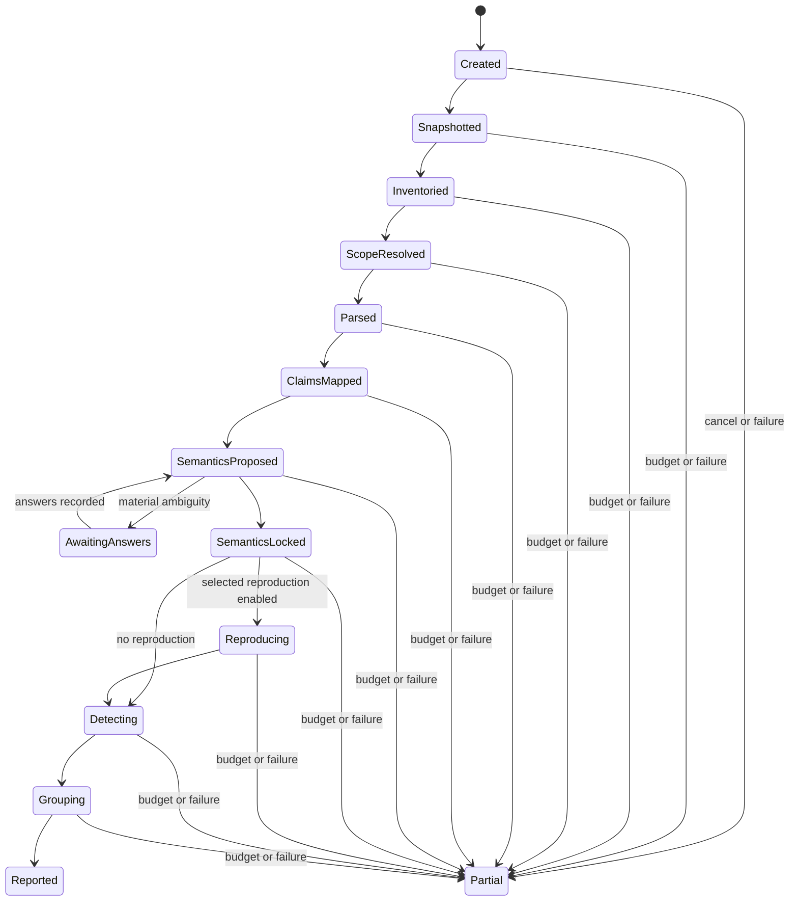

# 4. Audit lifecycle

## 4.1 Lifecycle goals

The audit lifecycle must be bounded in cost, resumable, useful before completion, reproducible after semantic lock, interactive only where ambiguity is material, and explicit about every skipped, failed, unsupported, or unavailable step.

## 4.2 Run state machine



`Partial` is a valid terminal state for one invocation. It is not an error synonym. The run must retain all completed records and explain what remains.

## 4.3 Stage 0 — Initialize policy and deadline

The controller creates an `AuditPlan` before inspecting project content. The plan fixes project root and permitted external roots, mode, publication-surface policy, user-visible scheduling cutoff and hard deadline, parser and domain profiles, execution privilege, network and dependency policy, data-read limits, output directory, security policy, cache policy, and stopping behavior.

Quick, standard, and publication default cutoff/deadline pairs are 120/300, 480/600, and 1500/1800 seconds. The elapsed clock includes model and tool latency, queues, retrieval, installation, sandbox startup, execution, and rendering. Only `awaiting_scientist_response` pauses the clock. Repository content MUST NOT modify this plan. User-directed changes create a new plan revision or linked run segment with provenance.

## 4.4 Stage 1 — Snapshot the project

The controller records project root, Git state when present, tracked and untracked files, symlinks, submodules, external roots, file identity policy, environment definitions, and snapshot digest.

Large data files SHOULD use the configured identity tier rather than always requiring full hashing. The controller materializes an immutable initial snapshot. If the live workspace changes, the current run continues exclusively against that snapshot, records `workspace_diverged`, and never imports changed live content. The scientist may create a linked follow-up run that reuses unaffected cached work.

## 4.5 Stage 2 — Inventory and classify

The controller inventories the entire in-scope project and classifies source code, notebooks, workflow definitions, manuscript sources, rendered reports, tables, figures, data assets, serialized objects, logs, environments, tests, generated content, vendored dependencies, and unknown items.

Items excluded from deep inspection remain in the inventory with an exclusion reason.

## 4.6 Stage 3 — Resolve the publication surface

The controller applies explicit precedence: user target or active workspace document, declared final build target, explicit task or repository statement, then unique lineage evidence. Filename and recency are supporting signals only.

If two or more surfaces could materially change the claims audited, the system asks one batched question. Inventory and safe parsing may continue while waiting and the elapsed deadline pauses. If no answer is available, it may audit multiple candidates within budget, but records and headlines remain separate and publication materiality stays unassessed.

## 4.7 Stage 4 — Static parse and build the lightweight graph

Python parsing uses CPython `ast` plus `tokenize`; R parsing uses Tree-sitter-R and, when available, a non-evaluating base-R parse helper. Parser adapters inspect supported files without importing or executing project code. They emit source units, operation records, artifact reads and writes, workflow dependencies, model formulas and parameters, candidate decisions, report-generation links, and opaque constructs.

Parser failures become structured records and coverage gaps. They do not terminate unrelated parsing.

## 4.8 Stage 5 — Extract final claims

The claim extractor operates on publication-surface text, captions, table labels, and figure annotations. It produces candidate `Claim` records with exact text, exact source, claim kind, structured proposition, extraction provenance, referenced artifacts, and unresolved interpretation fields.

Claims outside results and conclusions may still be material—for example, statements about cohort construction, model adequacy, or calibration.

## 4.9 Stage 6 — Build backward slices and selection envelopes

For each final claim, the controller traces the referenced result, generating operation, upstream transformations and filters, inputs and environments, candidate analyses and choices, and report rendering.

It expands the slice to include choices capable of selecting the reported result. Expansion stops at root inputs, recorded irrelevance, opaque boundaries, or budget limits. Every stop condition is recorded.

## 4.10 Stage 7 — Propose scientific semantics

The controller creates bounded work packets containing one claim group, report excerpt, upstream graph, relevant code, data schema and metadata, existing assertions, unresolved contract dimensions, and required output fields.

The model returns proposed claims, assertions, mappings, questions, and possible counterevidence. Submissions that fail schema or source validation are rejected or repaired. The model MUST NOT infer a scientific invariant merely because it is conventional in a field.

## 4.11 Stage 8 — Determine question materiality

A question is material if plausible answers can alter detector applicability, detector state, assessment type, potential impact or publication materiality, root-cause grouping, or affected claims.

Where practical, the controller SHOULD evaluate detector prerequisites under candidate answers. If all plausible answers produce the same audit conclusion, the unknown remains recorded but the scientist is not interrupted.

## 4.12 Stage 9 — Resolve or preserve unknowns

The agent first searches explicit task text, prior scientist statements available in the workspace, repository metadata, report definitions, local documentation, and observed execution.

An interpretation produced by the coding agent itself is `model_asserted` unless the scientist confirms it or explicit evidence supports it. Unresolved material questions are asked in one concise batch where possible. If the scientist cannot answer, the value remains `unknown` and the audit proceeds with abstentions or conditional concerns.

## 4.13 Stage 10 — Resolve conflicts by authority scope

Conflict resolution MUST be scoped:

| Conflict | Resolution rule |
|---|---|
| Scientist intent vs executed cohort | Scientist resolves intent; execution remains unchanged; mismatch may be a finding |
| Scientist interpretation vs report wording | Report text remains observed wording; scientist may state intended wording |
| Model proposal vs metadata definition | Explicit metadata normally supersedes the proposal for that definition |
| Static source vs runtime trace | Both remain; runtime establishes the executed path where reliable |
| Two scientist statements | Preserve both until one is superseded or scoped explicitly |

No resolution deletes the conflicting assertion.

## 4.14 Stage 11 — Create the semantic lock

The semantic lock fixes repository snapshot identity, publication-surface state, final claims, accepted assertions, unresolved unknowns, conflicts, flattened Scientific Contracts, Causal Contracts, selection envelopes, asset identities, external evidence snapshots, policy, enabled profiles, and relevant digests.

A semantic lock is not a statement that all semantics are known. It is a stable statement of what is known, unknown, conflicted, and accepted for deterministic evaluation.

## 4.15 Stage 12 — Verification, environment reconstruction, or reproduction request

The controller distinguishes three execution levels:

1. **Safe inspection:** syntax parsing, text and safe structured reads, metadata, manifests, archive listings, hashes, and non-executable format inspection.
2. **Auditor-owned verification:** code shipped with sc-referee that verifies an existing scalar, table, interval, identity, or lineage fact without importing project modules or fitting an alternative analysis.
3. **Project-code execution:** Python or R scripts, notebook or Quarto execution, Make, Snakemake, Nextflow, custom binaries, or local project installation. This requires explicit authorization and remains sandboxed.

Standard mode may reconstruct declared dependencies automatically in an isolated audit-owned environment. It never mutates the user environment, installs system packages, or installs the local project automatically. Unpinned reconstruction is marked approximate.

Version one does not submit HPC jobs or automatically run a complete workflow. If external execution could materially resolve a claim or detector prerequisite, the controller emits a `ReproductionRequest`. Imported traces, logs, outputs, and identities become ordinary evidence records.

A skipped or requested reproduction becomes an execution-coverage state, not a scientific accusation.

## 4.16 Stage 13 — Run applicable detectors

The controller indexes detectors by target type, operation kind, semantic dimensions, domain, language, and workflow system. It schedules only applicable detector-target pairs.

Every scheduled pair produces one `DetectorResult`, including abstention and error. High-materiality and high-maturity detectors run before lower-value work.

## 4.17 Stage 14 — Finite counterevidence checks

The production audit does not perform an open-ended model concern pass. After detector execution, the controller resolves detector-generated prerequisites and runs every applicable finite counterevidence check declared by candidate-producing detector manifests.

A decisive unavailable source blocks Finding admission and produces an appropriate MaterialQuestion, ConditionalConcern, Disclosure, or abstention. Model assistance, when used at all, is limited to verified explicit extraction from a bounded source selected by the deterministic check; it does not invent new scientific concerns or declare the check complete.

## 4.18 Stage 15 — Assessment admission and root-cause grouping

For each detector candidate, the controller first chooses the appropriate output type. A candidate may become a `Finding`, `ConditionalConcern`, `MaterialQuestion`, `Disclosure`, negative-within-coverage result, abstention, unsupported-path result, unavailable-evidence result, or detector error.

A `Finding` is admitted only when all five conditions hold: the bounded wording follows directly from the evidence; no unresolved fact could reasonably reverse it; the validated or publication-grade detector applies to the exact situation; every applicable check in its finite counterevidence protocol is complete; and the wording states only what was established and reruns deterministically from the semantic lock. Failure of any condition blocks Finding admission rather than creating a lower-confidence Finding.

Admitted Findings are grouped by causal root and list all materially affected descendants. Conditional concerns link to their blocking material questions where applicable. Suppressed candidates, failed admission checks, and counterevidence remain in detector records for evaluation and debugging.

## 4.19 Stage 16 — Calculate coverage and render outputs

Coverage is calculated from actual inventory, parser results, semantic states, detector results, execution evidence, and pending work. It is not estimated by the model.

The renderer produces normalized JSONL, an audit bundle, semantic lock, machine summary, self-contained Jinja2 HTML, performance records, and optional audit diffs. SQLite is regenerated as a disposable query index.

## 4.20 Incremental reruns

A change invalidates only dependent records where possible:

```text
changed file or answer
  -> parser or assertion records
  -> affected operations and artifacts
  -> affected lineage and contracts
  -> dependent detector results
  -> findings, coverage, and report sections
```

Unchanged content-addressed work is reused.

## 4.21 Deadline, cancellation, failure, and recovery

At the scheduling cutoff, the controller stops starting optional work and finishes only work that can safely complete before the hard deadline. At the hard deadline, it terminates eligible child processes, checkpoints durable output, marks pending work with an exact reason, recalculates coverage, and renders a partial report.

At every stage, the controller MUST checkpoint durable output. On cancellation, host model exhaustion, network failure, installation failure, parser or detector error, or security denial, it renders a partial report containing completed scope, incomplete work items, failures, semantic unknowns, completed detector results, pending questions, external evidence status, reproduction requests, and deadline use. A later resume creates a linked run segment and reuses valid cached work.


## 4.22 Separate qualification lifecycle

The offline detector-qualification lifecycle is distinct from a production audit:

1. snapshot and classify a candidate fixture;
2. calibrate the exact agent configurations;
3. run four or more Stage-1 blind reviews across two provider families;
4. freeze review records and transcripts;
5. run two or more fresh Stage-2 scientific adjudications;
6. apply deterministic source, entailment, counterevidence, scope, and disagreement checks;
7. admit a positive, verified-good, or hard-negative label only when its proof obligations hold;
8. otherwise preserve the case as ambiguous or insufficient evidence;
9. freeze the benchmark label before showing sc-referee output;
10. compare detector output in Stage 3;
11. calculate clustered metrics and promotion safety gates; and
12. publish the qualification record, report, and capability-matrix entry.

This lifecycle is not subject to the interactive audit time ceilings. Its resource use, model configurations, and wall time are recorded separately.
